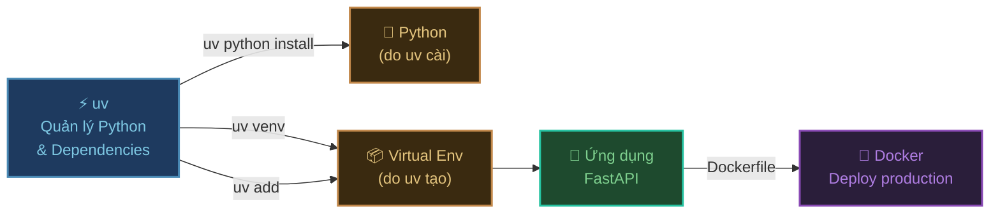
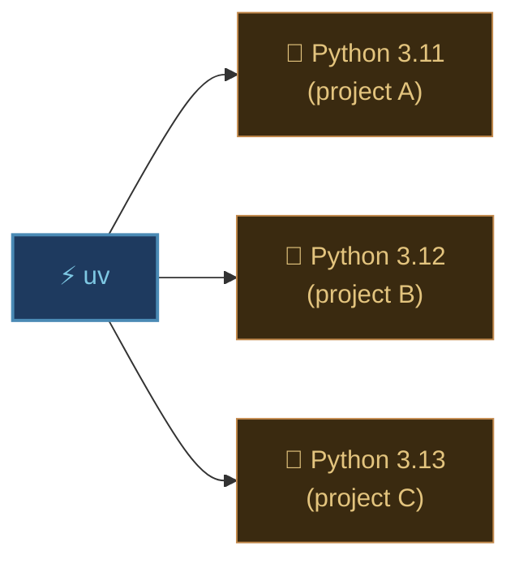
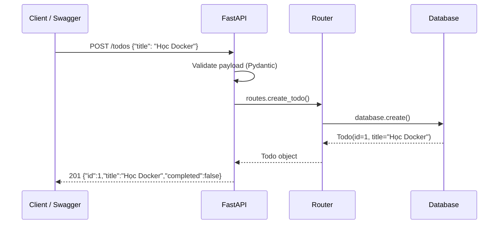
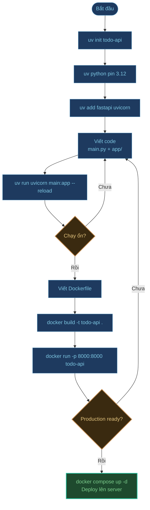

# Python — Cài đặt môi trường và uv

## Tổng quan luồng làm việc



---

## Tại sao dùng uv thay vì pip?

`uv` là package manager thế hệ mới cho Python, viết bằng Rust — nhanh hơn `pip` tới **10–100 lần** và giải quyết được nhiều vấn đề mà pip + venv + pyenv làm riêng lẻ.

| Tính năng | pip + pyenv + venv | uv |
| :--- | :---: | :---: |
| Cài Python | pyenv (cài riêng) | ✅ tích hợp sẵn |
| Quản lý packages | pip | ✅ tích hợp sẵn |
| Virtual env | venv (tạo thủ công) | ✅ tự động |
| Lock file | ❌ | ✅ `uv.lock` |
| Tốc độ install | 🐢 chậm | ⚡ rất nhanh |
| File cấu hình | `requirements.txt` | `pyproject.toml` |

---

## 1. Cài đặt uv

### macOS / Linux

```bash
curl -LsSf https://astral.sh/uv/install.sh | sh
```

### Windows (PowerShell)

```powershell
powershell -ExecutionPolicy ByPass -c "irm https://astral.sh/uv/install.ps1 | iex"
```

### Kiểm tra cài đặt

```bash
uv --version
# uv 0.5.x
```

---

## 2. Quản lý Python với uv

### Xem các version Python có thể cài

```bash
uv python list
```

### Cài Python version cụ thể

```bash
# Cài Python 3.12
uv python install 3.12

# Cài nhiều version
uv python install 3.11 3.12 3.13

# Xem các version đã cài
uv python list --only-installed
```

### Chuyển đổi version trong project

```bash
# Dùng Python 3.12 cho project hiện tại
uv python pin 3.12
# → Tạo file .python-version
```



---

## 3. Demo — Tạo ứng dụng FastAPI

Chúng ta sẽ xây dựng một **REST API quản lý công việc (Todo)** đơn giản với FastAPI.

### Khởi tạo project

```bash
# Tạo project mới
uv init todo-api
cd todo-api

# Ghim Python version
uv python pin 3.12

# Xem cấu trúc được tạo
ls
# .python-version   pyproject.toml   README.md   main.py
```

### Thêm dependencies

```bash
# Thêm FastAPI và server ASGI
uv add fastapi uvicorn[standard]

# Thêm dependency chỉ dùng khi dev (không cần ở production)
uv add --dev pytest httpx
```

:::tip uv.lock
Sau khi `uv add`, file `uv.lock` được tạo tự động — giống `package-lock.json` trong Node.js. **Commit file này** vào git để đảm bảo mọi người cùng dùng đúng version.
:::

### Cấu trúc project

```
todo-api/
├── .python-version     ← Python 3.12
├── pyproject.toml      ← Cấu hình project + dependencies
├── uv.lock             ← Lock file (commit vào git)
├── main.py             ← Entry point
├── app/
│   ├── __init__.py
│   ├── models.py       ← Data models
│   ├── routes.py       ← API routes
│   └── database.py     ← Giả lập database
├── tests/
│   └── test_api.py
└── Dockerfile
```

### Viết code

**`app/models.py`** — Định nghĩa cấu trúc dữ liệu:

```python
from pydantic import BaseModel
from typing import Optional
from datetime import datetime

class TodoCreate(BaseModel):
    title: str
    description: Optional[str] = None

class Todo(BaseModel):
    id: int
    title: str
    description: Optional[str] = None
    completed: bool = False
    created_at: datetime = datetime.now()
```

**`app/database.py`** — Giả lập database bằng dict:

```python
from app.models import Todo
from datetime import datetime

# Giả lập database trong bộ nhớ
_db: dict[int, Todo] = {}
_counter = 0

def get_all() -> list[Todo]:
    return list(_db.values())

def get_by_id(todo_id: int) -> Todo | None:
    return _db.get(todo_id)

def create(title: str, description: str | None) -> Todo:
    global _counter
    _counter += 1
    todo = Todo(
        id=_counter,
        title=title,
        description=description,
        created_at=datetime.now(),
    )
    _db[_counter] = todo
    return todo

def update(todo_id: int, completed: bool) -> Todo | None:
    todo = _db.get(todo_id)
    if not todo:
        return None
    _db[todo_id] = todo.model_copy(update={"completed": completed})
    return _db[todo_id]

def delete(todo_id: int) -> bool:
    if todo_id not in _db:
        return False
    del _db[todo_id]
    return True
```

**`app/routes.py`** — Định nghĩa các API endpoint:

```python
from fastapi import APIRouter, HTTPException
from app.models import Todo, TodoCreate
from app import database

router = APIRouter(prefix="/todos", tags=["Todo"])

@router.get("/", response_model=list[Todo])
def list_todos():
    """Lấy toàn bộ danh sách công việc"""
    return database.get_all()

@router.post("/", response_model=Todo, status_code=201)
def create_todo(payload: TodoCreate):
    """Tạo công việc mới"""
    return database.create(payload.title, payload.description)

@router.patch("/{todo_id}/complete", response_model=Todo)
def complete_todo(todo_id: int):
    """Đánh dấu hoàn thành"""
    todo = database.update(todo_id, completed=True)
    if not todo:
        raise HTTPException(status_code=404, detail="Không tìm thấy công việc")
    return todo

@router.delete("/{todo_id}", status_code=204)
def delete_todo(todo_id: int):
    """Xóa công việc"""
    if not database.delete(todo_id):
        raise HTTPException(status_code=404, detail="Không tìm thấy công việc")
```

**`main.py`** — Entry point:

```python
from fastapi import FastAPI
from app.routes import router

app = FastAPI(
    title="Todo API",
    description="Ứng dụng quản lý công việc đơn giản",
    version="1.0.0",
)

app.include_router(router)

@app.get("/")
def root():
    return {"message": "Todo API đang chạy 🚀", "docs": "/docs"}
```

---

## 4. Chạy Local

```bash
# uv tự tạo venv và chạy trong đó — không cần activate thủ công
uv run uvicorn main:app --reload
```

```
INFO:     Uvicorn running on http://127.0.0.1:8000 (Press CTRL+C to quit)
INFO:     Started reloader process
```

Truy cập các URL sau:

| URL | Mô tả |
| :--- | :--- |
| `http://localhost:8000` | Root endpoint |
| `http://localhost:8000/docs` | Swagger UI — thử API trực tiếp |
| `http://localhost:8000/redoc` | ReDoc — tài liệu API đẹp hơn |

### Luồng request



### Test nhanh bằng curl

```bash
# Tạo todo
curl -X POST http://localhost:8000/todos \
  -H "Content-Type: application/json" \
  -d '{"title": "Học Docker", "description": "Xem bài hướng dẫn"}'

# Lấy danh sách
curl http://localhost:8000/todos

# Đánh dấu hoàn thành
curl -X PATCH http://localhost:8000/todos/1/complete

# Xóa
curl -X DELETE http://localhost:8000/todos/1
```

### Chạy test

```bash
uv run pytest tests/ -v
```

---

## 5. Chạy với Docker

### Viết Dockerfile

```dockerfile
# syntax=docker/dockerfile:1

# ── Stage 1: Build dependencies ──────────────────────
FROM python:3.12-slim AS builder

# Cài uv vào image
COPY --from=ghcr.io/astral-sh/uv:latest /uv /usr/local/bin/uv

WORKDIR /app

# Copy file lock trước — tận dụng Docker cache layer
COPY pyproject.toml uv.lock ./

# Cài dependencies vào thư mục cố định (không cần venv)
RUN uv sync --frozen --no-dev --no-install-project

# ── Stage 2: Runtime ─────────────────────────────────
FROM python:3.12-slim

WORKDIR /app

# Copy dependencies từ stage 1
COPY --from=builder /app/.venv /app/.venv

# Copy source code
COPY . .

# Đặt PATH để dùng Python từ venv
ENV PATH="/app/.venv/bin:$PATH"

EXPOSE 8000

CMD ["uvicorn", "main:app", "--host", "0.0.0.0", "--port", "8000"]
```

:::tip --host 0.0.0.0
Mặc định `uvicorn` chỉ lắng nghe `127.0.0.1` (localhost trong container). Phải đổi thành `0.0.0.0` để nhận request từ bên ngoài container.
:::

### .dockerignore

```
.venv
.git
.python-version
__pycache__
*.pyc
*.pyo
.pytest_cache
tests/
*.md
```

### Build và chạy

```bash
# Build image
docker build -t todo-api .

# Chạy container
docker run -d \
  --name todo-api \
  -p 8000:8000 \
  todo-api

# Kiểm tra log
docker logs -f todo-api

# Truy cập
# http://localhost:8000/docs
```

### Docker Compose — Mở rộng thêm Redis cache

Khi project lớn hơn, thêm Redis để cache kết quả:

```yaml
# docker-compose.yml
services:
  api:
    build: .
    container_name: todo-api
    restart: unless-stopped
    ports:
      - "8000:8000"
    environment:
      REDIS_URL: redis://redis:6379
    depends_on:
      - redis

  redis:
    image: redis:7-alpine
    container_name: todo-redis
    restart: unless-stopped
    volumes:
      - redis-data:/data

volumes:
  redis-data:
```

```bash
# Khởi động toàn bộ stack
docker compose up -d --build

# Xem log
docker compose logs -f api

# Dừng
docker compose down
```

---

## Tổng kết luồng đầy đủ



## Cheat sheet

| Việc cần làm | Lệnh |
| :--- | :--- |
| Cài uv | `curl -LsSf https://astral.sh/uv/install.sh \| sh` |
| Cài Python | `uv python install 3.12` |
| Tạo project | `uv init my-project` |
| Thêm package | `uv add fastapi` |
| Thêm dev package | `uv add --dev pytest` |
| Chạy script | `uv run python main.py` |
| Chạy lệnh trong env | `uv run uvicorn main:app` |
| Sync dependencies | `uv sync` |
| Xem packages đã cài | `uv pip list` |
