Python là một trong những ngôn ngữ lập trình phổ biến nhất thế giới — và có lý do chính đáng cho điều đó. Cú pháp rõ ràng, cộng đồng lớn, và ứng dụng rộng từ web đến AI khiến Python trở thành lựa chọn lý tưởng cho người mới bắt đầu lẫn chuyên gia.

## Python là gì?

Python là ngôn ngữ lập trình bậc cao (high-level), thông dịch (interpreted), và đa mục đích (general-purpose). Được tạo ra bởi Guido van Rossum năm 1991, Python được thiết kế với triết lý: **code dễ đọc hơn là dễ viết**.

### Python dùng ở đâu?

| Lĩnh vực | Ứng dụng thực tế | Thư viện phổ biến |
|---|---|---|
| Web Development | API, backend server | Django, FastAPI, Flask |
| Data Science | Phân tích dữ liệu, visualization | pandas, matplotlib, numpy |
| Machine Learning / AI | Huấn luyện model, LLM | scikit-learn, PyTorch, TensorFlow |
| Automation / Scripting | Tự động hóa tác vụ, bot | selenium, requests, schedule |
| DevOps | CI/CD scripts, cloud tools | boto3, ansible, fabric |

### Tại sao Python phù hợp người mới?

```python
# Java: Hello World
public class HelloWorld {
    public static void main(String[] args) {
        System.out.println("Hello, World!");
    }
}

# Python: Hello World
print("Hello, World!")
```

Python loại bỏ hầu hết "boilerplate code" — bạn tập trung vào logic, không phải cú pháp. Không cần khai báo kiểu dữ liệu, không cần dấu chấm phẩy, không cần dấu ngoặc nhọn cho block code.

## Roadmap series này

```mermaid
graph LR
    A[Intro &\nCài đặt] --> B[Biến &\nKiểu dữ liệu]
    B --> C[Toán tử &\nĐiều kiện]
    C --> D[Vòng lặp]
    D --> E[Hàm]
    E --> F[Cấu trúc\ndữ liệu]
    F --> G[Xử lý\nchuỗi]
    G --> H[File I/O]
    H --> I[OOP]
    I --> J[Xử lý\nlỗi]

    style A fill:#4CAF50,color:#fff
    style B fill:#2196F3,color:#fff
    style C fill:#2196F3,color:#fff
    style D fill:#2196F3,color:#fff
    style E fill:#FF9800,color:#fff
    style F fill:#FF9800,color:#fff
    style G fill:#FF9800,color:#fff
    style H fill:#9C27B0,color:#fff
    style I fill:#9C27B0,color:#fff
    style J fill:#9C27B0,color:#fff
```



Mỗi bài xây dựng trên bài trước — hãy học theo thứ tự để hiểu vững nền tảng.

## Cài đặt Python

### Cách 1: Cài trực tiếp từ python.org (đơn giản nhất)

1. Truy cập [python.org/downloads](https://python.org/downloads)
2. Tải Python 3.12+ (phiên bản mới nhất ổn định)
3. Chạy installer — **nhớ tích chọn "Add Python to PATH"**
4. Kiểm tra:

```bash
python --version
# Output: Python 3.12.x

python3 --version  # Trên macOS/Linux
# Output: Python 3.12.x
```

### Cách 2: Dùng `uv` — package manager hiện đại (khuyên dùng)

`uv` là tool quản lý Python environment cực nhanh, viết bằng Rust.

```bash
# Cài uv
curl -LsSf https://astral.sh/uv/install.sh | sh  # macOS/Linux
# Hoặc trên Windows PowerShell:
# powershell -c "irm https://astral.sh/uv/install.ps1 | iex"

# Cài Python qua uv
uv python install 3.12

# Tạo project mới
uv init my-project
cd my-project

# Chạy Python
uv run python script.py
```

:::tip uv vs pip
`uv` nhanh hơn `pip` tới 10-100 lần và tự động quản lý virtual environment. Nếu bạn làm project thực tế, hãy dùng `uv`.
:::

### Cài đặt VS Code

1. Tải [VS Code](https://code.visualstudio.com)
2. Cài extension **Python** (của Microsoft)
3. Cài extension **Pylance** để có autocomplete thông minh
4. Chọn Python interpreter: `Ctrl+Shift+P` → "Python: Select Interpreter"

## Chạy Python như thế nào?

### 1. Python REPL (interactive shell)

REPL = Read-Eval-Print Loop — gõ code, Enter, thấy kết quả ngay.

```bash
python
```

```python
>>> 2 + 2
4
>>> name = "Huấn"
>>> print(f"Xin chào, {name}!")
Xin chào, Huấn!
>>> exit()
```

REPL phù hợp để thử nhanh, kiểm tra hàm, debug nhỏ.

### 2. Chạy file script

Tạo file `hello.py`:

```python title="hello.py"
name = "Python"
print(f"Xin chào, {name}!")
```

Chạy:

```bash
python hello.py
# Output: Xin chào, Python!
```

### 3. Chạy trong VS Code

- Mở file `.py`
- Nhấn `F5` hoặc nút Run ▶ góc trên phải
- Kết quả hiện trong Terminal bên dưới

## Hello World — giải thích từng dòng

```python title="hello.py"
# Đây là comment — Python bỏ qua dòng này

name = "Đào Trọng Huấn"   # Khai báo biến kiểu string
age = 25                    # Khai báo biến kiểu integer
is_developer = True         # Khai báo biến kiểu boolean

print("Hello, World!")                          # In ra màn hình
print(f"Tên: {name}, Tuổi: {age}")             # f-string: nhúng biến vào chuỗi
print(f"Là developer: {is_developer}")
```

Output:
```
Hello, World!
Tên: Đào Trọng Huấn, Tuổi: 25
Là developer: True
```

**Giải thích:**
- `#` — comment, Python bỏ qua hoàn toàn
- `=` — gán giá trị cho biến (không phải so sánh bằng)
- `print()` — hàm built-in in ra màn hình
- `f"..."` — f-string, `{tên_biến}` được thay bằng giá trị thực

## Cheat sheet: Lệnh hay dùng khi bắt đầu

```python
# Xem kiểu dữ liệu
type(42)          # <class 'int'>
type("hello")     # <class 'str'>
type(3.14)        # <class 'float'>
type(True)        # <class 'bool'>

# Chuyển đổi kiểu
int("42")         # 42
str(42)           # "42"
float("3.14")     # 3.14
bool(0)           # False
bool(1)           # True

# In ra với nhiều giá trị
print("a", "b", "c")           # a b c
print("a", "b", sep=", ")      # a, b
print("Loading", end="...")    # Loading... (không xuống dòng)

# Nhập liệu từ user
name = input("Nhập tên: ")     # Đọc từ bàn phím, luôn trả về string
age = int(input("Nhập tuổi: "))  # Chuyển sang int

# Xem tài liệu
help(print)       # Xem docs của hàm print
dir(str)          # Xem các method của string
```

:::note Python 2 vs Python 3
Series này dùng **Python 3** (3.10+). Python 2 đã kết thúc hỗ trợ từ năm 2020 — không cần học Python 2.
:::

## Bài tập

**Bài 1.** Cài Python và VS Code theo hướng dẫn. Chạy lệnh `python --version` và chụp màn hình kết quả.

**Bài 2.** Tạo file `about_me.py`, in ra các thông tin: tên, tuổi, nghề nghiệp, ngôn ngữ lập trình yêu thích. Dùng f-string cho ít nhất một dòng.

**Bài 3.** Mở Python REPL, thử các phép tính: `10 / 3`, `10 // 3`, `10 % 3`, `2 ** 10`. Quan sát sự khác biệt giữa `/` và `//`.

**Bài 4.** Viết chương trình hỏi tên người dùng bằng `input()`, sau đó in ra lời chào có tên và số ký tự trong tên (`len(name)`).
