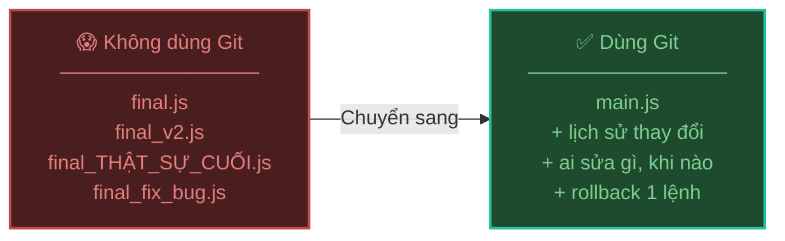
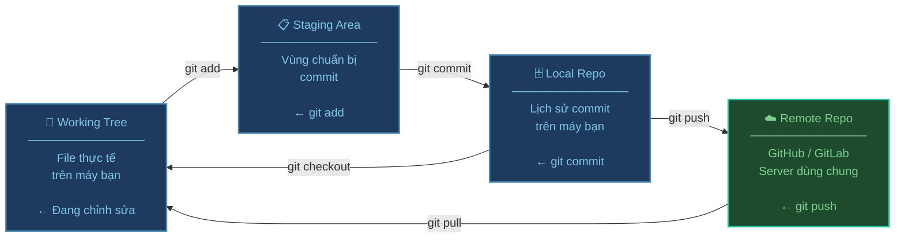
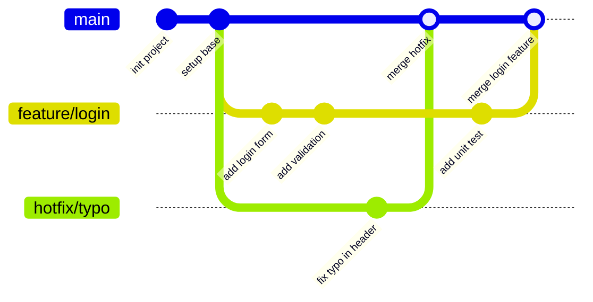
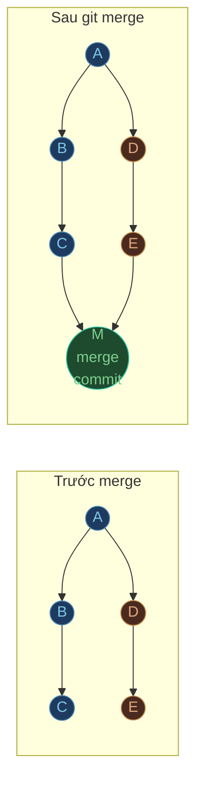
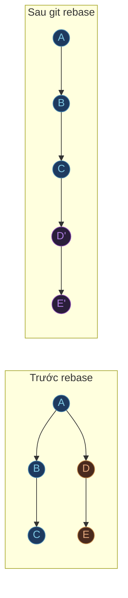
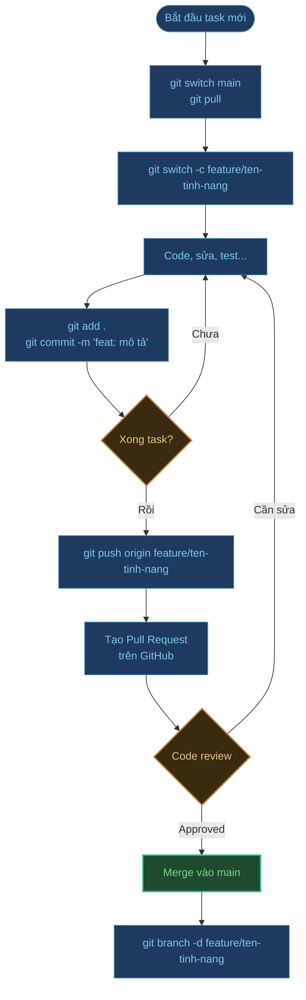

# Git cơ bản — Quản lý source code

## Git là gì và tại sao cần dùng?

**Git** là hệ thống quản lý phiên bản (Version Control System) — giúp bạn theo dõi mọi thay đổi trong source code theo thời gian.



---

## Kiến trúc 3 vùng của Git

Đây là khái niệm quan trọng nhất cần hiểu trước khi dùng Git:



---

## Cài đặt và cấu hình ban đầu

```bash
# Kiểm tra Git đã được cài chưa
git --version

# Cấu hình tên và email (chỉ làm 1 lần)
git config --global user.name "Đào Trọng Huấn"
git config --global user.email "your@email.com"

# Xem lại cấu hình
git config --list
```

---

## Các lệnh cơ bản hàng ngày

### Khởi tạo và clone

```bash
# Tạo repo mới từ folder hiện tại
git init

# Clone repo từ GitHub về máy
git clone https://github.com/username/repo-name.git

# Clone và đổi tên folder
git clone https://github.com/username/repo-name.git my-project
```

### Xem trạng thái

```bash
# Xem file nào đang thay đổi
git status

# Xem chi tiết nội dung thay đổi
git diff

# Xem lịch sử commit (đẹp hơn)
git log --oneline --graph --all
```

### Add và Commit

```bash
# Thêm 1 file vào staging
git add src/index.js

# Thêm toàn bộ thay đổi
git add .

# Commit với message
git commit -m "feat: thêm tính năng đăng nhập"

# Add + commit gộp (chỉ với file đã track)
git commit -am "fix: sửa lỗi validation email"
```

:::tip Quy tắc viết commit message
Dùng **Conventional Commits** để dễ đọc lịch sử:
- `feat:` — thêm tính năng mới
- `fix:` — sửa bug
- `docs:` — cập nhật tài liệu
- `refactor:` — tái cấu trúc code
- `chore:` — việc vặt (update dep, config...)
:::

---

## Branch — Nhánh code

Branch cho phép bạn làm việc song song mà không ảnh hưởng lẫn nhau.



```bash
# Xem tất cả branch
git branch -a

# Tạo branch mới
git branch feature/login

# Tạo và chuyển sang branch mới (gộp 2 lệnh)
git checkout -b feature/login
# Hoặc cú pháp mới hơn:
git switch -c feature/login

# Chuyển branch
git checkout main
git switch main

# Xóa branch (sau khi merge xong)
git branch -d feature/login
```

---

## Merge và Rebase

### Merge — Gộp nhánh

```bash
# Đứng ở branch đích, merge branch nguồn vào
git checkout main
git merge feature/login
```



### Rebase — Viết lại lịch sử gọn hơn

```bash
# Đứng ở feature branch, rebase lên main
git checkout feature/login
git rebase main
```



:::info Merge vs Rebase
| | Merge | Rebase |
|---|---|---|
| Lịch sử | Giữ nguyên, có merge commit | Tuyến tính, sạch hơn |
| An toàn | Luôn an toàn | **Không rebase branch public** |
| Dùng khi | Merge feature vào main | Cập nhật feature branch với main |
:::

---

## Xử lý conflict

Conflict xảy ra khi 2 người cùng sửa một đoạn code.

```bash
# Sau khi merge bị conflict, Git đánh dấu trong file:
<<<<<<< HEAD (thay đổi của bạn)
const greeting = "Xin chào";
=======
const greeting = "Hello";
>>>>>>> feature/login (thay đổi từ branch kia)

# Bước 1: Mở file, chọn giữ version nào (xóa các dấu <<<, ===, >>>)
# Bước 2: Add file đã resolve
git add src/greeting.js

# Bước 3: Hoàn thành merge
git commit
```

---

## Làm việc với Remote

```bash
# Xem remote hiện tại
git remote -v

# Thêm remote
git remote add origin https://github.com/username/repo.git

# Đẩy code lên remote (lần đầu)
git push -u origin main

# Đẩy code lên remote (các lần sau)
git push

# Lấy code mới từ remote (fetch + merge)
git pull

# Chỉ fetch, chưa merge (xem trước)
git fetch origin
git log HEAD..origin/main --oneline
```

---

## Các lệnh cứu nguy

```bash
# Lỡ sửa file, muốn hoàn tác (chưa add)
git restore src/index.js

# Lỡ add nhầm, muốn bỏ khỏi staging
git restore --staged src/index.js

# Tạm cất công việc dở để làm việc khác
git stash
git stash pop          # Lấy lại sau

# Xem lại commit trước (không xóa lịch sử)
git revert <commit-hash>

# ⚠️ Xóa commit gần nhất (nguy hiểm nếu đã push)
git reset --soft HEAD~1   # Giữ lại thay đổi trong staging
git reset --hard HEAD~1   # Xóa luôn thay đổi
```

:::danger git reset --hard
Lệnh này **không thể hoàn tác** — xóa vĩnh viễn các thay đổi chưa commit. Chỉ dùng khi chắc chắn.
:::

---

## Workflow thực tế trong dự án nhóm



---

## Cheat sheet nhanh

| Việc cần làm | Lệnh |
| :--- | :--- |
| Xem trạng thái | `git status` |
| Thêm tất cả vào staging | `git add .` |
| Commit | `git commit -m "message"` |
| Tạo branch mới | `git switch -c ten-branch` |
| Chuyển branch | `git switch ten-branch` |
| Merge branch | `git merge ten-branch` |
| Đẩy lên remote | `git push` |
| Lấy code mới | `git pull` |
| Tạm cất công việc | `git stash` |
| Xem lịch sử | `git log --oneline --graph` |
