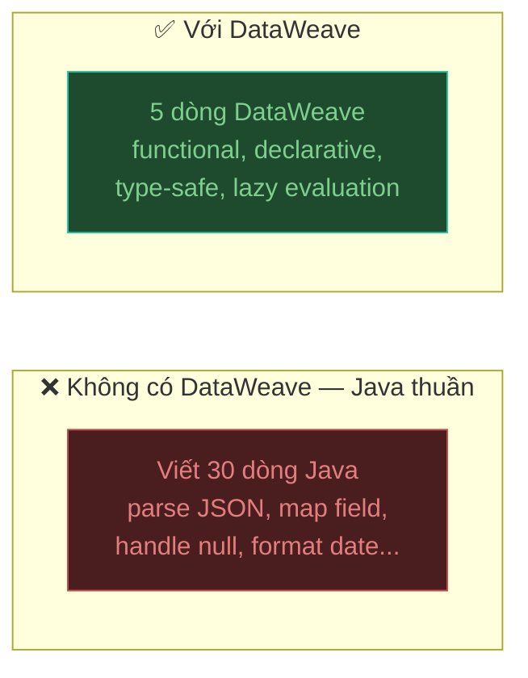

## DataWeave là gì?

**DataWeave** là ngôn ngữ transformation chính thức của Mule 4 — dùng để biến đổi dữ liệu từ định dạng này sang định dạng khác, hoặc reshape cấu trúc JSON/XML.

Tại sao cần DataWeave thay vì Java/Groovy?



DataWeave hoạt động bên trong component **Transform Message** trong Anypoint Studio.

---

## Cú pháp cơ bản

Mọi script DataWeave có 2 phần, ngăn cách bởi `---`:

```dataweave
%dw 2.0                          ← Version DataWeave (luôn là 2.0 với Mule 4)
output application/json          ← Định dạng output
---
                                 ← Phần body: logic transform
{
  greeting: "Hello!"
}
```

### Các MIME type hay dùng

```dataweave
output application/json          ← JSON (phổ biến nhất)
output application/xml           ← XML
output text/plain                ← Chuỗi thuần
output application/csv           ← CSV (comma-separated)
output application/java          ← Java Object
output application/x-www-form-urlencoded   ← Form data
```

---

## Thêm Transform Message vào Studio

1. Trong Palette, tìm **Core** → **Transform Message**
2. Kéo vào flow, sau component nhận dữ liệu
3. Double-click để mở DataWeave editor
4. Gõ script vào panel bên phải

---

## Transform JSON → JSON

Tình huống thực tế: backend trả về dữ liệu khác format so với những gì mobile app cần.

**Input (từ backend):**
```json
{
  "order_id": "ORD-001",
  "cust_name": "Nguyen Van A",
  "cust_email": "a@example.com",
  "order_date": "2024-01-15T08:30:00",
  "line_items": [
    {"sku": "PROD-A", "qty": 2, "unit_price": 150000},
    {"sku": "PROD-B", "qty": 1, "unit_price": 250000}
  ],
  "status_code": "SHIPPED"
}
```

**DataWeave transform:**
```dataweave
%dw 2.0
output application/json
---
{
  id: payload.order_id,
  customer: {
    name: payload.cust_name,
    email: payload.cust_email
  },
  date: payload.order_date as Date {format: "yyyy-MM-dd'T'HH:mm:ss"} as String {format: "dd/MM/yyyy"},
  items: payload.line_items map {
    product: $.sku,
    quantity: $.qty,
    price: $.unit_price,
    subtotal: $.qty * $.unit_price
  },
  total: (payload.line_items reduce ((item, acc = 0) -> acc + (item.qty * item.unit_price))),
  status: upper(payload.status_code)
}
```

**Output (gửi cho mobile app):**
```json
{
  "id": "ORD-001",
  "customer": {
    "name": "Nguyen Van A",
    "email": "a@example.com"
  },
  "date": "15/01/2024",
  "items": [
    {"product": "PROD-A", "quantity": 2, "price": 150000, "subtotal": 300000},
    {"product": "PROD-B", "quantity": 1, "price": 250000, "subtotal": 250000}
  ],
  "total": 550000,
  "status": "SHIPPED"
}
```

---

## Transform JSON → XML

```dataweave
%dw 2.0
output application/xml
---
{
  order: {
    "@id": payload.order_id,           ← attribute XML (dùng @)
    customer: payload.cust_name,
    status: payload.status_code,
    items: {
      (payload.line_items map {
        item: {
          "@sku": $.sku,
          quantity: $.qty,
          price: $.unit_price
        }
      })
    }
  }
}
```

**Output XML:**
```xml
<?xml version='1.0' encoding='UTF-8'?>
<order id="ORD-001">
  <customer>Nguyen Van A</customer>
  <status>SHIPPED</status>
  <items>
    <item sku="PROD-A">
      <quantity>2</quantity>
      <price>150000</price>
    </item>
    <item sku="PROD-B">
      <quantity>1</quantity>
      <price>250000</price>
    </item>
  </items>
</order>
```

## Transform XML → JSON

```dataweave
%dw 2.0
output application/json
---
{
  id: payload.order.@id,             ← đọc attribute XML
  customer: payload.order.customer,
  items: payload.order.items.*item map {   ← .* để lấy tất cả children tên "item"
    sku: $.@sku,
    qty: $.quantity as Number,
    price: $.price as Number
  }
}
```

---

## Selectors — Cách truy cập dữ liệu

```dataweave
// Object field
payload.name                    // field "name"
payload["user-name"]            // field có ký tự đặc biệt

// Nested
payload.address.city

// Array element
payload.items[0]                // phần tử đầu tiên (index 0)
payload.items[-1]               // phần tử cuối

// Tất cả children cùng tên (XML)
payload.items.*item             // trả về array

// XML attribute
payload.order.@id

// Optional (không throw lỗi nếu null)
payload.address?.city           // trả về null nếu address không tồn tại

// Default value
payload.name default "Unknown"  // "Unknown" nếu name null hoặc không tồn tại
```

---

## map — Biến đổi từng phần tử trong array

```dataweave
// Cú pháp
arrayExpression map ((item, index) -> { ... })

// Hoặc dùng $ (shorthand cho item)
arrayExpression map { field: $.fieldName }
```

**Ví dụ:**
```dataweave
%dw 2.0
output application/json
---
payload.products map {
  id: $.productId,
  name: upper($.name),
  priceVND: $.priceUSD * 25000,
  inStock: $.quantity > 0
}
```

---

## filter — Lọc phần tử thỏa điều kiện

```dataweave
// Lọc orders đang active
payload.orders filter ($.status == "ACTIVE")

// Lọc orders giá trị cao
payload.orders filter ($.total > 1000000)

// Kết hợp: lọc rồi map
(payload.orders filter ($.status == "ACTIVE")) map {
  id: $.orderId,
  total: $.total
}
```

---

## reduce — Tính toán tổng hợp trên array

```dataweave
// Tính tổng
payload.items reduce ((item, acc = 0) -> acc + item.price)

// Tính tổng có điều kiện
(payload.items filter ($.active == true)) reduce ((item, acc = 0) -> acc + item.qty)

// Tìm giá lớn nhất
payload.items reduce ((item, acc = payload.items[0].price) ->
  if (item.price > acc) item.price else acc
)
```

---

## groupBy — Nhóm phần tử theo key

```dataweave
%dw 2.0
output application/json
---
// Nhóm orders theo status
payload.orders groupBy $.status

// Output:
// {
//   "ACTIVE": [{...}, {...}],
//   "SHIPPED": [{...}],
//   "CANCELLED": [{...}]
// }
```

---

## Xử lý null và giá trị thiếu

```dataweave
// Cách 1: default
payload.city default "Hà Nội"

// Cách 2: if/else
if (payload.name != null) upper(payload.name) else "UNKNOWN"

// Cách 3: Optional selector (trả null thay vì throw exception)
payload.address?.district

// Cách 4: isEmpty
if (!isEmpty(payload.tags)) payload.tags else []

// Cách 5: Conditional field — chỉ thêm field nếu có giá trị
{
  name: payload.name,
  (phone: payload.phone) if payload.phone != null
}
```

---

## Các hàm hay dùng

### String

```dataweave
upper("hello world")            // "HELLO WORLD"
lower("HELLO")                  // "hello"
trim("  abc  ")                 // "abc"
"Xin chào" contains "chào"     // true
splitBy("a,b,c", ",")          // ["a", "b", "c"]
joinBy(["a", "b", "c"], "-")   // "a-b-c"
replace("foo bar", /foo/, "baz") // "baz bar"
sizeOf("hello")                 // 5
substringBefore("user@mail.com", "@")   // "user"
```

### Number

```dataweave
abs(-5)                         // 5
round(3.7)                      // 4
floor(3.9)                      // 3
ceil(3.1)                       // 4
"123" as Number                 // 123
123 as String                   // "123"
```

### Date và Time

```dataweave
now()                           // current datetime
now() as String {format: "yyyy-MM-dd"}              // "2024-01-15"
now() as String {format: "dd/MM/yyyy HH:mm:ss"}    // "15/01/2024 08:30:00"

// Parse string thành date
"2024-01-15" as Date {format: "yyyy-MM-dd"}

// Tính toán với date
now() + |P1D|                   // ngày mai
now() - |P7D|                   // 7 ngày trước
```

### Array và Object

```dataweave
sizeOf([1,2,3])                 // 3
sizeOf({a:1, b:2})             // 2
isEmpty([])                     // true
first([1,2,3])                  // 1
last([1,2,3])                   // 3
flatten([[1,2],[3,4]])          // [1,2,3,4]
distinctBy payload.items by $.id    // loại bỏ duplicate theo id
orderBy payload.items by $.name     // sắp xếp theo name
keysOf({a:1, b:2})             // ["a","b"]
valuesOf({a:1, b:2})           // [1, 2]
```

---

## Ví dụ thực tế — Transform cho mobile app

**Bài toán:** API order management trả về response nặng, mobile app chỉ cần một phần. Cần:
1. Đổi tên field theo camelCase
2. Tính thêm `totalItems` và `grandTotal`
3. Chỉ lấy orders đang `ACTIVE` hoặc `SHIPPED`
4. Format ngày theo `dd/MM/yyyy`

```dataweave
%dw 2.0
output application/json
---
{
  userId: payload.user_id,
  userName: payload.user_name,
  generatedAt: now() as String {format: "dd/MM/yyyy HH:mm"},
  orders: (payload.orders filter ($.status == "ACTIVE" or $.status == "SHIPPED"))
    map {
      orderId: $.order_id,
      status: $.status,
      orderDate: $.created_at as Date {format: "yyyy-MM-dd'T'HH:mm:ss"}
                              as String {format: "dd/MM/yyyy"},
      totalItems: sizeOf($.items),
      grandTotal: $.items reduce ((item, acc = 0) -> acc + (item.qty * item.price)),
      items: $.items map {
        name: $.product_name,
        qty: $.qty,
        price: $.price
      }
    },
  orderCount: sizeOf(payload.orders filter ($.status == "ACTIVE" or $.status == "SHIPPED"))
}
```

---

## DataWeave Playground

Bạn có thể test DataWeave mà không cần chạy Mule app:

1. Trong Anypoint Studio: **Window** → **Show View** → **DataWeave**
2. Paste input JSON vào panel trái
3. Viết script vào panel giữa
4. Xem output ở panel phải ngay lập tức

Hoặc dùng online tool tại **DataWeave Playground** trên Anypoint Exchange.

---

:::tip Bước tiếp theo
DataWeave là kỹ năng cốt lõi — càng dùng nhiều càng quen. Bước tiếp theo là kết nối với dữ liệu thực từ [Database](../ket-noi-database) thay vì dữ liệu hardcode.
:::
