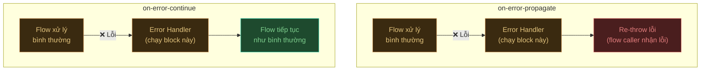
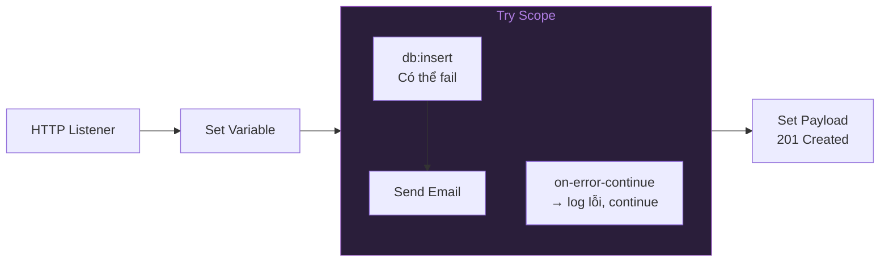
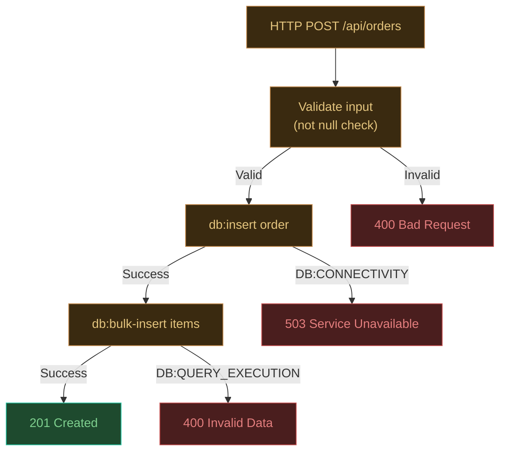

## Tại sao cần error handling?

Không có error handling, đây là những gì client nhận được khi gặp lỗi:

```json
// ❌ Response mặc định khi không có error handler
{
  "statusCode": 500,
  "message": "com.mysql.cj.jdbc.exceptions.CommunicationsException: Communications link failure\n\tat sun.reflect.NativeConstructorAccessorImpl...\n\t[100 more lines...]"
}
```

Stack trace Java lộ ra ngoài: không chuyên nghiệp, tiết lộ thông tin nội bộ, khiến client không biết phải làm gì.

Với error handling tốt:

```json
// ✅ Response sau khi có error handler
{
  "code": "DATABASE_UNAVAILABLE",
  "message": "Service temporarily unavailable. Please try again in a few minutes.",
  "timestamp": "2024-01-15T08:30:00",
  "requestId": "c9a3b2d1-..."
}
```

---

## Cấu trúc lỗi trong Mule

Khi lỗi xảy ra, Mule tạo một **Error object** có thể truy cập qua `error`:

```
error.errorType.namespace    → "HTTP", "DB", "MULE"...
error.errorType.identifier  → "CONNECTIVITY", "QUERY_EXECUTION"...
error.description            → mô tả lỗi dạng String
error.cause                  → exception object Java gốc
error.errorMessage           → Mule Message tại thời điểm lỗi
```

```dataweave
// Ví dụ dùng trong error handler
error.errorType.namespace ++ ":" ++ error.errorType.identifier
// → "DB:CONNECTIVITY"

error.description
// → "Cannot get a connection, pool error Timeout waiting for connection from pool"
```

### Error types hay gặp

| Error Type | Nguyên nhân |
|:---|:---|
| `HTTP:CONNECTIVITY` | Không kết nối được server đích |
| `HTTP:UNAUTHORIZED` | Response 401 từ server đích |
| `HTTP:NOT_FOUND` | Response 404 từ server đích |
| `HTTP:TIMEOUT` | Request hết thời gian chờ |
| `DB:CONNECTIVITY` | Không kết nối được database |
| `DB:QUERY_EXECUTION` | SQL error (syntax, constraint...) |
| `MULE:EXPRESSION` | DataWeave expression lỗi |
| `MULE:ROUTING` | Không tìm thấy flow để route |
| `VALIDATION:INVALID_INPUT` | Validation component fail |
| `ANY` | Bắt tất cả error |

---

## on-error-propagate vs on-error-continue

Đây là điểm khác biệt quan trọng nhất trong error handling Mule:



| | `on-error-propagate` | `on-error-continue` |
|:---|:---:|:---:|
| Chạy block error handler | ✅ | ✅ |
| Re-throw lỗi ra ngoài | ✅ | ❌ |
| Flow caller nhận lỗi | ✅ | ❌ |
| Response về client | Lỗi (4xx/5xx) | Payload từ error handler |
| **Khi dùng** | Báo lỗi cho client | Fallback / graceful degradation |

---

## Error Handler cấp Flow

Thêm vào cuối mỗi flow để bắt lỗi từ flow đó:

```xml title="Ví dụ đầy đủ — GET /api/orders"
<flow name="get-orders-flow">

  <http:listener config-ref="HTTP_Listener_config" path="/api/orders"/>

  <db:select config-ref="Database_Config">
    <db:sql>SELECT * FROM orders WHERE status = :status</db:sql>
    <db:input-parameters>#[{status: attributes.queryParams.status default "ACTIVE"}]</db:input-parameters>
  </db:select>

  <ee:transform>
    <ee:message>
      <ee:set-payload><![CDATA[%dw 2.0
output application/json
---
payload map { id: $.id, status: $.status }]]>
      </ee:set-payload>
    </ee:message>
  </ee:transform>

  <!-- Error Handler cho flow này -->
  <error-handler>

    <!-- Lỗi kết nối DB → trả về 503 -->
    <on-error-propagate type="DB:CONNECTIVITY">
      <ee:transform>
        <ee:message>
          <ee:set-payload><![CDATA[%dw 2.0
output application/json
---
{
  code: "DATABASE_UNAVAILABLE",
  message: "Database is temporarily unavailable. Please try again later.",
  timestamp: now() as String {format: "yyyy-MM-dd'T'HH:mm:ss"}
}]]>
          </ee:set-payload>
        </ee:message>
        <ee:variables>
          <ee:set-variable variableName="httpStatus">503</ee:set-variable>
        </ee:variables>
      </ee:transform>
    </on-error-propagate>

    <!-- Lỗi SQL → trả về 400 -->
    <on-error-propagate type="DB:QUERY_EXECUTION">
      <ee:transform>
        <ee:message>
          <ee:set-payload><![CDATA[%dw 2.0
output application/json
---
{
  code: "INVALID_QUERY",
  message: "Invalid request parameters.",
  timestamp: now() as String {format: "yyyy-MM-dd'T'HH:mm:ss"}
}]]>
          </ee:set-payload>
        </ee:message>
        <ee:variables>
          <ee:set-variable variableName="httpStatus">400</ee:set-variable>
        </ee:variables>
      </ee:transform>
    </on-error-propagate>

    <!-- Bắt tất cả lỗi còn lại → 500 -->
    <on-error-propagate type="ANY">
      <logger level="ERROR" message="#['Unhandled error: ' ++ error.description]"/>
      <ee:transform>
        <ee:message>
          <ee:set-payload><![CDATA[%dw 2.0
output application/json
---
{
  code: "INTERNAL_ERROR",
  message: "An unexpected error occurred. Please contact support.",
  timestamp: now() as String {format: "yyyy-MM-dd'T'HH:mm:ss"}
}]]>
          </ee:set-payload>
        </ee:message>
        <ee:variables>
          <ee:set-variable variableName="httpStatus">500</ee:set-variable>
        </ee:variables>
      </ee:transform>
    </on-error-propagate>

  </error-handler>

</flow>
```

---

## Global Error Handler — Xử lý chung cho toàn app

Thay vì lặp error handler ở mỗi flow, tạo một Global Error Handler dùng chung:

1. Tab **Global Elements** → **Create...**
2. Tìm **Error Handler** → **OK**
3. Đặt tên: `Global_Error_Handler`

```xml title="Global Error Handler"
<error-handler name="Global_Error_Handler">

  <on-error-propagate type="HTTP:UNAUTHORIZED">
    <ee:transform>
      <ee:message>
        <ee:set-payload><![CDATA[%dw 2.0
output application/json
---
{code: "UNAUTHORIZED", message: "Authentication required."}]]>
        </ee:set-payload>
      </ee:message>
      <ee:variables>
        <ee:set-variable variableName="httpStatus">401</ee:set-variable>
      </ee:variables>
    </ee:transform>
  </on-error-propagate>

  <on-error-propagate type="ANY">
    <logger level="ERROR" message="#[error.description]"/>
    <ee:transform>
      <ee:message>
        <ee:set-payload><![CDATA[%dw 2.0
output application/json
---
{
  code: "INTERNAL_ERROR",
  message: "An unexpected error occurred.",
  timestamp: now() as String {format: "yyyy-MM-dd'T'HH:mm:ss"}
}]]>
        </ee:set-payload>
      </ee:message>
      <ee:variables>
        <ee:set-variable variableName="httpStatus">500</ee:set-variable>
      </ee:variables>
    </ee:transform>
  </on-error-propagate>

</error-handler>
```

Gắn vào mỗi flow:
```xml
<flow name="my-flow" errorHandlerRef="Global_Error_Handler">
  ...
</flow>
```

---

## Try Scope — Isolate lỗi trong một block

Khi chỉ muốn catch lỗi từ một phần của flow, dùng **Try scope**:



```xml
<try>
  <!-- Chỉ block này được wrap trong try -->
  <db:insert config-ref="Database_Config">
    <db:sql>INSERT INTO audit_log (action, user_id) VALUES (:action, :userId)</db:sql>
    <db:input-parameters>#[{action: "ORDER_CREATED", userId: vars.userId}]</db:input-parameters>
  </db:insert>

  <error-handler>
    <!-- Lỗi ghi audit log → không ảnh hưởng main flow -->
    <on-error-continue type="DB:CONNECTIVITY">
      <logger level="WARN" message="Failed to write audit log, continuing..."/>
    </on-error-continue>
  </error-handler>
</try>
```

---

## Pattern: Chuẩn hóa error response

Tạo một error response format nhất quán cho toàn bộ API:

```dataweave
%dw 2.0
output application/json
---
{
  // Error code dạng SCREAMING_SNAKE_CASE
  code: (error.errorType.namespace ++ "_" ++ error.errorType.identifier),

  // Message thân thiện (không expose technical details)
  message: "An error occurred while processing your request.",

  // Timestamp để dễ trace trong log
  timestamp: now() as String {format: "yyyy-MM-dd'T'HH:mm:ssZ"},

  // Correlation ID để tracking (Mule tự tạo)
  requestId: correlationId
}
```

---

## Until Successful — Retry tự động

Dùng khi muốn retry operation nếu fail (ví dụ: gọi external API không ổn định):

```xml
<until-successful maxRetries="3" millisBetweenRetries="5000">
  <!-- Retry tối đa 3 lần, cách nhau 5 giây -->
  <http:request config-ref="HTTP_Request_config"
                method="POST"
                path="/external/process"/>
</until-successful>
```

Sau `maxRetries` lần thất bại, throw `MULE:RETRY_EXHAUSTED`.

---

## Ví dụ hoàn chỉnh — POST /api/orders với full error handling



**Flow tóm tắt:**

1. Nhận request → validate payload (Validation module)
2. Nếu validation fail → `VALIDATION:INVALID_INPUT` → error handler → 400
3. Insert order vào DB → nếu DB down → 503
4. Bulk insert items → nếu data lỗi → 400
5. Mọi thứ OK → trả về 201

---

## Cheat sheet Error Handling

| Tình huống | Handler | Status Code |
|:---|:---|:---:|
| Database không connect được | `DB:CONNECTIVITY` → `on-error-propagate` | 503 |
| SQL lỗi / constraint violation | `DB:QUERY_EXECUTION` → `on-error-propagate` | 400 |
| Request tới external API bị 401 | `HTTP:UNAUTHORIZED` → `on-error-propagate` | 401 |
| External API timeout | `HTTP:TIMEOUT` → retry → 504 | 504 |
| DataWeave expression lỗi | `MULE:EXPRESSION` → `on-error-propagate` | 500 |
| Input thiếu field bắt buộc | `VALIDATION:INVALID_INPUT` → `on-error-propagate` | 400 |
| Lỗi không xác định | `ANY` → log + `on-error-propagate` | 500 |
| Lỗi audit/non-critical | `ANY` → `on-error-continue` | (tiếp tục) |

---

:::tip Học thêm gì tiếp theo?
Bạn đã nắm được nền tảng MuleSoft: cài đặt, flow, DataWeave, database và error handling. Các chủ đề nâng cao tiếp theo:
- **API Manager** — thêm authentication policy, rate limiting
- **Anypoint MQ** — xử lý bất đồng bộ với message queue
- **Batch Processing** — xử lý file lớn hàng triệu records
- **CloudHub deployment** — deploy lên production
:::
