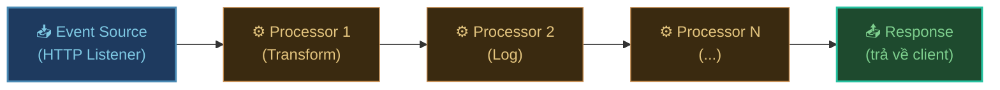
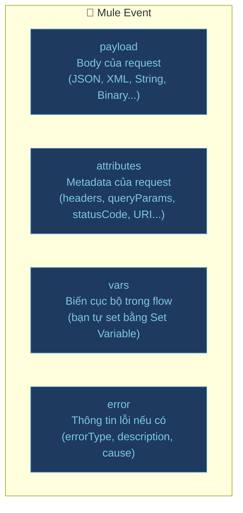

## Mục tiêu bài này

Kết thúc bài này bạn sẽ tạo được một HTTP API:
- `GET /api/hello` → trả về `{"message": "Hello, MuleSoft!"}`
- `GET /api/hello?name=Huan` → trả về `{"message": "Hello, Huan!"}`

---

## Flow là gì?

**Flow** là đơn vị xử lý cơ bản trong Mule — một pipeline nhận event vào, xử lý qua từng component, rồi trả về kết quả.



Khi HTTP Listener nhận request → tạo **Mule Event** → event đi qua từng component → response trả về client.

---

## Mule Event — Trái tim của Mule

Mỗi lần có request đến, Mule tạo một **Mule Event** chứa toàn bộ thông tin:



```
payload                         → body của request (sau khi parse)
attributes.headers              → {"Content-Type": "application/json", ...}
attributes.queryParams          → {"name": "Huan", "page": "1"}
attributes.uriParams            → {"id": "123"} (từ path /orders/{id})
attributes.method               → "GET"
attributes.requestPath          → "/api/hello"
vars.myVariable                 → giá trị bạn đã set bằng Set Variable
```

---

## Tạo project mới

1. **File** → **New** → **Mule Project**
2. Project Name: `hello-api`
3. Mule Runtime: chọn phiên bản mới nhất
4. Click **Finish**

---

## Bước 1 — Thêm HTTP Listener

HTTP Listener là event source — lắng nghe HTTP request đến.

### Tạo HTTP Listener Config (dùng chung)

1. Tab **Global Elements** → **Create...**
2. Tìm **HTTP Listener config** → **OK**
3. Điền:
   - **Name**: `HTTP_Listener_config`
   - **Host**: `0.0.0.0`
   - **Port**: `8081`
4. Click **OK**

### Thêm HTTP Listener vào flow

1. Trong Mule Palette, tìm **HTTP** → kéo **Listener** vào Canvas
2. Trong Properties Panel:
   - **Connector configuration**: chọn `HTTP_Listener_config`
   - **Path**: `/api/hello`
   - **Allowed Methods**: `GET`

---

## Bước 2 — Thêm Set Payload

Set Payload thay đổi `payload` của Mule Event — đây là nội dung trả về cho client.

1. Trong Palette, tìm **Core** → **Set Payload**
2. Kéo vào Canvas, sau HTTP Listener
3. Trong Properties:
   - **Value**: click icon `fx` để nhập DataWeave expression
   - Nhập: `output application/json --- {"message": "Hello, MuleSoft!"}`
   - **MIME Type**: `application/json`

Flow hiện tại:
```
[HTTP Listener: GET /api/hello] ──► [Set Payload: {"message": "Hello, MuleSoft!"}]
```

---

## Bước 3 — Chạy và test

### Chạy app

Click chuột phải project → **Run As** → **Mule Application**

Đợi Console hiện:
```
INFO ... **** Mule is up and kicking (listening on: http://0.0.0.0:8081)
```

### Test bằng curl

```bash
curl http://localhost:8081/api/hello
```

Kết quả:
```json
{"message": "Hello, MuleSoft!"}
```

### Test bằng Postman

1. Method: `GET`
2. URL: `http://localhost:8081/api/hello`
3. Click **Send**

---

## Bước 4 — Đọc query parameter

Thêm tính năng: nếu có `?name=Huan` thì trả về `Hello, Huan!`, không có thì trả về `Hello, MuleSoft!`.

### Sửa Set Payload

Click vào **Set Payload**, đổi Value thành:

```dataweave
output application/json
---
{
  message: "Hello, " ++ (attributes.queryParams.name default "MuleSoft") ++ "!"
}
```

Giải thích:
- `attributes.queryParams.name` — đọc query param `?name=`
- `default "MuleSoft"` — nếu không có `name` thì dùng `"MuleSoft"`
- `++` — nối string trong DataWeave

### Test lại

```bash
# Không có name
curl http://localhost:8081/api/hello
# → {"message": "Hello, MuleSoft!"}

# Có name
curl "http://localhost:8081/api/hello?name=Huan"
# → {"message": "Hello, Huan!"}
```

---

## Bước 5 — Thêm Logger để debug

Logger giúp in thông tin ra Console khi flow chạy.

1. Kéo **Logger** (trong Core) vào sau HTTP Listener, trước Set Payload
2. Trong Properties:
   - **Message**: `#["\n→ Request: " ++ attributes.method ++ " " ++ attributes.requestPath ++ "\n→ QueryParams: " ++ write(attributes.queryParams, "application/json")]`
   - **Level**: `INFO`

Flow đầy đủ:
```
[HTTP Listener] ──► [Logger] ──► [Set Payload]
```

Khi gọi API, Console sẽ in:
```
INFO ... → Request: GET /api/hello
         → QueryParams: {"name":"Huan"}
```

---

## Nhìn vào XML phía sau

Chuyển sang tab **Configuration XML** để xem file XML mà Studio tạo ra:

```xml title="hello-api.xml"
<?xml version="1.0" encoding="UTF-8"?>
<mule xmlns="http://www.mulesoft.org/schema/mule/core"
      xmlns:http="http://www.mulesoft.org/schema/mule/http"
      ...>

  <!-- Global Config — dùng chung -->
  <http:listener-config name="HTTP_Listener_config">
    <http:listener-connection host="0.0.0.0" port="8081"/>
  </http:listener-config>

  <!-- Flow -->
  <flow name="hello-apiFlow">

    <!-- Event Source -->
    <http:listener config-ref="HTTP_Listener_config"
                   path="/api/hello"
                   allowedMethods="GET"/>

    <!-- Logger -->
    <logger level="INFO"
            message='#["→ Request: " ++ attributes.method]'/>

    <!-- Set Payload -->
    <set-payload mimeType="application/json">
      <![CDATA[%dw 2.0
output application/json
---
{
  message: "Hello, " ++ (attributes.queryParams.name default "MuleSoft") ++ "!"
}]]>
    </set-payload>

  </flow>

</mule>
```

Bạn có thể chỉnh sửa trực tiếp XML hoặc dùng giao diện kéo thả — cả hai đều hợp lệ.

---

## Mở rộng — Path parameter

Thay vì query param `?name=Huan`, dùng path param `/api/hello/Huan`:

1. Sửa HTTP Listener path thành: `/api/hello/{name}`
2. Sửa Set Payload:

```dataweave
output application/json
---
{
  message: "Hello, " ++ (attributes.uriParams.name default "MuleSoft") ++ "!"
}
```

```bash
curl http://localhost:8081/api/hello/Huan
# → {"message": "Hello, Huan!"}
```

---

## Cheat sheet Mule Event

| Truy cập | DataWeave expression |
|:---|:---|
| Body request | `payload` |
| Query param `?page=2` | `attributes.queryParams.page` |
| Path param `/{id}` | `attributes.uriParams.id` |
| HTTP header | `attributes.headers['Content-Type']` |
| HTTP method | `attributes.method` |
| Request URI | `attributes.requestPath` |
| Variable đã set | `vars.myVar` |
| Correlation ID | `correlationId` |

---

:::tip Bước tiếp theo
Flow Hello World chỉ trả về dữ liệu cứng. Trong thực tế, bạn cần biến đổi dữ liệu từ nhiều nguồn khác nhau — đó là lúc cần [DataWeave](../dataweave-co-ban).
:::
