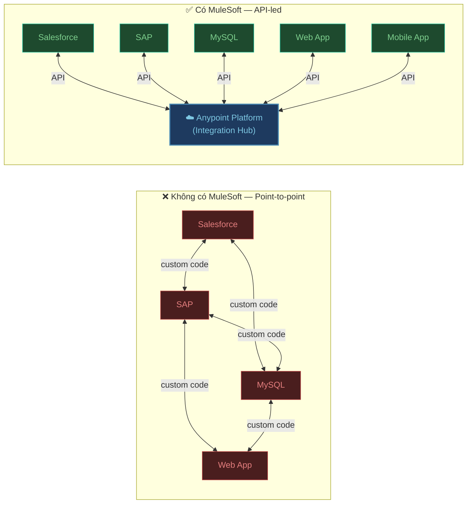
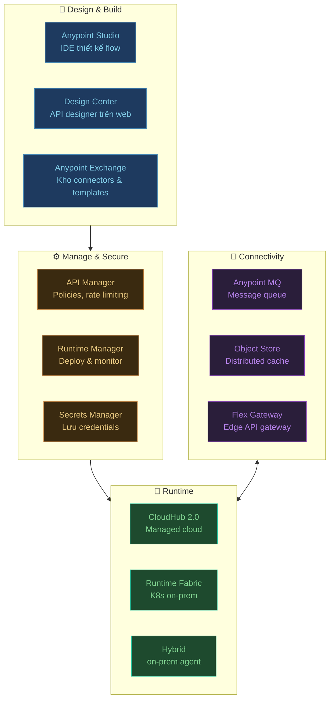
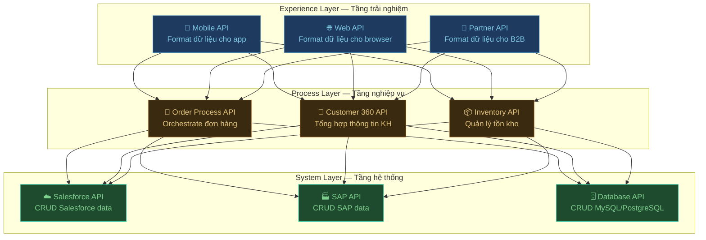

Trong bất kỳ doanh nghiệp nào cũng có bài toán kinh điển này:

> *"Salesforce lưu thông tin khách hàng. SAP lưu đơn hàng. MySQL lưu lịch sử thanh toán. Ba hệ thống không nói chuyện được với nhau."*

Kết quả: nhân viên phải copy-paste thủ công, dữ liệu bị lệch, báo cáo sai, và mỗi lần muốn kết nối thêm một hệ thống mới lại phải viết integration code từ đầu.

**MuleSoft** ra đời để giải quyết đúng vấn đề này.

## MuleSoft là gì?

MuleSoft là nền tảng tích hợp doanh nghiệp (Integration Platform as a Service — iPaaS) cho phép bạn kết nối các ứng dụng, dữ liệu và thiết bị thông qua **API**. Thay vì viết integration point-to-point giữa từng cặp hệ thống, MuleSoft cung cấp một lớp trung gian — **Anypoint Platform** — nơi tất cả hệ thống giao tiếp theo chuẩn thống nhất.



Thêm một hệ thống mới? Chỉ cần kết nối nó vào Anypoint Platform — không cần sửa code các hệ thống khác.

---

## Anypoint Platform — Bộ công cụ đầy đủ



---

## Kiến trúc API-led Connectivity

Đây là pattern kiến trúc đặc trưng và quan trọng nhất của MuleSoft — chia integration thành 3 lớp độc lập:



| Lớp | Nhiệm vụ | Ai dùng? |
|:---|:---|:---|
| **System APIs** | Bọc từng hệ thống gốc, expose CRUD chuẩn | Backend developers |
| **Process APIs** | Kết hợp nhiều System APIs, implement business logic | Integration developers |
| **Experience APIs** | Format data cho từng kênh (mobile, web, partner) | Frontend / partner teams |

**Lợi ích:** Thay đổi database từ MySQL sang PostgreSQL? Chỉ sửa System API — Process và Experience APIs không cần đụng đến.

---

## MuleSoft vs các giải pháp khác

| Giải pháp | Ưu điểm | Nhược điểm | Khi nào chọn |
|:---|:---|:---|:---|
| **REST thuần (code tay)** | Linh hoạt, không overhead | Mỗi integration = code mới, khó maintain | Team nhỏ, 1-2 integrations đơn giản |
| **ESB truyền thống** (WSO2, IBM MQ) | Ổn định, enterprise-grade | Nặng, cấu hình phức tạp, XML heavy | Legacy enterprise, đã đầu tư hạ tầng |
| **MuleSoft** | API-first, 1000+ connectors, low-code | Chi phí license cao, learning curve | Enterprise nhiều hệ thống, cần governance |
| **Azure Logic Apps** | Serverless, tích hợp Azure | Vendor lock-in, debug khó | Đã dùng Azure, integration đơn giản |
| **Apache Camel** | Open source, linh hoạt | Cần code Java nhiều | Java team mạnh, không muốn tốn license |

---

## Lộ trình học 5 tuần

| Tuần | Chủ đề | Bài | Kỹ năng đạt được |
|:---|:---|:---|:---|
| **Tuần 1** | Setup | [Cài đặt](./cai-dat), [Giao diện](./giao-dien) | Cài Anypoint Studio, hiểu UI và project structure |
| **Tuần 2** | Flow cơ bản | [Flow đầu tiên](./flow-dau-tien) | Tạo HTTP API, test bằng Postman |
| **Tuần 3** | DataWeave | [DataWeave cơ bản](./dataweave-co-ban) | Transform JSON/XML, map, filter, reduce |
| **Tuần 4** | Database | [Kết nối Database](./ket-noi-database) | CRUD database, parameterized query, properties |
| **Tuần 5** | Reliability | [Error Handling](./error-handling) | Xử lý lỗi, retry, log, custom error response |

---

## Use cases thực tế

### Salesforce ↔ SAP Integration
```
[SAP: Order Created] → MuleSoft → [Transform data] → [Salesforce: Create Opportunity]
[Salesforce: Account Updated] → MuleSoft → [Sync] → [SAP: Update Customer Master]
```

### Nightly Data Warehouse Load
```
[MySQL CRM]    ─┐
[Salesforce]   ─┼─► MuleSoft Batch Job ──► [Snowflake DW]
[REST API]     ─┘    (transform, dedupe, load)
                          ↓ 2:00 AM daily
```

### Real-time Event Processing
```
[Web App: Order Placed]
    → HTTP POST → MuleSoft
        → Anypoint MQ (async)
            → Inventory Service (deduct stock)
            → Email Service (confirmation)
            → Salesforce (create Opportunity)
```

---

:::tip Tài khoản Anypoint miễn phí
MuleSoft cung cấp **Anypoint Platform free tier** với CloudHub 0.1 vCPU — đủ để học và deploy ứng dụng nhỏ. Đăng ký tại [anypoint.mulesoft.com](https://anypoint.mulesoft.com) bằng email công ty hoặc cá nhân.
:::
