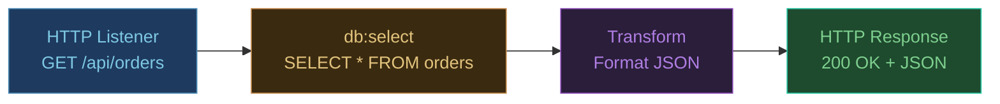
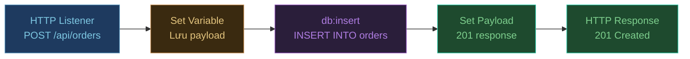

## Database Connector là gì?

**Database Connector** cho phép Mule app kết nối và thao tác với database quan hệ (MySQL, PostgreSQL, Oracle, MS SQL Server...) thông qua JDBC. Connector hỗ trợ:

- `db:select` — truy vấn dữ liệu
- `db:insert` / `db:update` / `db:delete` — thay đổi dữ liệu
- `db:bulk-insert` — insert nhiều record cùng lúc
- `db:stored-procedure` — gọi stored procedure

---

## Bước 1 — Thêm dependency vào pom.xml

### MySQL

```xml title="pom.xml"
<dependencies>
  <!-- Database Connector -->
  <dependency>
    <groupId>org.mule.connectors</groupId>
    <artifactId>mule-db-connector</artifactId>
    <version>1.14.6</version>
    <classifier>mule-plugin</classifier>
  </dependency>

  <!-- MySQL JDBC Driver -->
  <dependency>
    <groupId>com.mysql</groupId>
    <artifactId>mysql-connector-j</artifactId>
    <version>8.3.0</version>
  </dependency>
</dependencies>
```

### PostgreSQL

```xml title="pom.xml"
<!-- PostgreSQL JDBC Driver (thay MySQL driver) -->
<dependency>
  <groupId>org.postgresql</groupId>
  <artifactId>postgresql</artifactId>
  <version>42.7.3</version>
</dependency>
```

Sau khi thêm, Maven tự động download. Nếu Studio không nhận, click chuột phải project → **Maven** → **Update Project**.

---

## Bước 2 — Cấu hình properties file

Không hardcode credentials trong flow XML. Đặt vào `application.properties`:

```properties title="src/main/resources/application.properties"
# HTTP
http.port=8081

# Database
db.host=localhost
db.port=3306
db.name=myapp_db
db.user=mule_user
db.password=secret123
```

:::warning Credentials trong production
Trên CloudHub, đặt các property nhạy cảm trong **Runtime Manager → Properties** và khai báo trong `mule-artifact.json`:

```json title="mule-artifact.json"
{
  "minMuleVersion": "4.6.0",
  "secureProperties": ["db.password"]
}
```

Giá trị sẽ được ẩn trong dashboard và mã hóa khi lưu trữ.
:::

---

## Bước 3 — Tạo Database Config (Global Element)

1. Tab **Global Elements** → **Create...**
2. Tìm **Database Config** → **OK**
3. Click **Configure...** bên cạnh Connection

### MySQL Connection

```
Connection: MySQL Connection
Host: ${db.host}
Port: ${db.port}
User: ${db.user}
Password: ${db.password}
Database: ${db.name}
```

### PostgreSQL Connection

```
Connection: Generic Connection
URL: jdbc:postgresql://${db.host}:${db.port}/${db.name}
Driver Class Name: org.postgresql.Driver
User: ${db.user}
Password: ${db.password}
```

4. Click **Test Connection** để kiểm tra kết nối
5. Click **OK**

---

## Bước 4 — Flow đọc dữ liệu (GET API)

**Mục tiêu:** `GET /api/orders` → query database → trả về JSON



### Thêm Database Select

1. Kéo **Database** → **Select** vào flow, sau HTTP Listener
2. Properties:
   - **Connector configuration**: chọn Database Config đã tạo
   - **SQL Query Text**:

```sql
SELECT id, customer_name, status, total_amount, created_at
FROM orders
WHERE status = :status
ORDER BY created_at DESC
LIMIT 100
```

3. **Input Parameters** (dùng parameterized query — bảo vệ SQL injection):

```dataweave
{
  status: attributes.queryParams.status default "ACTIVE"
}
```

:::danger Không bao giờ string-concat SQL
```dataweave
// ❌ SAI — SQL injection vulnerability
"SELECT * FROM orders WHERE status = '" ++ attributes.queryParams.status ++ "'"

// ✅ ĐÚNG — parameterized query
// SQL: WHERE status = :status
// Input params: { status: attributes.queryParams.status }
```
:::

### Transform kết quả về JSON

Sau `db:select`, `payload` là **array of objects** (mỗi object là một row).

```dataweave
%dw 2.0
output application/json
---
payload map {
  id: $.id,
  customer: $.customer_name,
  status: $.status,
  total: $.total_amount,
  createdAt: $.created_at as String {format: "dd/MM/yyyy"}
}
```

### Test

```bash
curl "http://localhost:8081/api/orders"
curl "http://localhost:8081/api/orders?status=SHIPPED"
```

---

## Bước 5 — Flow ghi dữ liệu (POST API)

**Mục tiêu:** `POST /api/orders` với body JSON → insert vào database → trả về 201 Created



**Request body:**
```json
{
  "customerName": "Tran Thi B",
  "customerEmail": "b@example.com",
  "items": [
    {"sku": "PROD-001", "qty": 3, "price": 150000}
  ]
}
```

### Set Variable — Lưu request payload

Vì `db:insert` sẽ thay đổi payload, cần lưu request body vào variable trước:

1. Kéo **Set Variable** vào sau HTTP Listener
2. Properties:
   - **Name**: `requestBody`
   - **Value**: `payload`

### Database Insert

1. Kéo **Database** → **Insert** vào flow
2. SQL:

```sql
INSERT INTO orders (customer_name, customer_email, status, total_amount, created_at)
VALUES (:customerName, :customerEmail, 'PENDING',
        :totalAmount, NOW())
```

3. Input Parameters:

```dataweave
{
  customerName: vars.requestBody.customerName,
  customerEmail: vars.requestBody.customerEmail,
  totalAmount: vars.requestBody.items reduce ((item, acc = 0) ->
    acc + (item.qty * item.price))
}
```

### Set Payload — Response 201

```dataweave
%dw 2.0
output application/json
---
{
  success: true,
  message: "Order created successfully",
  generatedKeys: payload.generatedKeys   // ID vừa insert
}
```

### Cấu hình HTTP response status 201

Click vào HTTP Listener → tab **Responses**:
- **Success Status Code**: `201`

### Test

```bash
curl -X POST http://localhost:8081/api/orders \
  -H "Content-Type: application/json" \
  -d '{
    "customerName": "Tran Thi B",
    "customerEmail": "b@example.com",
    "items": [{"sku": "PROD-001", "qty": 3, "price": 150000}]
  }'
```

---

## Bulk Insert — Insert nhiều record cùng lúc

Khi cần import hàng nghìn records, dùng `db:bulk-insert` thay vì loop insert từng cái:

```xml
<db:bulk-insert config-ref="Database_Config" doc:name="Bulk Insert Orders">
  <db:sql>INSERT INTO order_items (order_id, sku, qty, price)
          VALUES (:orderId, :sku, :qty, :price)</db:sql>
</db:bulk-insert>
```

Input phải là **array** — mỗi element là một object với các param:

```dataweave
%dw 2.0
output application/java
---
vars.requestBody.items map {
  orderId: vars.newOrderId,
  sku: $.sku,
  qty: $.qty,
  price: $.price
}
```

`db:bulk-insert` tự động dùng **JDBC batch** → hiệu suất gấp 10-50x so với insert từng cái.

---

## Transaction — Đảm bảo toàn vẹn dữ liệu

Khi cần insert vào 2 bảng cùng lúc (hoặc rollback nếu lỗi):

```xml title="flow XML"
<try transactionalAction="ALWAYS_BEGIN">

  <!-- Tạo order header -->
  <db:insert config-ref="Database_Config">
    <db:sql>INSERT INTO orders (customer_name) VALUES (:name)</db:sql>
    <db:input-parameters>#[{name: vars.requestBody.customerName}]</db:input-parameters>
  </db:insert>

  <set-variable variableName="orderId" value="#[payload.generatedKeys[0]]"/>

  <!-- Insert order items -->
  <db:bulk-insert config-ref="Database_Config">
    <db:sql>INSERT INTO order_items (order_id, sku, qty) VALUES (:orderId, :sku, :qty)</db:sql>
  </db:bulk-insert>

  <error-handler>
    <on-error-propagate type="ANY">
      <!-- Transaction tự động rollback -->
      <logger level="ERROR" message="#['DB transaction failed: ' ++ error.description]"/>
    </on-error-propagate>
  </error-handler>

</try>
```

---

## Cheat sheet Database Connector

| Operation | Component | Kết quả trong `payload` |
|:---|:---|:---|
| Đọc nhiều row | `db:select` | Array of objects |
| Đọc 1 row | `db:select` + filter | Array (lấy `payload[0]`) |
| Insert | `db:insert` | `{generatedKeys: [...]}` |
| Update | `db:update` | `{affectedRows: N}` |
| Delete | `db:delete` | `{affectedRows: N}` |
| Bulk insert | `db:bulk-insert` | `{affectedRows: N}` |

---

:::tip Bước tiếp theo
Database query có thể fail vì nhiều lý do — connection timeout, SQL error, constraint violation. Hãy đọc [Error Handling](../error-handling) để xử lý các trường hợp này một cách chuyên nghiệp.
:::
