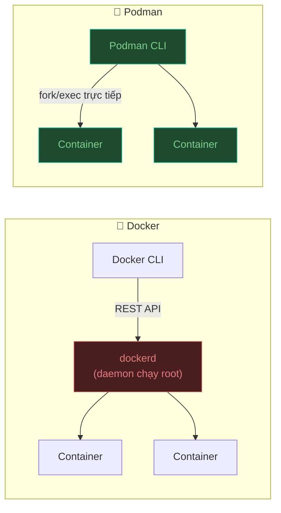
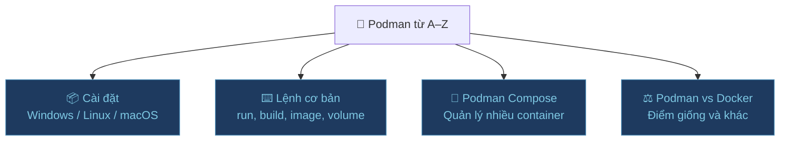

## Podman là gì?

**Podman** (Pod Manager) là một container engine mã nguồn mở do Red Hat phát triển, dùng để tạo và quản lý container theo chuẩn OCI — **không cần chạy daemon nền, không cần quyền root**.



Điểm khác biệt cốt lõi so với Docker:

| | Docker | Podman |
|:---|:---:|:---:|
| Cần daemon chạy nền | ✅ | ❌ |
| Hỗ trợ rootless | Một phần | ✅ Mặc định |
| Tương thích Docker CLI | — | ✅ (`alias docker=podman`) |
| Hỗ trợ Pod (nhóm container) | ❌ | ✅ |
| Tích hợp systemd | Hạn chế | ✅ |

---

## Tại sao dùng Podman?

### 1. Bảo mật hơn — rootless by default

Docker daemon chạy với quyền `root`. Nếu container bị tấn công, kẻ xấu có thể leo thang lên root của máy host.

Podman chạy container với **quyền của user hiện tại** — không cần root, không có daemon.

### 2. Không có Single Point of Failure

Docker daemon chết → tất cả container chết theo.  
Podman không có daemon → mỗi container là một process độc lập.

### 3. Tương thích hoàn toàn với Docker

```bash
# Dùng alias để thay thế docker bằng podman
alias docker=podman

# Toàn bộ lệnh Docker chạy được với Podman
podman run -d -p 8080:80 nginx
podman build -t my-app .
podman compose up -d
```

### 4. Hỗ trợ Pod — giống Kubernetes

Podman có khái niệm **Pod** (nhóm container dùng chung network namespace), tương tự Kubernetes Pod — giúp học Kubernetes dễ hơn.

---

## Nội dung series



| Bài | Nội dung |
|:---|:---|
| [Cài đặt trên Windows](./cai-dat-windows) | Cài Podman bằng winget trên PowerShell |
| [Lệnh cơ bản](./lenh-co-ban) | Image, container, volume, network |
| [Podman Compose](./podman-compose) | Quản lý nhiều container với file YAML |
| [Podman vs Docker](./so-sanh-docker) | So sánh chi tiết, khi nào dùng cái nào |

---

:::tip Đã biết Docker?
Nếu bạn đã quen với Docker, có thể bỏ qua phần lý thuyết và đọc thẳng [Podman vs Docker](./so-sanh-docker) để nắm sự khác biệt, rồi bắt đầu từ [lệnh cơ bản](./lenh-co-ban).
:::
