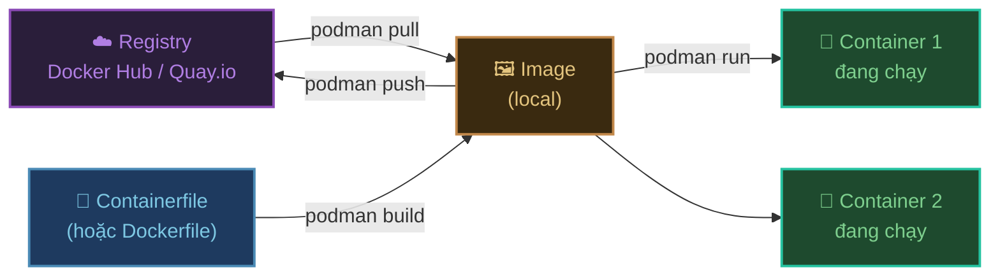
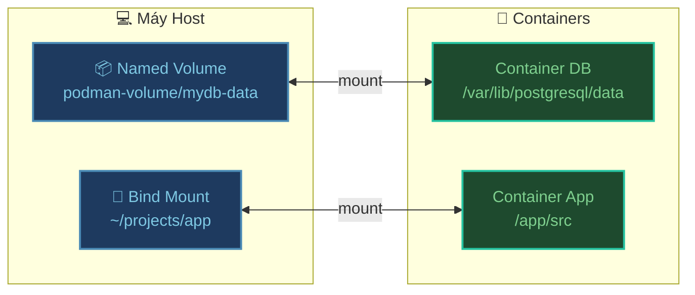

## Tổng quan luồng làm việc



---

## Làm việc với Image

### Kéo image từ registry

```bash
# Kéo image từ Docker Hub
podman pull nginx
podman pull nginx:alpine          # Chỉ định tag
podman pull node:20-alpine

# Kéo từ Quay.io (Red Hat registry)
podman pull quay.io/podman/hello

# Tìm kiếm image
podman search nginx
podman search --filter is-official=true nginx
```

### Xem và quản lý image

```bash
# Xem danh sách image
podman images

# Xem chi tiết image
podman inspect nginx

# Xem lịch sử layer của image
podman history nginx

# Xóa image
podman rmi nginx
podman rmi nginx:alpine

# Xóa tất cả image không dùng
podman image prune

# Xóa toàn bộ image (⚠️ cẩn thận)
podman rmi --all
```

---

## Làm việc với Container

### Chạy container

```bash
# Chạy và in output ra terminal (foreground)
podman run nginx

# Chạy ngầm (detached)
podman run -d nginx

# Đặt tên container
podman run -d --name my-nginx nginx

# Map port: host_port:container_port
podman run -d -p 8080:80 --name my-nginx nginx
# → Truy cập http://localhost:8080

# Tự xóa container sau khi dừng
podman run --rm nginx echo "Hello Podman"

# Chạy với biến môi trường
podman run -d \
  --name my-postgres \
  -e POSTGRES_PASSWORD=secret \
  -e POSTGRES_DB=mydb \
  -p 5432:5432 \
  postgres:15

# Vào terminal tương tác
podman run -it ubuntu bash
podman run -it node:20-alpine sh
```

### Xem trạng thái container

```bash
# Xem container đang chạy
podman ps

# Xem tất cả container (kể cả đã dừng)
podman ps -a

# Xem chi tiết container
podman inspect my-nginx

# Xem tài nguyên đang dùng (CPU, RAM)
podman stats

# Xem tiến trình trong container
podman top my-nginx
```

### Điều khiển container

```bash
# Dừng container (graceful — gửi SIGTERM)
podman stop my-nginx

# Dừng ngay lập tức (SIGKILL)
podman kill my-nginx

# Khởi động lại
podman restart my-nginx

# Xóa container (phải dừng trước)
podman rm my-nginx

# Dừng rồi xóa luôn
podman rm -f my-nginx

# Xóa tất cả container đã dừng
podman container prune
```

### Xem log và debug

```bash
# Xem log
podman logs my-nginx

# Follow log real-time
podman logs -f my-nginx

# Xem 50 dòng log cuối
podman logs --tail 50 my-nginx

# Vào shell của container đang chạy
podman exec -it my-nginx bash
podman exec -it my-nginx sh      # Nếu không có bash

# Chạy lệnh trong container
podman exec my-nginx cat /etc/nginx/nginx.conf

# Copy file giữa host và container
podman cp my-nginx:/etc/nginx/nginx.conf ./nginx.conf
podman cp ./custom.conf my-nginx:/etc/nginx/conf.d/
```

---

## Viết Containerfile (tương đương Dockerfile)

Podman dùng **Containerfile** làm chuẩn, nhưng hoàn toàn đọc được **Dockerfile** — hai format giống hệt nhau.

### Containerfile cơ bản

```dockerfile title="Containerfile"
# Base image
FROM node:20-alpine

# Thư mục làm việc trong container
WORKDIR /app

# Copy package trước để tận dụng cache layer
COPY package*.json ./

# Cài dependencies
RUN npm ci --production

# Copy source code
COPY . .

# Khai báo port
EXPOSE 3000

# Lệnh chạy khi container khởi động
CMD ["node", "src/index.js"]
```

### Build image từ Containerfile

```bash
# Build image đặt tên my-app:latest
podman build -t my-app .

# Chỉ định file cụ thể
podman build -f Containerfile.prod -t my-app:prod .

# Build với build args
podman build --build-arg NODE_ENV=production -t my-app .

# Xem tiến trình build chi tiết
podman build --progress=plain -t my-app .
```

### Multi-stage build — giảm kích thước image

```dockerfile title="Containerfile"
# Stage 1: Build
FROM node:20-alpine AS builder
WORKDIR /app
COPY package*.json ./
RUN npm ci
COPY . .
RUN npm run build

# Stage 2: Chỉ giữ runtime (image nhỏ hơn 10x)
FROM node:20-alpine AS runner
WORKDIR /app
COPY package*.json ./
RUN npm ci --production
COPY --from=builder /app/dist ./dist
EXPOSE 3000
CMD ["node", "dist/index.js"]
```

```bash
# Build với target stage cụ thể
podman build --target runner -t my-app:slim .
```

---

## Volume — Lưu dữ liệu bền vững

Container bị xóa thì dữ liệu trong container **mất theo**. Volume giúp dữ liệu tồn tại độc lập với container.



### Named Volume

```bash
# Tạo volume
podman volume create mydb-data

# Dùng volume khi chạy container
podman run -d \
  --name postgres \
  -e POSTGRES_PASSWORD=secret \
  -v mydb-data:/var/lib/postgresql/data \
  -p 5432:5432 \
  postgres:15

# Xem danh sách volume
podman volume ls

# Xem chi tiết volume (đường dẫn thực trên host)
podman volume inspect mydb-data

# Xóa volume
podman volume rm mydb-data

# Xóa volume không dùng
podman volume prune
```

### Bind Mount — Mount thư mục từ máy host

```bash
# Mount thư mục hiện tại vào container (dùng khi dev)
podman run -d \
  -v ./src:/app/src:z \    # :z là SELinux label — cần thiết trên Linux
  -p 3000:3000 \
  my-app

# Trên Windows (dùng đường dẫn Windows-style)
podman run -d \
  -v C:\projects\app\src:/app/src \
  -p 3000:3000 \
  my-app
```

:::note Khác biệt với Docker — flag `:z`
Trên Linux với SELinux (Fedora, RHEL, CentOS), bind mount cần thêm `:z` hoặc `:Z` để Podman gán đúng SELinux label. Trên Windows/macOS không cần.
:::

---

## Network

```bash
# Xem danh sách network
podman network ls

# Tạo network
podman network create my-network

# Chạy container trong network
podman run -d \
  --name app \
  --network my-network \
  my-app

podman run -d \
  --name db \
  --network my-network \
  postgres:15

# Hai container cùng network → giao tiếp bằng tên container
# app có thể kết nối đến db qua hostname "db"

# Xóa network
podman network rm my-network
```

---

## Cheat sheet nhanh

| Việc cần làm | Lệnh |
|:---|:---|
| Kéo image | `podman pull nginx` |
| Xem image | `podman images` |
| Xóa image | `podman rmi nginx` |
| Chạy container | `podman run -d -p 8080:80 nginx` |
| Xem container đang chạy | `podman ps` |
| Xem log | `podman logs -f <tên>` |
| Vào shell container | `podman exec -it <tên> sh` |
| Dừng container | `podman stop <tên>` |
| Xóa container | `podman rm <tên>` |
| Build image | `podman build -t my-app .` |
| Tạo volume | `podman volume create mydata` |
| Dọn sạch hệ thống | `podman system prune` |

---

:::tip Bước tiếp theo
Khi cần quản lý **nhiều container** cùng lúc, hãy đọc [Podman Compose](../podman-compose) để dùng file YAML thay vì gõ từng lệnh.
:::
