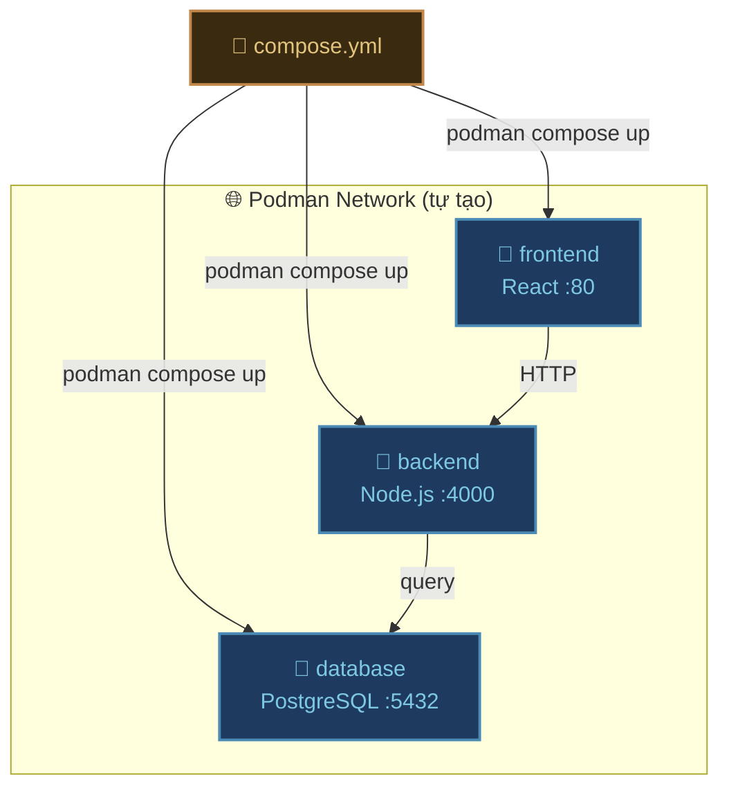
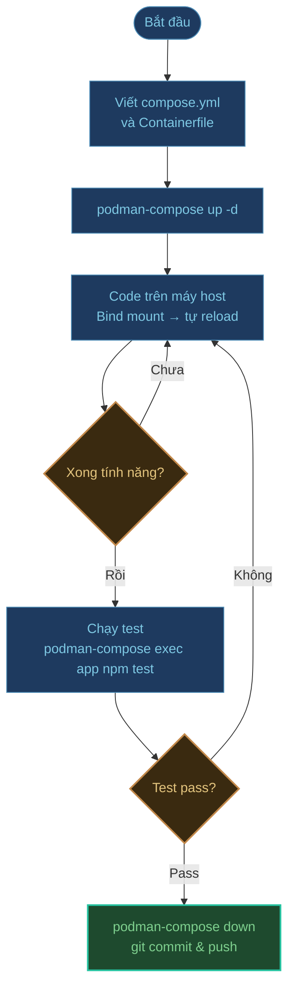
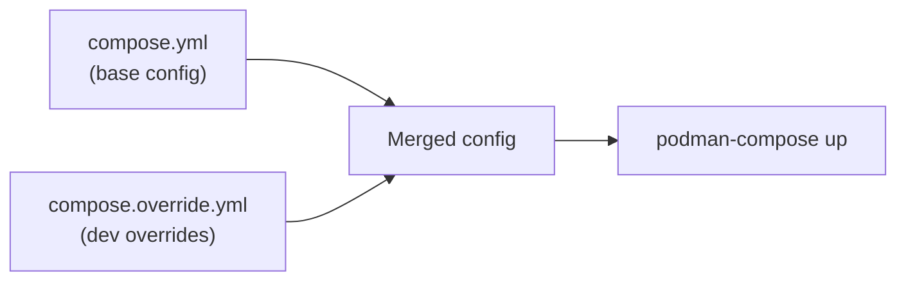

## Podman Compose là gì?

**Podman Compose** là công cụ giúp định nghĩa và chạy nhiều container cùng lúc bằng một file YAML duy nhất — tương thích hoàn toàn với cú pháp `docker-compose.yml`.



---

## Cài đặt Podman Compose

### Trên Windows (PowerShell)

```powershell
# Cài Python nếu chưa có
winget install Python.Python.3.13

# Cài podman-compose qua pip
pip install podman-compose

# Kiểm tra
podman-compose --version
```

### Trên Linux / macOS

```bash
# Dùng pip
pip3 install podman-compose

# Hoặc dùng pipx (tốt hơn cho CLI tools)
pipx install podman-compose
```

:::tip Podman v4.7+ có compose tích hợp sẵn
Từ Podman v4.7+, bạn có thể dùng `podman compose` (không cần cài thêm) — nó sẽ gọi `podman-compose` hoặc `docker-compose` nếu có sẵn trong PATH.

```bash
podman compose up -d   # Tích hợp sẵn từ Podman 4.7+
podman-compose up -d   # Tool cài thêm (hoạt động với mọi phiên bản)
```
:::

---

## Cấu trúc file compose.yml

Podman Compose đọc file `compose.yml` (hoặc `docker-compose.yml` — cả hai đều được).

### Bộ khung cơ bản

```yaml title="compose.yml"
services:
  # Tên service (cũng là hostname trong internal network)
  service-name:
    image: nginx:alpine        # Dùng image sẵn có
    # HOẶC
    build: ./path/to/dir       # Build từ Containerfile/Dockerfile

    container_name: my-nginx   # Tên container (tùy chọn)
    restart: unless-stopped    # Tự restart nếu crash

    ports:
      - "8080:80"              # host:container

    environment:
      KEY: value
      # HOẶC dùng file .env
    env_file:
      - .env

    volumes:
      - named-volume:/data     # Named volume
      - ./local-dir:/app/dir   # Bind mount

    depends_on:
      - other-service          # Khởi động sau service này

    networks:
      - app-network

volumes:
  named-volume:                # Khai báo named volume

networks:
  app-network:                 # Khai báo network tùy chỉnh
```

---

## Ví dụ thực tế — App Node.js + PostgreSQL + Redis

Giả sử bạn có dự án:

```
my-app/
├── backend/
│   ├── Containerfile
│   └── src/
├── frontend/
│   ├── Containerfile
│   └── src/
├── compose.yml
└── .env
```

### File .env

```bash title=".env"
# Database
POSTGRES_USER=admin
POSTGRES_PASSWORD=secret123
POSTGRES_DB=myapp

# Redis
REDIS_PASSWORD=redissecret

# App
NODE_ENV=production
JWT_SECRET=your-jwt-secret-here
```

### compose.yml hoàn chỉnh

```yaml title="compose.yml"
services:
  # PostgreSQL Database
  db:
    image: postgres:15-alpine
    container_name: myapp-db
    restart: unless-stopped
    environment:
      POSTGRES_USER: ${POSTGRES_USER}
      POSTGRES_PASSWORD: ${POSTGRES_PASSWORD}
      POSTGRES_DB: ${POSTGRES_DB}
    volumes:
      - postgres-data:/var/lib/postgresql/data
      - ./db/init.sql:/docker-entrypoint-initdb.d/init.sql  # Chạy khi tạo DB lần đầu
    ports:
      - "5432:5432"    # Mở ra ngoài để dev tools kết nối
    networks:
      - app-network
    healthcheck:
      test: ["CMD-SHELL", "pg_isready -U ${POSTGRES_USER}"]
      interval: 10s
      timeout: 5s
      retries: 5

  # Redis Cache
  redis:
    image: redis:7-alpine
    container_name: myapp-redis
    restart: unless-stopped
    command: redis-server --requirepass ${REDIS_PASSWORD}
    volumes:
      - redis-data:/data
    ports:
      - "6379:6379"
    networks:
      - app-network

  # Backend API
  backend:
    build:
      context: ./backend
      dockerfile: Containerfile
    container_name: myapp-backend
    restart: unless-stopped
    env_file: .env
    environment:
      DATABASE_URL: postgresql://${POSTGRES_USER}:${POSTGRES_PASSWORD}@db:5432/${POSTGRES_DB}
      REDIS_URL: redis://:${REDIS_PASSWORD}@redis:6379
    ports:
      - "4000:4000"
    depends_on:
      db:
        condition: service_healthy    # Đợi DB healthy thật sự
      redis:
        condition: service_started
    volumes:
      - ./backend/src:/app/src        # Bind mount để dev
    networks:
      - app-network

  # Frontend
  frontend:
    build:
      context: ./frontend
      dockerfile: Containerfile
    container_name: myapp-frontend
    restart: unless-stopped
    environment:
      VITE_API_URL: http://localhost:4000
    ports:
      - "80:80"
    depends_on:
      - backend
    networks:
      - app-network

volumes:
  postgres-data:
  redis-data:

networks:
  app-network:
    driver: bridge
```

---

## Các lệnh Podman Compose hay dùng

### Khởi động và dừng

```bash
# Khởi động tất cả service (build image nếu chưa có)
podman-compose up -d

# Build lại image trước khi chạy
podman-compose up -d --build

# Khởi động chỉ một service
podman-compose up -d backend

# Dừng tất cả (giữ lại container và volume)
podman-compose stop

# Dừng và xóa container (giữ lại volume)
podman-compose down

# Dừng và xóa luôn volume (⚠️ mất data)
podman-compose down -v
```

### Xem trạng thái và log

```bash
# Xem trạng thái tất cả service
podman-compose ps

# Xem log tất cả service
podman-compose logs

# Follow log real-time
podman-compose logs -f

# Log của một service cụ thể
podman-compose logs -f backend

# Xem 100 dòng cuối
podman-compose logs --tail 100 backend
```

### Tương tác với service

```bash
# Vào shell trong service
podman-compose exec backend sh
podman-compose exec db psql -U admin -d myapp

# Chạy lệnh một lần (không cần service đang chạy)
podman-compose run --rm backend node scripts/seed.js

# Restart một service
podman-compose restart backend

# Scale service (chạy nhiều instance)
podman-compose up -d --scale backend=3
```

---

## Workflow phát triển với Podman Compose



### Tips dev hiệu quả

```bash
# Alias rút ngắn lệnh hay gõ
alias pc="podman-compose"

pc up -d          # Thay vì: podman-compose up -d
pc logs -f        # Thay vì: podman-compose logs -f
pc down           # Thay vì: podman-compose down
```

---

## Override file — Tách config dev/prod



```yaml title="compose.yml (base — dùng cho prod)"
services:
  backend:
    image: my-registry/myapp-backend:latest
    restart: always
    environment:
      NODE_ENV: production
```

```yaml title="compose.override.yml (chỉ dùng khi dev)"
services:
  backend:
    build: ./backend          # Build local thay vì pull image
    volumes:
      - ./backend/src:/app/src  # Hot reload
    environment:
      NODE_ENV: development
```

```bash
# Dev: tự động đọc compose.yml + compose.override.yml
podman-compose up -d

# Prod: chỉ dùng file base
podman-compose -f compose.yml up -d
```

---

## Cheat sheet nhanh

| Việc cần làm | Lệnh |
|:---|:---|
| Khởi động tất cả | `podman-compose up -d` |
| Build lại và khởi động | `podman-compose up -d --build` |
| Dừng tất cả | `podman-compose down` |
| Xem log | `podman-compose logs -f` |
| Vào shell service | `podman-compose exec <service> sh` |
| Restart service | `podman-compose restart <service>` |
| Xem trạng thái | `podman-compose ps` |
| Chạy lệnh một lần | `podman-compose run --rm <service> <cmd>` |

---

:::tip Bước tiếp theo
Tìm hiểu [sự khác biệt chi tiết giữa Podman và Docker](../so-sanh-docker) để biết khi nào nên chọn công cụ nào.
:::
