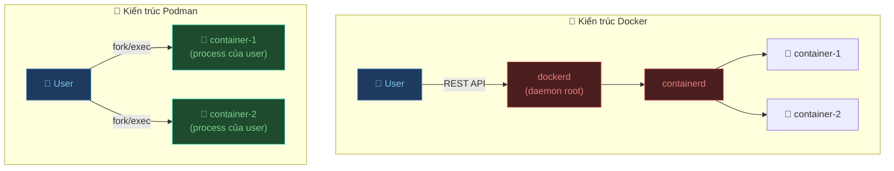
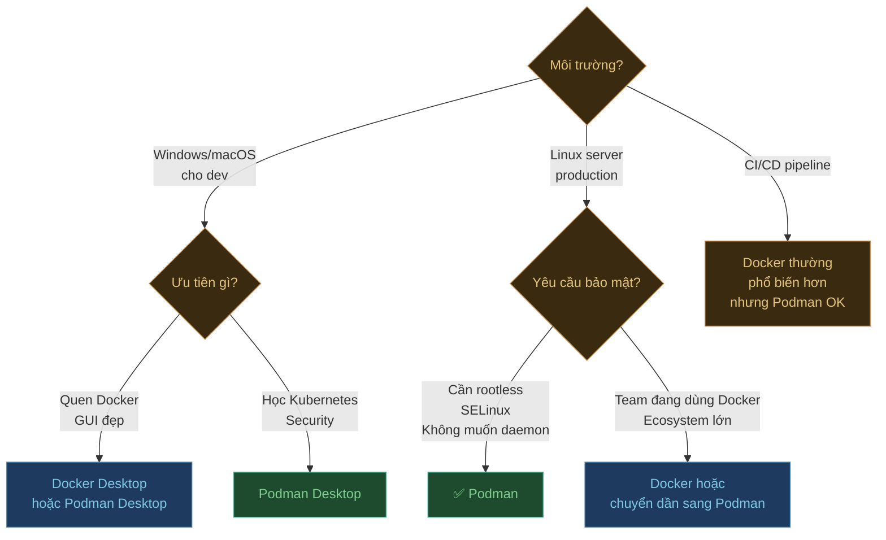

## Kiến trúc — Điểm khác biệt cốt lõi



**Docker** dùng kiến trúc client-server: CLI gửi lệnh đến daemon `dockerd` chạy với quyền root, daemon mới thực sự tạo container.

**Podman** không có daemon: CLI trực tiếp tạo container dưới dạng process con của user hiện tại.

---

## So sánh chi tiết

### Bảo mật

| Tiêu chí | Docker | Podman |
|:---|:---:|:---:|
| Chạy daemon với root | ✅ Bắt buộc | ❌ Không có daemon |
| Rootless containers | Phức tạp, cần cấu hình | ✅ Mặc định |
| Bề mặt tấn công | Lớn hơn (daemon root) | Nhỏ hơn |
| SELinux integration | Hạn chế | ✅ Tích hợp sâu |
| Seccomp profiles | Có | Có |

**Ví dụ rủi ro với Docker:**  
Nếu container bị escape, attacker có thể access Docker socket → có quyền root trên máy host.

```bash
# Docker: socket chạy với root
ls -la /var/run/docker.sock
# srw-rw---- 1 root docker ...

# Podman: không có socket daemon như vậy
# Mỗi container chạy với UID của user hiện tại
```

### Daemon và tính khả dụng

| Tiêu chí | Docker | Podman |
|:---|:---:|:---:|
| Daemon chạy nền | ✅ Bắt buộc | ❌ Không cần |
| Single point of failure | ✅ (daemon crash = mọi container stop) | ❌ (container độc lập) |
| Auto-restart container | Qua daemon | Qua systemd |
| Resource overhead | Cao hơn (daemon luôn chạy) | Thấp hơn |

### Tính năng

| Tính năng | Docker | Podman |
|:---|:---:|:---:|
| Docker Hub | ✅ | ✅ |
| Quay.io | Có thể | ✅ Tích hợp sẵn |
| Docker Compose | ✅ `docker compose` | ✅ `podman-compose` |
| Pods (nhóm container) | ❌ | ✅ |
| Kubernetes YAML export | ❌ | ✅ `podman generate kube` |
| Systemd integration | Hạn chế | ✅ `podman generate systemd` |
| Multi-arch build | ✅ BuildKit | ✅ |
| Docker Desktop GUI | ✅ | ✅ Podman Desktop |

### Tương thích

Podman thiết kế để **thay thế drop-in** cho Docker:

```bash
# Alias này hoạt động hoàn toàn
alias docker=podman

# Mọi lệnh Docker đều chạy được
docker run -d -p 80:80 nginx     # ← thực ra gọi podman
docker build -t my-app .
docker compose up -d
```

---

## Tính năng độc quyền của Podman

### 1. Pods — Nhóm container dùng chung network

```bash
# Tạo pod (giống Kubernetes Pod)
podman pod create --name my-pod -p 8080:80

# Chạy container trong pod
podman run -d --pod my-pod --name nginx nginx
podman run -d --pod my-pod --name sidecar my-sidecar

# Container trong cùng pod giao tiếp qua localhost
# nginx → sidecar qua 127.0.0.1:PORT

# Xem pod
podman pod ps
podman pod inspect my-pod

# Dừng/xóa pod
podman pod stop my-pod
podman pod rm my-pod
```

### 2. Generate Kubernetes YAML từ container đang chạy

```bash
# Chạy container
podman run -d --name web -p 8080:80 nginx

# Export thành Kubernetes Pod YAML
podman generate kube web > web-pod.yaml

# Chạy bằng Kubernetes YAML
podman kube play web-pod.yaml
```

```yaml title="web-pod.yaml (tự động tạo)"
apiVersion: v1
kind: Pod
metadata:
  name: web
spec:
  containers:
  - name: web
    image: docker.io/library/nginx:latest
    ports:
    - containerPort: 80
      hostPort: 8080
```

### 3. Generate systemd service — Auto-restart container khi boot

```bash
# Tạo systemd service từ container
podman generate systemd --name my-app --files --new

# Cài service
mv container-my-app.service ~/.config/systemd/user/

# Bật auto-start khi login
systemctl --user enable container-my-app
systemctl --user start container-my-app

# Xem trạng thái
systemctl --user status container-my-app
```

---

## Khi nào dùng Docker, khi nào dùng Podman?



### Dùng Podman khi:

- **Môi trường production Linux** cần rootless containers vì lý do bảo mật
- **Tích hợp systemd** để quản lý container như service
- **Học Kubernetes** — Pods của Podman giúp hiểu concept K8s
- **RHEL / Fedora / CentOS** — Podman là công cụ mặc định trên Red Hat ecosystem
- **Không muốn daemon** chiếm tài nguyên nền liên tục

### Dùng Docker khi:

- **Team đã quen Docker** và không có lý do rõ ràng để đổi
- **Docker Desktop** — nếu cần GUI hoàn chỉnh và hỗ trợ tốt trên Mac/Windows
- **Docker Swarm** — nếu đang dùng native clustering của Docker
- **Ecosystem phụ thuộc Docker** — một số công cụ cần Docker cụ thể

---

## Migration từ Docker sang Podman

### Bước 1 — Kiểm tra tương thích

```bash
# Thử alias đơn giản
alias docker=podman
docker ps
docker run hello-world
```

### Bước 2 — Chuyển docker-compose.yml sang Podman Compose

File `docker-compose.yml` hoạt động **không cần sửa** với `podman-compose`:

```bash
# Không cần đổi tên file
podman-compose up -d    # Đọc docker-compose.yml hoặc compose.yml
```

### Bước 3 — Xử lý các điểm khác biệt nhỏ

```bash
# Docker: gắn volume không cần flag đặc biệt
docker run -v ./data:/app/data my-app

# Podman trên Linux với SELinux: thêm :z hoặc :Z
podman run -v ./data:/app/data:z my-app
#  :z — chia sẻ giữa nhiều container
#  :Z — chỉ dùng cho container này
```

### Bước 4 — Cập nhật CI/CD

```yaml title=".github/workflows/build.yml"
# Trước (Docker)
- name: Build image
  run: docker build -t my-app .

# Sau (Podman — hoán đổi trực tiếp)
- name: Build image
  run: podman build -t my-app .
```

---

## Tóm tắt

| | Docker | Podman |
|:---|:---:|:---:|
| Bảo mật (rootless) | Khó | ✅ Dễ |
| Không cần daemon | ❌ | ✅ |
| Tương thích Docker CLI | — | ✅ |
| Hỗ trợ Pods | ❌ | ✅ |
| Generate K8s YAML | ❌ | ✅ |
| Systemd integration | Hạn chế | ✅ |
| Ecosystem / Community | Rất lớn | Đang lớn nhanh |
| Docker Desktop GUI | ✅ | ✅ Podman Desktop |
| Phổ biến trong CI/CD | Rất cao | Đang tăng |

Cả hai đều là công cụ tốt. **Podman** có lợi thế về bảo mật và tích hợp Linux. **Docker** mạnh hơn về ecosystem và độ phổ biến. Tin vui là — nếu bạn biết dùng một cái, cái kia gần như học được ngay.
