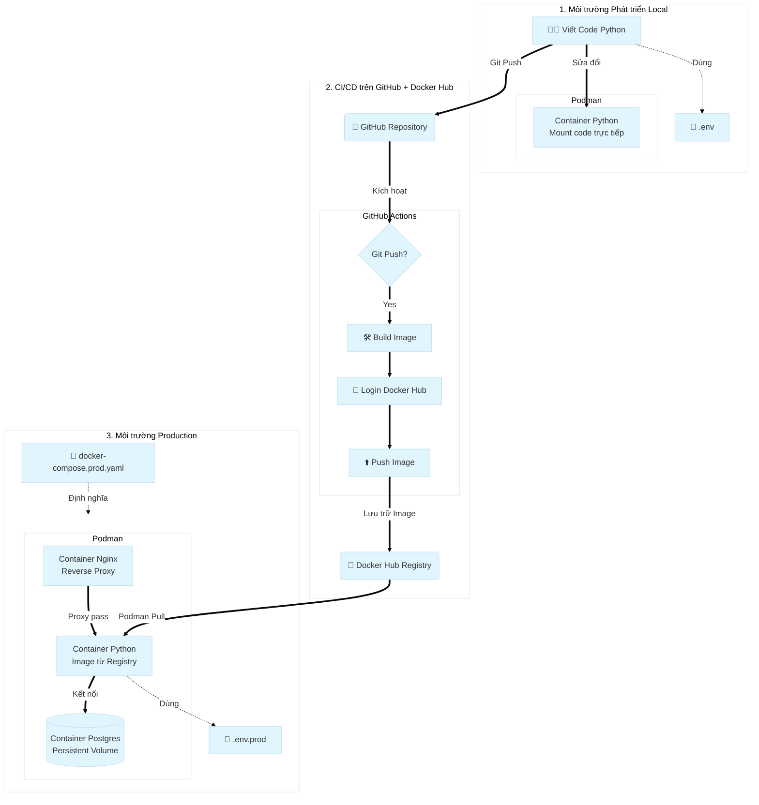

# Series CI/CD với Podman: Tổng quan

Series này hướng dẫn bạn xây dựng một quy trình **CI/CD hoàn chỉnh** sử dụng Podman — từ việc viết code trên máy local, tự động đóng gói lên Docker Hub qua GitHub Actions, cho đến deploy vào môi trường production.

## Bạn sẽ học được gì?

Sau khi hoàn thành series, bạn có thể:

- Chạy ứng dụng Python + Postgres + Nginx hoàn chỉnh trên máy local bằng Podman Compose
- Tự động build và push Docker Image lên Docker Hub mỗi khi push code lên GitHub
- Deploy ứng dụng từ Docker Hub vào môi trường production chỉ với 3 lệnh
- Tách biệt cấu hình dev/prod để không bao giờ bị lỗi "chạy được trên máy tôi"

## Kiến trúc hệ thống

Toàn bộ flow gồm 3 môi trường hoạt động phối hợp với nhau:

## Tại sao cần làm vậy?

| Vấn đề thực tế | Giải pháp trong series |
|---|---|
| "Chạy được trên máy tôi nhưng lỗi trên server" | Dev/Prod Parity — cùng Image, khác config |
| Build thủ công tốn thời gian, dễ sai | GitHub Actions tự động build khi push code |
| Update code làm mất dữ liệu database | Named Volumes tách biệt data khỏi container |
| Config nhạy cảm (password, key) lẫn trong code | File `.env` riêng cho từng môi trường |

## Công nghệ sử dụng

- **Podman + Podman Compose** — container runtime (thay thế Docker)
- **Python + Gunicorn** — ứng dụng web backend
- **Nginx** — reverse proxy
- **PostgreSQL** — cơ sở dữ liệu
- **GitHub Actions** — CI/CD pipeline
- **Docker Hub** — container image registry

## Lộ trình series

| Bài | Nội dung | Kết quả |
|---|---|---|
| **Bài 2** | [Thiết lập môi trường Local](../thiet-lap-local) | Chạy được app trên máy với Podman Compose |
| **Bài 3** | [CI: Tự động hóa với GitHub Actions](../ci-github-actions) | Push code → Image tự động lên Docker Hub |
| **Bài 4** | [CD: Deploy lên Production](../cd-deploy-production) | Kéo Image về và chạy trên server/production |

## Yêu cầu trước khi bắt đầu

Trước khi bắt đầu, hãy chắc chắn bạn đã có:

- [ ] Podman và Podman Compose đã cài đặt (xem [hướng dẫn cài đặt](../../cai-dat-windows))
- [ ] Tài khoản GitHub và biết dùng Git cơ bản
- [ ] Tài khoản Docker Hub (đăng ký miễn phí tại [hub.docker.com](https://hub.docker.com))
- [ ] Python cơ bản (hiểu file `requirements.txt`, cách app Python chạy)

---

Sẵn sàng? Bắt đầu từ [Bài 2: Thiết lập môi trường Local](../thiet-lap-local).
