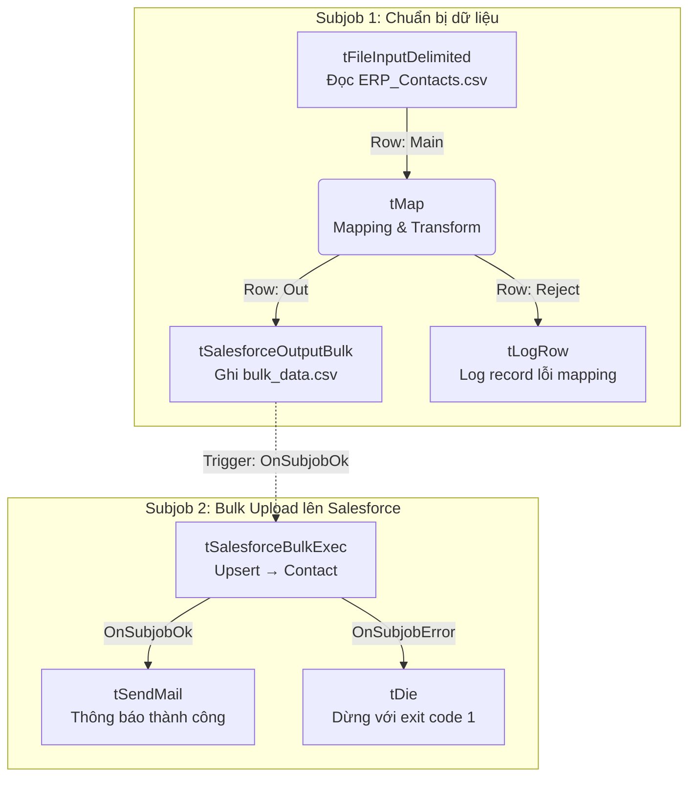

Bài này hướng dẫn xây dựng một Talend Job hoàn chỉnh để đồng bộ **500,000 bản ghi Contact** từ file CSV xuất ra bởi hệ thống ERP nội bộ lên Salesforce — sử dụng Bulk API thay vì SOAP API thông thường. Đây là scenario điển hình trong các dự án migration dữ liệu quy mô doanh nghiệp.

<!--truncate-->

## Tại sao cần Bulk API?

Khi nói đến Salesforce integration, hầu hết developer đều quen với `tSalesforceOutput` — component dùng SOAP API (REST API) để insert/update record. Với dữ liệu nhỏ (vài nghìn record), cách này hoàn toàn ổn. Nhưng khi số lượng lên đến **hàng trăm nghìn record**, bạn sẽ gặp ngay hai vấn đề:

**API Governor Limits:**
- Salesforce giới hạn **API call mỗi ngày** dựa trên loại org (Developer: 15,000 calls/day, Enterprise: 1,000 calls × số user).
- `tSalesforceOutput` xử lý theo batch 200 records/lần. 500,000 records = **2,500 API calls** chỉ riêng cho việc upsert.
- Cộng thêm các API call từ hệ thống khác (Salesforce automation, integration app, v.v.) — dễ vượt limit giữa ngày.

**Throughput quá thấp:**
- SOAP API: ~200 records/batch, tốc độ phụ thuộc network latency.
- Bulk API 2.0: xử lý batch lên đến **10,000 records**, Salesforce xử lý bất đồng bộ ở server-side, throughput cao hơn nhiều lần.

### So sánh hai approach

| Tiêu chí | `tSalesforceOutput` (SOAP) | `tSalesforceBulkExec` (Bulk API 2.0) |
|---|---|---|
| Batch size | 200 records | 10,000+ records |
| API calls tiêu thụ | Cao (tính theo batch) | Thấp hơn đáng kể |
| Xử lý | Đồng bộ (synchronous) | Bất đồng bộ (asynchronous) |
| Phù hợp | < 10,000 records | 100,000+ records |
| Error detail | Ngay lập tức | Qua result file sau khi job hoàn thành |
| Component Talend | `tSalesforceOutput` | `tSalesforceOutputBulk` + `tSalesforceBulkExec` |

:::warning
Bulk API không hỗ trợ tất cả Salesforce object. Trước khi dùng, kiểm tra xem object có flag `Bulk API accessible` trong Salesforce setup hay không.
:::

### Điều kiện tiên quyết: External ID Field

Để **Upsert** hoạt động đúng (thêm mới nếu chưa có, cập nhật nếu đã tồn tại), Salesforce cần một field làm **khóa định danh duy nhất** từ phía ERP. Field này gọi là **External ID**.

Bạn cần tạo custom field trên Contact object trong Salesforce:
1. Vào **Setup → Object Manager → Contact → Fields & Relationships → New**
2. Chọn kiểu **Text**, độ dài 50
3. Đặt tên: `External ID` (API name: `External_ID__c`)
4. Tick chọn: **External ID** và **Unique**
5. Save

Không có field này, Bulk API không biết record nào cần update, record nào cần insert.

---

## Kiến trúc Job — 2 Subjob

Job được chia thành 2 subjob tách biệt, kết nối bằng trigger `OnSubjobOk`:



**Lý do tách 2 subjob thay vì 1 luồng liên tục:**

- `tSalesforceOutputBulk` chỉ **ghi dữ liệu ra file CSV tạm** — không kết nối Salesforce, không upload gì cả.
- `tSalesforceBulkExec` đọc file CSV đó và mới thực sự upload lên Salesforce.
- Tách biệt giúp bạn: (1) kiểm tra file tạm trước khi upload, (2) retry subjob 2 mà không cần đọc lại CSV gốc, (3) xử lý lỗi từng bước rõ ràng hơn.

---

## Chuẩn bị — Schema mapping ERP → Salesforce

File CSV từ ERP (`ERP_Contacts.csv`) có cấu trúc:

```csv
ERP_ID,FullName,EmailAddress,Phone,CreatedDate,Department,Title
ERP-001,Nguyen Van An,an.nguyen@company.com,0901234567,1990-05-15,IT,Developer
ERP-002,Tran Thi Binh,binh.tran@company.com,+84912345678,1985-11-20,Sales,Manager
ERP-003,Le Van Cuong,,0977654321,1992-03-08,HR,
```

Mapping sang Salesforce Contact:

| ERP Field | Salesforce Field | Kiểu | Ghi chú |
|---|---|---|---|
| `ERP_ID` | `External_ID__c` | String | Upsert key — bắt buộc, không được rỗng |
| `FullName` | `LastName` | String | Tách từ FullName, lấy phần sau cùng |
| `FullName` | `FirstName` | String | Tách từ FullName, lấy phần còn lại |
| `EmailAddress` | `Email` | String | Validate format — reject nếu sai |
| `Phone` | `Phone` | String | Chuẩn hóa về định dạng +84 |
| `CreatedDate` | `Birthdate` | Date | Convert từ `yyyy-MM-dd` |
| `Department` | `Department` | String | Map trực tiếp |
| `Title` | `Title` | String | Map trực tiếp |

:::note
Trong ví dụ này `CreatedDate` từ ERP được map sang `Birthdate` vì đây là ngày sinh nhân viên. Thực tế tùy schema từng dự án — điều quan trọng là format ngày phải được convert đúng.
:::

---

## Cấu hình từng component

### tFileInputDelimited — Đọc file CSV từ ERP

Tab **Basic Settings:**

| Thuộc tính | Giá trị |
|---|---|
| File Name | `context.input_file_path` |
| Field Separator | `,` (dấu phẩy) |
| Row Separator | `\n` |
| Header | `1` (bỏ qua dòng tiêu đề) |
| Encoding | `UTF-8` |
| CSV options | Tick **CSV options** để xử lý đúng field có dấu phẩy trong ngoặc kép |

Tab **Schema** — khai báo các cột đúng với file CSV:

| Column | Type | Length |
|---|---|---|
| ERP_ID | String | 50 |
| FullName | String | 200 |
| EmailAddress | String | 255 |
| Phone | String | 40 |
| CreatedDate | String | 20 |
| Department | String | 80 |
| Title | String | 80 |

:::tip
Khai báo `CreatedDate` là kiểu **String** ở bước đọc file, rồi mới convert sang Date trong tMap. Cách này tránh lỗi parse date khi file có dòng trống hoặc format không đều.
:::

---

### tMap — Transformation Logic

Đây là component quan trọng nhất trong Job. Mở tMap editor và cấu hình:

**Output schema** (bên phải tMap) — đặt tên output là `out`:

| Column | Type | Length |
|---|---|---|
| External_ID__c | String | 50 |
| FirstName | String | 80 |
| LastName | String | 80 |
| Email | String | 255 |
| Phone | String | 40 |
| Birthdate | Date | — |
| Department | String | 80 |
| Title | String | 80 |

**Expression mapping** cho từng field output:

```java
// External_ID__c — map trực tiếp từ ERP_ID
row1.ERP_ID

// LastName — lấy phần tử cuối cùng sau khi split theo dấu cách
// "Nguyen Van An" -> "An"
row1.FullName != null && row1.FullName.contains(" ")
    ? row1.FullName.substring(row1.FullName.lastIndexOf(" ") + 1)
    : row1.FullName

// FirstName — lấy tất cả trừ phần tử cuối
// "Nguyen Van An" -> "Nguyen Van"
row1.FullName != null && row1.FullName.contains(" ")
    ? row1.FullName.substring(0, row1.FullName.lastIndexOf(" "))
    : ""

// Email — trim whitespace, lowercase
row1.EmailAddress != null ? row1.EmailAddress.trim().toLowerCase() : null

// Phone — chuẩn hóa về định dạng +84
// "0901234567" -> "+84901234567"
// "+84912345678" -> "+84912345678" (giữ nguyên)
row1.Phone != null && row1.Phone.startsWith("0")
    ? "+84" + row1.Phone.substring(1)
    : row1.Phone != null && row1.Phone.startsWith("+84")
        ? row1.Phone
        : row1.Phone

// Birthdate — convert từ String "yyyy-MM-dd" sang Date
row1.CreatedDate != null && !row1.CreatedDate.isEmpty()
    ? TalendDate.parseDate("yyyy-MM-dd", row1.CreatedDate)
    : null

// Department — map trực tiếp, trim whitespace
row1.Department != null ? row1.Department.trim() : null

// Title — map trực tiếp
row1.Title
```

**Reject condition** — thiết lập ở tab Filter của output `out`:

```java
// Reject record nếu: ERP_ID rỗng HOẶC Email không đúng format
!(row1.ERP_ID == null || row1.ERP_ID.trim().isEmpty())
&& !(row1.EmailAddress != null
     && !row1.EmailAddress.trim().isEmpty()
     && !row1.EmailAddress.matches("^[A-Za-z0-9+_.-]+@[A-Za-z0-9.-]+\\.[A-Za-z]{2,}$"))
```

:::warning
Filter trong tMap dùng điều kiện **giữ lại** (keep row if true), không phải điều kiện loại bỏ. Hãy đọc kỹ logic: expression trên trả về `true` cho record **hợp lệ**, record không hợp lệ sẽ đi vào Reject flow.
:::

**Reject flow** — kết nối output `Reject` của tMap sang `tLogRow`:

Trong `tLogRow`, set **Print to** = `System.err` để phân biệt với log thông thường. Những record bị reject sẽ hiển thị trong console với lý do rõ ràng khi debug.

---

### tSalesforceOutputBulk — Tạo file CSV tạm

Component này **không kết nối Salesforce**. Nó chỉ ghi dữ liệu đã transform vào một file CSV với format mà Salesforce Bulk API chấp nhận.

Tab **Basic Settings:**

| Thuộc tính | Giá trị |
|---|---|
| File Name | `context.temp_dir + "/bulk_contacts_" + TalendDate.getDate("yyyyMMdd_HHmmss") + ".csv"` |
| Append | Không tick (ghi đè file cũ nếu có) |
| Encoding | `UTF-8` |

Tab **Schema** — phải khớp chính xác với output schema của tMap ở trên.

:::note
Tên file có timestamp (`yyyyMMdd_HHmmss`) để tránh conflict nếu Job chạy đồng thời nhiều instance. Trong production, bạn có thể set tên file vào một global variable để subjob 2 đọc lại chính xác đường dẫn.
:::

Để truyền đường dẫn file từ subjob 1 sang subjob 2, thêm component `tSetGlobalVar` sau `tSalesforceOutputBulk`:

- Trigger kết nối: `tSalesforceOutputBulk` →(OnComponentOk)→ `tSetGlobalVar`
- Trong tSetGlobalVar, khai báo biến:
  - **Variable**: `BULK_FILE_PATH`
  - **Value**: `context.temp_dir + "/bulk_contacts_" + TalendDate.getDate("yyyyMMdd_HHmmss") + ".csv"`

:::warning
Đặt cùng expression cho tên file ở cả `tSalesforceOutputBulk` và `tSetGlobalVar` sẽ có vấn đề nếu timestamp thay đổi giữa 2 lần gọi. Cách tốt hơn: set biến `context.bulk_file_name` từ đầu Job bằng `tJava`, dùng biến đó xuyên suốt.
:::

**Cách tốt hơn — set tên file một lần duy nhất:**

Thêm `tJava` ở đầu Job (trước subjob 1):

```java
// Trong tJava — chạy một lần khi Job bắt đầu
globalMap.put("BULK_FILE_PATH",
    context.temp_dir + "/bulk_contacts_" + TalendDate.getDate("yyyyMMdd_HHmmss") + ".csv");
```

Sau đó dùng `(String)globalMap.get("BULK_FILE_PATH")` ở cả `tSalesforceOutputBulk` và `tSalesforceBulkExec`.

---

### tSalesforceBulkExec — Upload lên Salesforce

Đây là component thực hiện kết nối và upload dữ liệu lên Salesforce qua Bulk API.

Tab **Basic Settings:**

| Thuộc tính | Giá trị | Ghi chú |
|---|---|---|
| User Id | `context.sf_username` | Email đăng nhập Salesforce |
| Password | `context.sf_password` | Password tài khoản |
| Security Key | `context.sf_token` | Security Token (xem bên dưới) |
| Salesforce URL | `https://login.salesforce.com/services/Soap/u/56.0` | Dùng test.salesforce.com cho Sandbox |
| Module Name | `Contact` | Salesforce object name |
| Output Action | `UPSERT` | |
| Upsert Key Column | `External_ID__c` | Phải là External ID field đã tạo |
| Bulk File Path | `(String)globalMap.get("BULK_FILE_PATH")` | Trỏ đến file CSV từ subjob 1 |
| Wait Time for checking bulk result (ms) | `30000` | 30 giây poll một lần |
| Max wait time (ms) | `3600000` | Tối đa 1 tiếng chờ Salesforce xử lý |

**Cách lấy Security Token từ Salesforce:**

1. Đăng nhập Salesforce
2. Click avatar góc trên phải → **Settings**
3. Trong menu bên trái: **My Personal Information → Reset My Security Token**
4. Click **Reset Security Token** — Salesforce gửi token mới về email
5. Copy token đó vào context variable `sf_token`

:::warning
Security Token là thứ bảo mật quan trọng. KHÔNG bao giờ hardcode trực tiếp vào Job. KHÔNG commit vào Git. Luôn dùng context variable và load từ file `.properties` hoặc secret manager.

Nếu bạn đổi password Salesforce, Security Token sẽ bị reset — cần cập nhật lại.
:::

**Sandbox vs Production:**

```bash
# Production
https://login.salesforce.com/services/Soap/u/56.0

# Sandbox
https://test.salesforce.com/services/Soap/u/56.0
```

---

## Context Variables — Best Practice

Tạo file `context/default.properties` trong project:

```bash
# Salesforce credentials
sf_username=your.email@company.com
sf_password=YourSalesforcePassword
sf_token=YourSecurityTokenHere

# File paths
input_file_path=/data/erp/ERP_Contacts.csv
temp_dir=/tmp/talend_bulk

# Environment
env=production
```

Khai báo trong Job context:

| Variable | Type | Default |
|---|---|---|
| `sf_username` | String | — |
| `sf_password` | String | — |
| `sf_token` | String | — |
| `input_file_path` | String | `/data/erp/ERP_Contacts.csv` |
| `temp_dir` | String | `/tmp/talend_bulk` |
| `env` | String | `dev` |

Chạy Job với context:

```bash
./ERP_to_Salesforce_Bulk/ERP_to_Salesforce_Bulk_run.sh \
  --context_param sf_username=admin@company.com \
  --context_param sf_password=SecurePass123 \
  --context_param sf_token=AbCdEfGhIjKlMn \
  --context_param input_file_path=/data/erp/ERP_Contacts_20260408.csv \
  --context_param temp_dir=/tmp/talend_bulk
```

---

## Error Handling — Xử lý kết quả từ Salesforce

Sau khi `tSalesforceBulkExec` hoàn thành, Salesforce tạo ra hai file kết quả trong thư mục tạm:

- `result_success.csv` — các record được xử lý thành công
- `result_failed.csv` — các record bị lỗi kèm mã lỗi

**Cấu trúc `result_failed.csv`:**

```csv
Id,Success,Created,Error
,false,false,"INVALID_EMAIL_ADDRESS:Email: invalid email address: notanemail;Email"
,false,false,"DUPLICATE_VALUE:duplicate value found: External_ID__c duplicates value on record with id: 003..."
ERP-003,false,false,"FIELD_INTEGRITY_EXCEPTION:Department: bad value for restricted picklist field: Unknown Dept"
```

**Các lỗi phổ biến và cách xử lý:**

| Mã lỗi | Nguyên nhân | Cách fix |
|---|---|---|
| `INVALID_EMAIL_ADDRESS` | Email sai format | Cải thiện validation trong tMap |
| `DUPLICATE_VALUE` | External ID trùng trong cùng batch | Kiểm tra file CSV có record trùng không |
| `FIELD_INTEGRITY_EXCEPTION` | Giá trị không hợp lệ cho picklist | Kiểm tra Salesforce picklist values |
| `REQUIRED_FIELD_MISSING` | Field bắt buộc bị null | Kiểm tra mapping và reject logic |
| `STRING_TOO_LONG` | Giá trị vượt độ dài field | Cắt bớt trong tMap bằng `StringHandling.LEFT()` |

**Thêm bước xử lý failed records** vào Job (subjob 3 tùy chọn):

```
tSalesforceBulkExec
  ├── OnSubjobOk
  │     └── tFileInputDelimited (đọc result_failed.csv)
  │           └── tMap (parse lỗi)
  │                 └── tFileOutputDelimited (ghi error_report.csv)
  │                 └── tSendMail (notify team)
  └── OnSubjobError
        └── tDie
```

Cách đọc file failed:

```java
// Đường dẫn file failed — tSalesforceBulkExec tự tạo
context.temp_dir + "/result_failed.csv"
```

---

## Performance Tips

**1. Tại sao 2 subjob nhanh hơn `tSalesforceOutput` trực tiếp?**

`tSalesforceOutput` gọi SOAP API theo từng batch 200 records — 500,000 records = 2,500 network round-trips. Với Bulk API, bạn upload toàn bộ file một lần, Salesforce xử lý server-side, Job chỉ cần poll kết quả.

**2. Bulk API limits cần biết:**

| Limit | Giá trị |
|---|---|
| Batches per day (per org) | 10,000 |
| Records per batch | 10,000 |
| File size per batch | 150 MB |
| Concurrent jobs | 5 |

Với 500,000 records trong một file 150MB, Salesforce tự động chia thành nhiều batch. Nếu file lớn hơn 150MB, cần chia file trước khi upload.

**3. Chia file lớn:**

Nếu file ERP vượt 10 triệu records, dùng pattern sau:

```
tFileInputDelimited (file gốc)
  └── tSplitRow (chia mỗi 500k records)
        └── tFileOutputDelimited (file_chunk_1.csv, file_chunk_2.csv, ...)
              └── tRunJob (child job xử lý từng chunk)
```

**4. Tắt tLogRow trong production:**

`tLogRow` in từng record ra console — với 500k records, điều này làm Job chậm đáng kể. Chỉ bật khi debug.

**5. JVM heap cho Job lớn:**

Khi chạy script, tăng JVM heap:

```bash
export JAVA_OPTS="-Xms512m -Xmx4g"
./ERP_to_Salesforce_Bulk_run.sh ...
```

**6. Chạy ngoài giờ cao điểm:**

Salesforce Bulk API xử lý bất đồng bộ — schedule Job vào ban đêm để tránh ảnh hưởng đến Salesforce API limits của business hours.

---

## Bài tập thực hành

**Bài 1 — Thêm validation nâng cao:**
Trong tMap, bổ sung logic kiểm tra `Phone` phải là số điện thoại Việt Nam hợp lệ (10 số, bắt đầu bằng 03x, 05x, 07x, 08x, 09x). Record có số điện thoại không hợp lệ vẫn được giữ lại nhưng field `Phone` set về `null`. Viết expression Java cho logic này.

**Bài 2 — Retry cơ chế:**
Thêm subjob 3 đọc `result_failed.csv`, lọc ra các record có lỗi `FIELD_INTEGRITY_EXCEPTION`, tự động fix dữ liệu (ví dụ: set Department về "Other" nếu không khớp picklist), rồi upload lại bằng một `tSalesforceBulkExec` thứ hai. Lưu ý xử lý vòng lặp vô hạn nếu retry vẫn fail.

**Bài 3 — Chunk processing:**
File ERP tăng lên 5 triệu records. Thiết kế lại Job để chia file thành các chunk 400k records, xử lý song song bằng `tParallelizeStart` / `tParallelizeEnd`. Giải thích tại sao không nên chạy quá 5 Bulk API job đồng thời.

**Bài 4 — Monitoring & Alerting:**
Thêm component `tFlowMeter` để đếm: (a) tổng records đọc từ CSV, (b) records bị reject trong tMap, (c) records thành công sau Bulk API. Cuối Job, gửi email tóm tắt bằng `tSendMail` với nội dung: "Processed: X | Rejected: Y | Success: Z | Failed: W". Dùng `tSetGlobalVar` để tích lũy các con số đếm này xuyên suốt Job.
