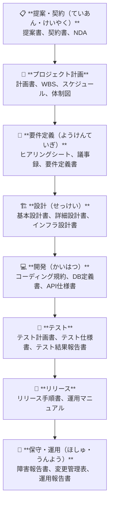

# Tài liệu & Báo cáo — ドキュメント管理（かんり）

Tại Nhật, **ドキュメント文化（ぶんか）** — văn hóa tài liệu hóa — là một đặc trưng nổi bật. Mọi quyết định, thay đổi, kết quả đều phải được ghi lại để đảm bảo **引継ぎ（ひきつぎ）** (bàn giao) suôn sẻ và vượt qua **監査（かんさ）** (kiểm toán).

---

## 1. Toàn cảnh tài liệu theo vòng đời dự án

---

## 2. Quy tắc đặt tên file — ファイル命名規則（めいめいきそく）

Đây là quy tắc quan trọng giúp tìm kiếm và sắp xếp tài liệu dễ dàng.

### Format chuẩn

**`YYYYMMDD_ドキュメント名_バージョン.拡張子`**

| Ví dụ | Giải thích |
|-------|-----------|
| `20250120_要件定義書_v1.0.xlsx` | Tài liệu yêu cầu, phiên bản 1.0 |
| `20250215_基本設計書_v2.3.docx` | Thiết kế cơ bản, phiên bản 2.3 |
| `20250301_テスト計画書_v1.0.pdf` | Kế hoạch test, phiên bản 1.0 |
| `20250120_定例会議_議事録.docx` | Biên bản họp định kỳ |

### Quy tắc Version

| バージョン | 意味 | Khi nào dùng |
|-----------|------|-------------|
| `v1.0` | 初版（しょはん） | First release — lần đầu phát hành |
| `v1.1` | 軽微な修正（けいびなしゅうせい）| Minor fix — sửa nhỏ |
| `v2.0` | 大幅な変更（おおはばなへんこう） | Major revision — thay đổi lớn |
| `_draft` | 作成中（さくせいちゅう） | Đang soạn thảo |
| `_review` | レビュー中 | Đang được review |
| `_final` | 最終版（さいしゅうはん）/ 承認済 | Đã được phê duyệt |

### ※※old フォルダの使い方

旧バージョンは削除せず **`※※old`** フォルダに移動する。  
→ 削除（さくじょ）すると監査（かんさ）時に履歴（りれき）が追えなくなるため。

- 📄 要件定義書\_v1.0.xlsx ← **現在の最新版**
- 📁 ※※old
  - 📄 要件定義書\_v0.1.xlsx
  - 📄 要件定義書\_v0.9.xlsx

---

## 3. Tài liệu thiết kế — 設計書（せっけいしょ）

### 基本設計書（きほんせっけいしょ）— Basic Design

> **「何を作るか」** を定義する — Định nghĩa "làm gì"

| 章（しょう） | 内容 |
|---|---|
| システム概要（がいよう） | アーキテクチャ図、システム構成図 |
| 機能設計（きのうせっけい） | 画面設計、機能仕様 |
| データ設計（でーたせっけい） | ER図、テーブル定義（定義項目のみ） |
| インターフェース設計 | 外部システム連携の概要 |
| 非機能要件 | 性能、セキュリティ、可用性の方針 |

### 詳細設計書（しょうさいせっけいしょ）— Detailed Design

> **「どう作るか」** を定義する — Định nghĩa "làm như thế nào"

| 章 | 内容 |
|---|---|
| 画面詳細設計（がめんしょうさい） | ワイヤーフレーム、入力バリデーション |
| DB詳細設計（でーたべーすしょうさい） | テーブル定義（全カラム）、INDEX設計 |
| API設計 | エンドポイント、リクエスト/レスポンス形式 |
| バッチ設計（ばっちせっけい） | 処理フロー、エラーハンドリング |
| インフラ設計（いんふらせっけい） | サーバー構成、ネットワーク構成 |

---

## 4. Tài liệu kiểm thử — テスト成果物（せいかぶつ）

- 📁 **50\_テスト**
  - 📁 501\_テスト計画書（けいかくしょ）
    - 📄 テスト範囲（はんい）、スケジュール、体制、環境
  - 📁 502\_単体テスト（たんたい）
    - 📄 テスト仕様書（しようしょ） — テストケース一覧
    - 📄 テスト結果（けっか） — エビデンス（証跡）
  - 📁 503\_結合テスト（けつごう）
    - 📄 （同上）
  - 📁 504\_システムテスト
    - 📄 シナリオテスト仕様書・結果
  - 📁 505\_受入テスト（うけいれ）
    - 📄 受入テスト計画書 — 顧客と合意したテスト内容
    - 📄 受入テスト結果 — 顧客が確認・署名（しょめい）
    - 📄 受入完了報告書（かんりょう） — 正式な受入完了の証明
  - 📁 506\_性能テスト（せいのう）
    - 📄 性能テスト計画・結果・考察（こうさつ）

### テスト仕様書の基本構成

| テストNo | テスト項目 | 前提条件（ぜんていじょうけん） | 操作手順（そうさてじゅん） | 期待結果（きたいけっか） | 実際結果（じっさいけっか） | 判定（はんてい） |
|---------|-----------|---------------------|-----------------|----------------|----------------|-----------|
| T-001 | ログイン成功 | 有効なID/PW保有 | IDとPWを入力し「ログイン」押下 | ダッシュボード画面に遷移 | ダッシュボード画面に遷移 | ○ |
| T-002 | ログイン失敗 | 無効なPW | 無効なPWを入力 | エラーメッセージ表示 | エラーメッセージ表示 | ○ |

---

## 5. Tài liệu vận hành — 運用マニュアル（うんようまにゅある）

- 📁 **60\_リリース**
  - 📁 603\_運用マニュアル（Operator向け）
    - 📄 日次作業手順（にちじさぎょうてじゅん） — Thao tác hàng ngày
    - 📄 月次作業手順（げつじ） — Thao tác hàng tháng
    - 📄 バックアップ手順（てじゅん） — Quy trình backup
    - 📄 リストア手順（てじゅん） — Quy trình restore
    - 📄 障害対応フロー（しょうがいたいおうふろー） — Khi sự cố xảy ra
  - 📁 604\_利用者マニュアル（User向け）
    - 📄 操作マニュアル（そうさまにゅある） — Hướng dẫn sử dụng
    - 📄 FAQ（よくある質問）

---

## 6. Tài liệu nhận từ khách hàng — 受領資料（じゅりょうしりょう）

- 📁 **80\_受領資料**
  - 📁 801\_顧客提供資料（こきゃくていきょうしりょう）
    - 📄 現行システム資料（げんこうシステムしりょう） — Tài liệu hệ thống cũ
    - 📄 業務マニュアル — Manual nghiệp vụ hiện tại
    - 📄 提供データ（ていきょうでーた） — Data mẫu, master data
  - 📁 802\_外部システム資料（がいぶシステムしりょう）
    - 📄 API仕様書（しようしょ）
    - 📄 連携インターフェース定義書

> **重要（じゅうよう）:** 受領資料は**受領日と受領者を必ず記録**すること。後のトラブルを防ぐために受領確認書（じゅりょうかくにんしょ）を交わすことが望ましい。

---

## 7. Tài liệu hoàn thành dự án — プロジェクト完了報告書（かんりょうほうこくしょ）

Tài liệu quan trọng nhất để đóng dự án và nhận **検収（けんしゅう）** — nghiệm thu chính thức.

### Cấu trúc 完了報告書

1. **プロジェクト概要（がいよう）**
   - 目的、期間、体制、予算

2. **成果物一覧（せいかぶついちらん）**
   - 納品済み（のうひんずみ）成果物と承認状況

3. **スコープ達成状況（たっせいじょうきょう）**
   - 当初スコープ vs 実施内容の比較

4. **スケジュール実績（じっせき）**
   - 計画 vs 実績のGanttチャート

5. **品質（ひんしつ）実績**
   - バグ件数（けんすう）、テスト結果サマリー

6. **課題・リスク対応実績**
   - 発生した課題とその解決結果

7. **振り返り（ふりかえり）**
   - よかった点（KPT: Keep / Problem / Try）
   - 次のプロジェクトへの教訓（きょうくん）

---

## Checklist — ドキュメント管理のベストプラクティス

- [ ] ファイル命名規則（めいめいきそく）をチームで統一（とういつ）
- [ ] 最新版が一目でわかる（バージョン管理）
- [ ] 旧バージョンは削除せず ※※old フォルダへ
- [ ] 承認済みドキュメントは変更不可（変更は正式な変更管理プロセスで）
- [ ] 受領資料は受領日・受領者を記録
- [ ] 運用マニュアルは第三者が読んで実行できる粒度（つぶど）で書く
- [ ] PJ完了時に完了報告書を顧客承認（しょうにん）取得
