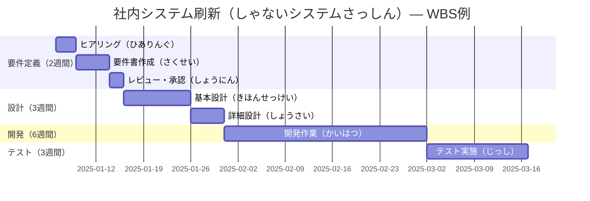
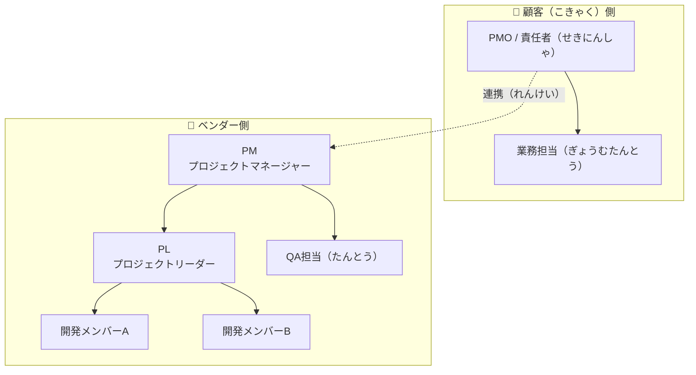
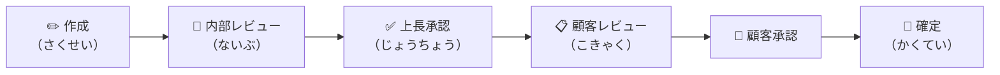

# Lập kế hoạch dự án — プロジェクト計画（けいかく）

Giai đoạn lập kế hoạch là nền tảng của toàn bộ dự án. Ở công ty Nhật, tài liệu kế hoạch thường được chuẩn bị rất kỹ lưỡng trước khi kick-off và phải được khách hàng (顧客 / こきゃく) phê duyệt chính thức.

---

## 1. Cấu trúc thư mục 002\_プロジェクト計画

- 📁 **002\_プロジェクト計画**
  - 📄 プロジェクト計画書（けいかくしょ） — Tài liệu kế hoạch tổng thể
  - 📄 WBS（Work Breakdown Structure） — Phân rã công việc
  - 📄 スケジュール表（ひょう） — Bảng lịch trình (Gantt chart)
  - 📄 体制図（たいせいず） — Sơ đồ tổ chức team
  - 📄 役割分担表（やくわりぶんたんひょう） — Bảng phân công vai trò
  - 📄 コミュニケーション計画 — Kế hoạch giao tiếp nội bộ/với KH
  - 📄 リスク管理表（かんりひょう） — Bảng quản lý rủi ro (ban đầu)

---

## 2. Tài liệu kế hoạch dự án — プロジェクト計画書

### Nội dung cơ bản cần có

| 項目（こうもく）| Nội dung |
|---|---|
| プロジェクト概要（がいよう） | Tóm tắt dự án, mục tiêu, phạm vi |
| 背景・目的（はいけい・もくてき） | Lý do thực hiện, kết quả kỳ vọng |
| スコープ（Scope） | Trong phạm vi / ngoài phạm vi |
| 成果物一覧（せいかぶついちらん） | Danh sách deliverable |
| スケジュール | Mốc thời gian chính (マイルストーン) |
| 体制・役割 | Ai làm gì, ai chịu trách nhiệm gì |
| 予算（よさん） | Ngân sách và cách kiểm soát |
| リスク・課題 | Rủi ro đã xác định và cách xử lý |
| 前提条件・制約（せいやく） | Điều kiện tiền đề, ràng buộc dự án |

---

## 3. WBS — 作業分解構造（さぎょうぶんかいこうぞう）

WBS là kỹ thuật phân rã toàn bộ công việc của dự án thành các đơn vị nhỏ có thể quản lý được.

### Nguyên tắc làm WBS kiểu Nhật

1. **階層構造（かいそうこうぞう）** — Phân cấp từ Phase → Task → Subtask
2. **100%ルール** — Tổng công việc trong WBS phải bằng 100% phạm vi dự án
3. **担当者明記（たんとうしゃめいき）** — Ghi rõ người phụ trách từng task
4. **工数見積（こうすうみつもり）** — Ước lượng số giờ công (人日 / にんにち)

### Ví dụ WBS — Gantt chart

> **人日（にんにち）** = 1 người làm 1 ngày = 1 人日. Ví dụ: task 5 人日 nghĩa là 1 người làm 5 ngày, hoặc 5 người làm 1 ngày.

---

## 4. Sơ đồ tổ chức — 体制図（たいせいず）

Đây là tài liệu bắt buộc trong mọi dự án tại Nhật. Nó xác định rõ trách nhiệm của từng bên:

### Các vai trò phổ biến

| 略称（りゃくしょう） | Vai trò |
|---|---|
| **PM** | プロジェクトマネージャー — Quản lý toàn bộ dự án |
| **PL** | プロジェクトリーダー — Dẫn dắt kỹ thuật |
| **PMO** | プロジェクトマネジメントオフィス — Bộ phận hỗ trợ quản lý |
| **SE** | システムエンジニア — Kỹ sư hệ thống (thiết kế, phân tích) |
| **PG** | プログラマー — Lập trình viên |

---

## 5. Bảng phân công vai trò — 役割分担表（RACI）

RACI Matrix là công cụ làm rõ ai chịu trách nhiệm gì:

| 記号 | 意味 | Giải thích |
|---|---|---|
| **R** | Responsible（レスポンシブル） | Người thực hiện trực tiếp |
| **A** | Accountable（アカウンタブル） | Người chịu trách nhiệm cuối cùng |
| **C** | Consulted（コンサルテッド） | Người cần hỏi ý kiến |
| **I** | Informed（インフォームド） | Người cần được thông báo |

---

## 6. Phê duyệt tài liệu — 承認フロー（しょうにんふろー）

Một đặc thù rất quan trọng ở Nhật là **ハンコ文化（ぶんか）** — văn hóa đóng dấu/ký tên phê duyệt. Tài liệu kế hoạch thường phải qua các bước:

> Khi tài liệu đã **確定（かくてい）** — được chốt, mọi thay đổi sau đó đều cần làm thủ tục **変更管理（へんこうかんり）** — quản lý thay đổi chính thức.

---

## Checklist — Hoàn thành giai đoạn lập kế hoạch

- [ ] プロジェクト計画書 đã được khách hàng phê duyệt
- [ ] WBS đã phân rã đến mức có thể ước lượng 工数
- [ ] Gantt chart (スケジュール表) đã xác định đủ マイルストーン
- [ ] 体制図 đã có đủ thông tin liên lạc của tất cả thành viên
- [ ] Rủi ro ban đầu đã được liệt kê vào リスク管理表
- [ ] Kênh giao tiếp (コミュニケーション計画) đã được thống nhất
