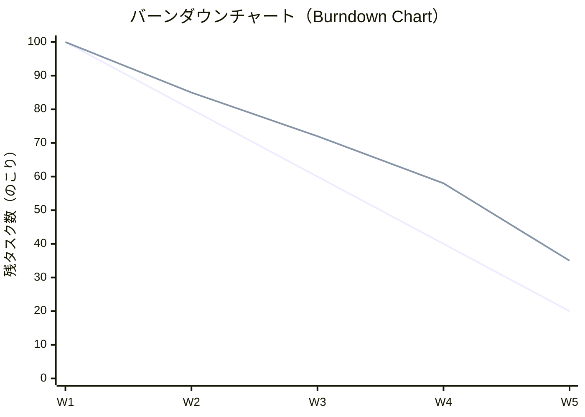

# Quản lý tiến độ — 進捗管理（しんちょくかんり）

進捗管理 là hoạt động diễn ra liên tục trong suốt dự án. Tại Nhật, báo cáo tiến độ thường xuyên và minh bạch là yếu tố cốt lõi để xây dựng **信頼（しんらい）** — lòng tin với khách hàng.

---

## 1. Cấu trúc thư mục quản lý tiến độ

- 📁 **003\_進捗管理（しんちょくかんり）**
  - 📄 週次進捗報告書（しゅうじしんちょくほうこくしょ） — Báo cáo tuần
  - 📄 月次進捗報告書（げつじしんちょくほうこくしょ） — Báo cáo tháng
  - 📄 課題管理表（かだいかんりひょう） — Bảng quản lý vấn đề
  - 📄 リスク管理表（りすくかんりひょう） — Bảng quản lý rủi ro
- 📁 **004\_会議体（かいぎたい）**
  - 📁 定例会議（ていれいかいぎ）
    - 📄 YYYYMMDD\_議事録（ぎじろく）
    - 📄 YYYYMMDD\_資料（しりょう）
  - 📁 ステアリングコミッティ（Steering Committee）
    - 📄 YYYYMMDD\_報告資料（ほうこくしりょう）
  - 📁 臨時会議（りんじかいぎ）

---

## 2. Báo cáo tiến độ — 進捗報告書（しんちょくほうこくしょ）

### Cấu trúc báo cáo tuần chuẩn

:::info[📊 週次進捗報告書 — テンプレート]
**報告日（ほうこくび）:** 2025/01/20  
**対象期間（たいしょうきかん）:** 2025/01/13 〜 01/17  
**プロジェクト名:** ○○システム刷新PJ  
**作成者（さくせいしゃ）:** 山田 太郎

---

**1. 全体進捗（ぜんたいしんちょく）**

予定（よてい）: 35% ／ 実績（じっせき）: 32% ／ ▲3% 遅延（ちえん）

**2. 今週（こんしゅう）の実績**
- ✅ 要件定義書 第1版 作成完了
- ✅ 顧客ヒアリング #3 実施
- ⚠️ 業務フロー図 レビュー — 1日遅れ

**3. 来週（らいしゅう）の予定**
- 要件定義書 顧客レビュー (1/22)
- 詳細ヒアリング #4 (1/24)

**4. 課題・リスク（かだい・りすく）**
- 🔴 [課題#003] ○○業務要件が未確定 → 1/22 顧客回答待ち
- 🟡 [リスク#005] テスト期間が短縮リスク → 要監視

**5. 連絡事項（れんらくじこう）**
- 次回定例: 1/22 15:00 会議室A
:::

---

## 3. Bảng quản lý vấn đề — 課題管理表（かだいかんりひょう）

**課題（かだい）** là những vấn đề **đang tồn tại** cần giải quyết. Khác với **リスク（rủi ro）** là những điều **có thể xảy ra**.

### Cấu trúc bảng 課題管理表

| No | 課題内容（ないよう） | 発生日（はっせいび） | 担当者 | 期限（きげん） | 優先度（ゆうせんど） | ステータス | 対応内容（たいおうないよう） |
|----|-----------------|-----------------|--------|---------|-----------|-----------|----------------|
| 課題#001 | ○○テーブル設計が未確定 | 01/10 | 山田 | 01/20 | 🔴 高 | 対応中 | 設計チームに確認依頼済 |
| 課題#002 | 外部API仕様書が未入手 | 01/12 | 田中 | 01/25 | 🟡 中 | 待ち | 顧客へ依頼中 |
| 課題#003 | テスト環境のサーバー手配 | 01/15 | 鈴木 | 02/01 | 🟢 低 | 完了 | インフラ部門で対応済 |

### Quy tắc quản lý 課題

- **毎週更新（まいしゅうこうしん）** — Cập nhật hàng tuần, không để cũ
- **期限（きげん）を必ず設定** — Mọi課題 đều phải có deadline
- **エスカレーション（escalation）** — Nếu không giải quyết được trong thời hạn, leo thang lên PM → 上長（じょうちょう）

---

## 4. Quản lý họp — 会議体（かいぎたい）

### Các loại họp phổ biến trong dự án Nhật

| 会議名（かいぎめい） | 頻度（ひんど） | 参加者 | 目的 |
|---|---|---|---|
| **定例会議（ていれいかいぎ）** | 毎週/隔週 | PM + チーム | Đồng bộ tiến độ nội bộ |
| **顧客定例（こきゃくていれい）** | 毎週 | PM + 顧客 | Báo cáo tiến độ cho KH |
| **設計レビュー（せっけいれびゅー）** | 都度（つど） | SE + 関係者 | Review tài liệu thiết kế |
| **ステコミ（ステアリングコミッティ）** | 月次 | 経営層 + PM | Báo cáo cấp cao |
| **臨時会議（りんじかいぎ）** | 必要時 | 関係者 | Xử lý vấn đề khẩn cấp |

### Biên bản họp — 議事録（ぎじろく）

Tại Nhật, 議事録 phải được gửi **24時間以内（じかんいない）** sau cuộc họp. Cấu trúc chuẩn:

:::info[📝 議事録 — テンプレート]
**日時（にちじ）:** 2025/01/20 15:00〜16:00  
**場所（ばしょ）:** 会議室A / Zoom  
**出席者（しゅっせきしゃ）:** 田中（顧客）、山田（PM）、鈴木（SE）  
**欠席者（けっせきしゃ）:** なし  
**議事録作成:** 山田

---

**【議題（ぎだい）】**
1. 要件定義書 第1版 レビュー
2. 次フェーズのスケジュール確認

**【決定事項（けっていじこう）】**
- ✅ 要件定義書 承認
- ✅ 次フェーズ開始: 2/1

**【宿題（しゅくだい）・アクションアイテム】**

| 内容 | 担当 | 期限 |
|------|------|------|
| 移行要件 追加ヒアリング実施 | 山田 | 01/27 |
| テスト環境の詳細を連絡 | 田中 | 01/25 |

**【次回日程（じかいにってい）】** 2025/01/27 15:00 会議室A
:::

---

## 5. Kỹ thuật theo dõi tiến độ

### Earned Value Management — EVMの基本（きほん）

| 指標（しひょう） | Ký hiệu | Ý nghĩa |
|---|---|---|
| 計画工数（けいかくこうすう） | PV (Planned Value) | Công việc dự kiến đến thời điểm hiện tại |
| 実績工数（じっせきこうすう） | AC (Actual Cost) | Công việc thực tế đã tiêu tốn |
| 出来高（できだか） | EV (Earned Value) | Giá trị công việc đã hoàn thành |

- **SPI = EV/PV** > 1.0 → Đang đúng/nhanh hơn kế hoạch
- **CPI = EV/AC** > 1.0 → Đang dùng ít chi phí hơn kế hoạch

### Burndown Chart — バーンダウンチャート

> 上の線（実績）が計画ラインより高い場合は **遅延（ちえん）** を意味します。

---

## 6. Điểm mốc quan trọng — マイルストーン

| マイルストーン | 内容 | 成果物（せいかぶつ） |
|---|---|---|
| **キックオフ（KO）** | Bắt đầu dự án | プロジェクト計画書 |
| **要件定義完了（かんりょう）** | Chốt yêu cầu | 要件定義書（承認済） |
| **設計完了** | Chốt thiết kế | 基本設計書、詳細設計書 |
| **開発完了** | Code xong | ソースコード、単体テスト結果 |
| **テスト完了** | Test xong | テスト結果報告書 |
| **リリース（Go-Live）** | Go live | リリース報告書 |
| **PJ完了（かんりょう）** | Đóng dự án | プロジェクト完了報告書 |

---

## Checklist — Quy trình báo cáo tiến độ hàng tuần

- [ ] WBSを更新 — Cập nhật tiến độ thực tế trên WBS
- [ ] 課題管理表を更新 — Cập nhật bảng課題
- [ ] 週次報告書を作成 — Viết báo cáo tuần
- [ ] 社内レビュー — Review với team trước khi gửi KH
- [ ] 顧客への報告 — Gửi báo cáo cho khách hàng
- [ ] 定例会議で説明 — Giải thích trong cuộc họp định kỳ
- [ ] 議事録を作成・共有（24時間以内） — Gửi biên bản họp
