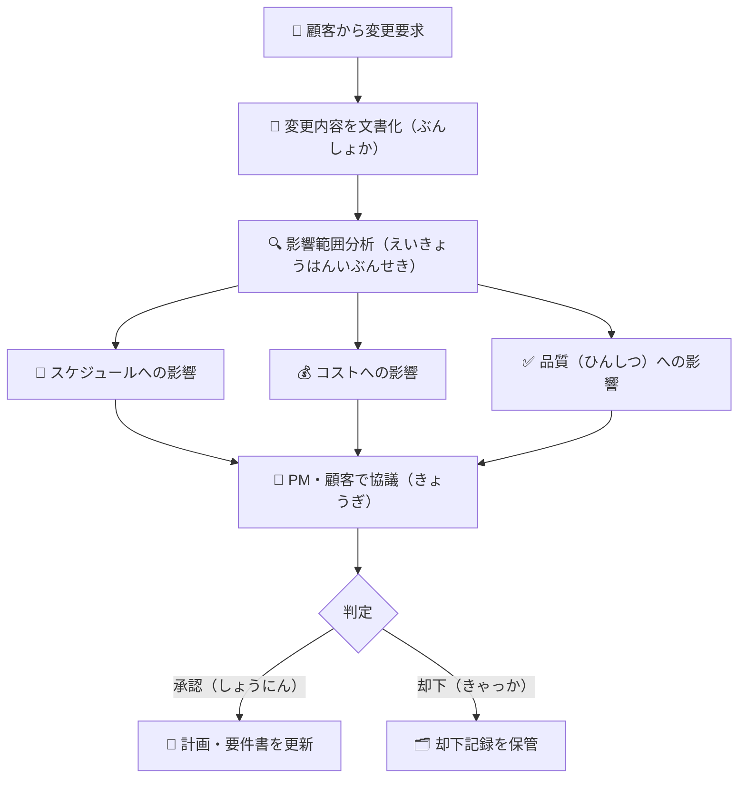
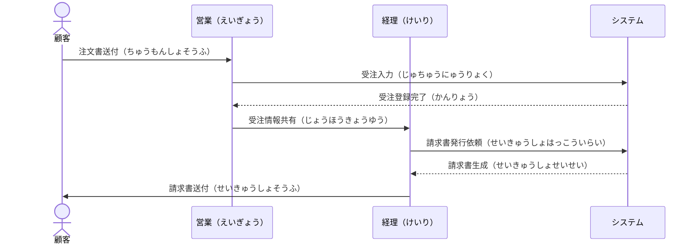

# Quản lý yêu cầu — 要件定義（ようけんていぎ）

要件定義 là giai đoạn quan trọng nhất trong vòng đời phát triển phần mềm tại Nhật. Sai sót ở giai đoạn này sẽ kéo theo chi phí sửa chữa gấp 10 lần ở giai đoạn sau.

---

## 1. Cấu trúc thư mục 10\_要件定義

- 📁 **10\_要件定義（ようけんていぎ）**
  - 📁 101\_要求管理（ようきゅうかんり）
    - 📄 ヒアリングシート（ひありんぐ） — Phiếu phỏng vấn khách hàng
    - 📄 ヒアリング議事録（ぎじろく） — Biên bản cuộc họp phỏng vấn
    - 📄 要求一覧（ようきゅういちらん） — Danh sách tất cả yêu cầu
  - 📁 102\_業務要件（ぎょうむようけん）
    - 📄 業務フロー図（ぎょうむふろーず） — Sơ đồ quy trình nghiệp vụ
    - 📄 業務要件定義書 — Tài liệu yêu cầu nghiệp vụ
    - 📄 用語集（ようごしゅう） — Bảng thuật ngữ dự án
  - 📁 103\_システム要件（しすてむようけん）
    - 📄 システム要件定義書 — Tài liệu yêu cầu hệ thống
    - 📄 画面一覧（がめんいちらん） — Danh sách màn hình
    - 📄 機能一覧（きのういちらん） — Danh sách chức năng
    - 📄 非機能要件（ひきのうようけん） — Yêu cầu phi chức năng
  - 📁 104\_移行要件（いこうようけん）
    - 📄 データ移行方針（いこうほうしん） — Chính sách di chuyển dữ liệu
    - 📄 移行計画書（いこうけいかくしょ） — Kế hoạch migrate
  - 📁 ※※old

---

## 2. Quy trình Hearing — ヒアリング（ひありんぐ）

**ヒアリング** là quá trình phỏng vấn khách hàng để nắm bắt yêu cầu. Đây là kỹ năng cốt lõi của **SE（システムエンジニア）**.

### Trước buổi Hearing

1. **事前準備（じぜんじゅんび）** — Chuẩn bị trước:
   - Nghiên cứu nghiệp vụ hiện tại của khách hàng
   - Chuẩn bị **ヒアリングシート** với danh sách câu hỏi
   - Xác nhận thành phần tham dự (参加者 / さんかしゃ)

2. **Cấu trúc ヒアリングシート cơ bản:**

:::note[📋 ヒアリングシート — テンプレート]
**日時（にちじ）:** 2025/01/20  
**場所（ばしょ）:** 会議室B / オンライン  
**参加者（さんかしゃ）:** 顧客側 田中様、ベンダー側 山田

---

**確認事項（かくにんじこう）:**

1. 現状（げんじょう）の業務フローを教えていただけますか？
2. 現状システムの課題（かだい）は何ですか？
3. 新システムで実現したいことは？
4. ユーザー数（にんずう）・処理件数の規模は？
5. リリース目標時期（もくひょうじき）はいつですか？
:::

### Sau buổi Hearing

- **議事録（ぎじろく）** — Biên bản họp phải gửi trong vòng **24時間以内（じかんいない）**
- Ghi rõ: 決定事項（けっていじこう）/ 宿題（しゅくだい）/ 次回日程（じかいにってい）
- Khách hàng phải **確認・承認（かくにん・しょうにん）** nội dung biên bản

---

## 3. Phân loại yêu cầu — 要件の種類（ようけんのしゅるい）

### Yêu cầu nghiệp vụ — 業務要件（ぎょうむようけん）

> Mô tả **WHAT** — hệ thống cần làm gì theo góc nhìn người dùng

- Quy trình nghiệp vụ hiện tại (As-Is) và tương lai (To-Be)
- Các rule nghiệp vụ (業務ルール / ぎょうむるーる)
- Danh sách màn hình và chức năng

**Ví dụ:** "受注入力（じゅちゅうにゅうりょく）画面では、顧客コードを入力すると自動で顧客名が表示される"

### Yêu cầu hệ thống — システム要件（しすてむようけん）

> Mô tả **HOW** — hệ thống thực hiện như thế nào về mặt kỹ thuật

### Yêu cầu phi chức năng — 非機能要件（ひきのうようけん）

| 観点（かんてん） | Ví dụ cụ thể |
|---|---|
| **性能（せいのう）** | 画面表示は3秒以内 / Response time ≤ 3s |
| **可用性（かようせい）** | 稼働率99.9%以上 / Uptime ≥ 99.9% |
| **セキュリティ** | ログイン失敗5回でアカウントロック |
| **拡張性（かくちょうせい）** | ユーザー数1万人まで対応 |
| **移行性（いこうせい）** | 既存データを100%移行 |
| **保守性（ほしゅせい）** | ドキュメント整備、ソースコード管理 |

---

## 4. Quản lý thay đổi yêu cầu — 要件変更管理（ようけんへんこうかんり）

Đây là điểm thường gây mâu thuẫn nhất giữa vendor và khách hàng.

### Quy trình xử lý thay đổi

### Bảng quản lý thay đổi — 変更管理表（へんこうかんりひょう）

| No | 要求内容 | 要求者 | 受付日 | 影響 | 対応方針 | ステータス |
|----|---------|--------|--------|------|---------|-----------|
| CR-001 | ○○画面に検索機能追加 | 田中様 | 01/15 | +3日, +5万円 | 承認 | 対応中 |
| CR-002 | CSV出力形式変更 | 鈴木様 | 01/20 | なし | 承認 | 完了 |

> **スコープクリープ（Scope Creep）** — Tình trạng phạm vi dự án bị mở rộng liên tục mà không có kiểm soát. Đây là một trong những nguyên nhân chính làm dự án chậm tiến độ.

---

## 5. Sơ đồ nghiệp vụ — 業務フロー図（ぎょうむふろーず）

Tài liệu trực quan hóa quy trình nghiệp vụ. Dùng **swim lane diagram** để phân biệt rõ ai làm gì.

**【受注処理フロー（じゅちゅうしょりふろー）】**

---

## Checklist — Hoàn thành 要件定義

- [ ] ヒアリング đã được thực hiện với đầy đủ stakeholder
- [ ] 議事録 đã được khách hàng xác nhận
- [ ] 業務フロー図 đã được vẽ (As-Is và To-Be)
- [ ] 機能一覧 đã liệt kê đủ và được phân ưu tiên (MoSCoW)
- [ ] 非機能要件 đã được định lượng cụ thể
- [ ] 用語集 đã thống nhất giữa vendor và khách hàng
- [ ] 移行要件 đã được xác định rõ ràng
- [ ] 要件定義書 đã được **顧客承認（こきゃくしょうにん）** chính thức
