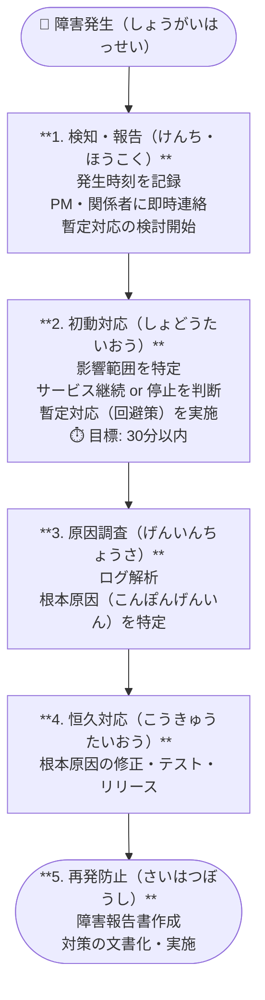

# Quản lý rủi ro — リスク管理（りすくかんり）

リスク管理 là hoạt động chủ động xác định, đánh giá và xử lý các sự kiện **có thể xảy ra** trong tương lai. Khác với **課題（かだい）** — vấn đề đang xảy ra, リスク là điều **chưa xảy ra** nhưng cần chuẩn bị sẵn kế hoạch đối phó.

---

## 1. Cấu trúc thư mục

- 📁 **002\_プロジェクト計画**
  - 📄 リスク管理表（りすくかんりひょう） — Tạo từ đầu dự án, cập nhật liên tục
- 📁 **70\_保守・運用（ほしゅ・うんよう）**
  - 📁 701\_障害対応（しょうがいたいおう）
    - 📄 障害対応フロー — Quy trình xử lý sự cố
    - 📄 YYYYMMDD\_障害報告書（ほうこくしょ） — Báo cáo từng sự cố
    - 📄 障害一覧（いちらん） — Danh sách tất cả sự cố
  - 📁 702\_変更管理（へんこうかんり）
    - 📄 変更管理表（へんこうかんりひょう） — Bảng quản lý thay đổi
  - 📁 703\_パフォーマンス監視（かんし）
    - 📄 監視設計書（かんしせっけいしょ） — Thiết kế monitoring
  - 📁 704\_セキュリティ管理（かんり）
    - 📄 セキュリティ要件・対策 — Yêu cầu bảo mật

---

## 2. Bảng quản lý rủi ro — リスク管理表（りすくかんりひょう）

### Các cột cơ bản

| No | リスク内容 | 発生確率（はっせいかくりつ） | 影響度（えいきょうど） | リスク値 | 対応策（たいおうさく） | 担当者 | ステータス |
|----|---------|--------------------|-----------------|---------|----------------|--------|-----------|
| R-001 | 要件が確定せずスケジュール遅延 | 高（3） | 高（3） | 9 | 早期ヒアリング実施、期限を明文化 | 山田 | 監視中 |
| R-002 | 外部システム連携の仕様変更 | 中（2） | 高（3） | 6 | 変更管理プロセスを事前合意 | 田中 | 対応済 |
| R-003 | キーメンバーの突然離脱 | 低（1） | 高（3） | 3 | ナレッジ共有、ドキュメント整備 | PM | 監視中 |

### Cách tính リスク値（りすくち）

**リスク値 = 発生確率（はっせいかくりつ） × 影響度（えいきょうど）**

| | 影響度: 低（1） | 影響度: 中（2） | 影響度: 高（3） |
|---|:---:|:---:|:---:|
| **発生確率: 高（3）** | 3 🟢 | 6 🟡 | **9 🔴** |
| **発生確率: 中（2）** | 2 🟢 | 4 🟡 | 6 🟡 |
| **発生確率: 低（1）** | 1 🟢 | 2 🟢 | 3 🟢 |

- 🔴 **7〜9** → 早急対応（そうきゅうたいおう）
- 🟡 **4〜6** → 要監視（ようかんし）
- 🟢 **1〜3** → 定期確認（ていきかくにん）

---

## 3. Các chiến lược xử lý rủi ro — リスク対応戦略（たいおうせんりゃく）

| 戦略 | 説明 | Ví dụ |
|---|---|---|
| **回避（かいひ）** | Loại bỏ nguyên nhân gốc rễ | Không sử dụng công nghệ chưa được kiểm chứng |
| **軽減（けいげん）** | Giảm xác suất hoặc mức độ ảnh hưởng | Test prototype sớm, phỏng vấn KH nhiều lần |
| **転嫁（てんか）** | Chuyển rủi ro sang bên thứ ba | Mua bảo hiểm, outsource phần rủi ro cao |
| **受容（じゅよう）** | Chấp nhận rủi ro, chuẩn bị kế hoạch dự phòng | Lập **コンティンジェンシー予備（よび）** trong lịch |

---

## 4. Xử lý sự cố — 障害対応（しょうがいたいおう）

Khi hệ thống đang vận hành gặp sự cố (本番障害 / ほんばんしょうがい), cần tuân theo quy trình chặt chẽ.

### Quy trình xử lý sự cố chuẩn

### 障害報告書（ほうこくしょ）の構成

:::danger[🚨 障害報告書 — 記入例]
**件名（けんめい）:** ○○システム ログイン不可障害  
**発生日時（はっせいにちじ）:** 2025/01/20 10:30  
**復旧日時（ふっきゅうにちじ）:** 2025/01/20 11:45  
**影響範囲（えいきょうはんい）:** 全ユーザー 約500名

---

**【障害概要（しょうがいがいよう）】**  
○○の認証サーバーに接続できず、ログイン不可の状態が発生。

**【原因（げんいん）】**  
サーバーの証明書（しょうめいしょ）が期限切れとなっていた。

**【対応内容（たいおうないよう）】**

| 時刻 | 対応 |
|------|------|
| 10:30 | 障害検知、PM・インフラ担当へ連絡 |
| 10:45 | 原因特定（証明書期限切れ確認） |
| 11:30 | 証明書更新作業実施 |
| 11:45 | サービス復旧確認 |

**【再発防止策（さいはつぼうしさく）】**
- 証明書期限を監視ツールに登録（期限30日前にアラート）
- 月次で証明書期限一覧をチェックする手順を追加
:::

---

## 5. Báo cáo leo thang — エスカレーション（えすかれーしょん）

Khi vấn đề vượt quá khả năng xử lý của team, cần leo thang lên cấp trên theo đúng quy trình.

### Khi nào cần エスカレーション?

- スケジュールが **1週間以上（いじょう）** 遅延する見込み
- 予算（よさん）オーバーが確実になった
- 顧客との認識齟齬（にんしきそご）が解決できない
- 重大な品質問題（ひんしつもんだい）が発生した

### Cách báo cáo leo thang

:::warning[⬆️ エスカレーション報告 — テンプレート]
**エスカレーション理由（りゆう）:**  
スケジュール遅延リスクが重大レベルに達しました。

**現状（げんじょう）:**  
要件確定の遅れにより、設計開始が2週間遅延。  
このままではリリース日 3/31 に間に合わない可能性があります。

**対応済み事項（たいおうすみじこう）:**
- 顧客へ早期決定を2回依頼済み
- チーム内でのリソース追加を検討

**判断が必要な事項（はんだん）:**
- スコープ縮小 or スケジュール延長 どちらを優先するか
- 追加費用（ついかひよう）発生の場合、承認権限は誰か
:::

---

## 6. Quản lý bảo mật — セキュリティ管理（かんり）

| 観点 | 対策（たいさく） |
|---|---|
| **認証（にんしょう）** | MFA必須、パスワードポリシー設定 |
| **認可（にんか）** | 最小権限の原則（ロールベースアクセス制御） |
| **通信（つうしん）** | HTTPS必須、証明書期限管理 |
| **データ保護（ほご）** | 個人情報（こじんじょうほう）の暗号化（あんごうか） |
| **ログ管理（かんり）** | アクセスログ、操作ログの保全 |
| **脆弱性（ぜいじゃくせい）** | 定期的な脆弱性スキャン実施 |

---

## Checklist — リスク管理

- [ ] リスク管理表をKO時点で作成済み
- [ ] 週次でリスク状況を確認・更新
- [ ] 高リスク項目は毎回の定例で報告
- [ ] 障害対応フローがチーム全員に共有されている
- [ ] エスカレーションの判断基準が明確になっている
- [ ] セキュリティ要件が要件定義書に記載済み
