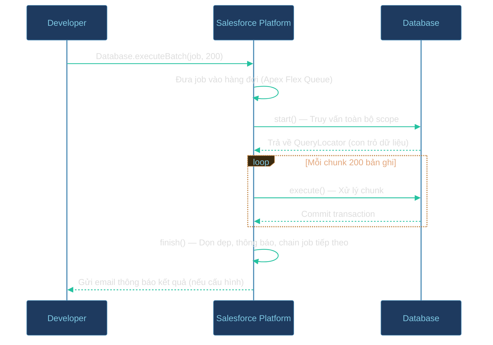
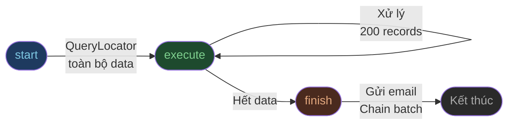
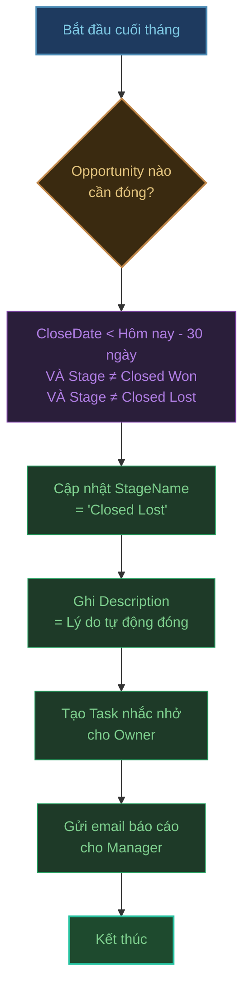
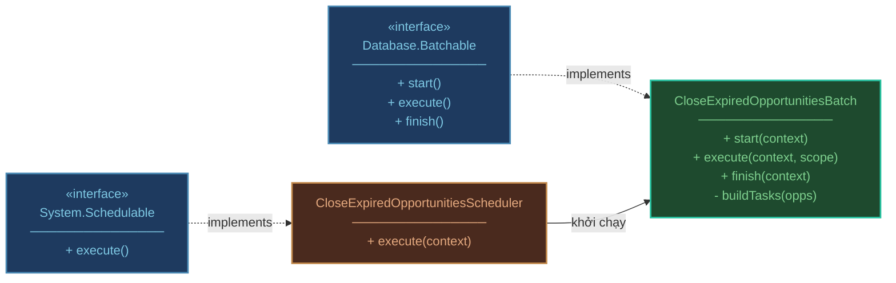
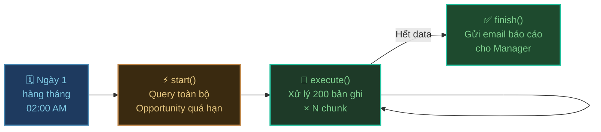
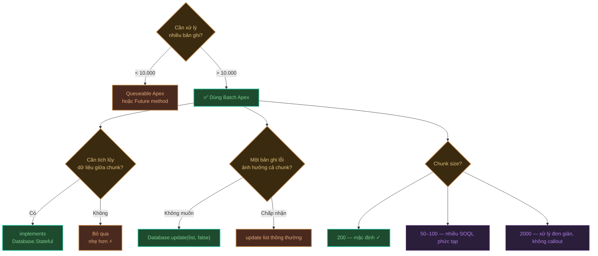

# Batch Apex — Xử lý dữ liệu lớn

## Tại sao cần Batch Apex?

Salesforce áp đặt **Governor Limits** để đảm bảo tài nguyên dùng chung không bị độc chiếm. Giới hạn quan trọng nhất khi xử lý dữ liệu:

| Giới hạn | Apex thường | Batch Apex |
| :--- | :---: | :---: |
| Số bản ghi SOQL trả về | 50.000 | **50.000 / mỗi chunk** |
| Số DML statement | 150 | **150 / mỗi chunk** |
| Tổng bản ghi có thể xử lý | 50.000 | **Không giới hạn** |
| Heap size | 6 MB | 12 MB |

→ Khi cần xử lý **hàng chục nghìn đến hàng triệu bản ghi**, Batch Apex là giải pháp duy nhất.

---

## Cơ chế hoạt động

Batch Apex chia toàn bộ dữ liệu thành các **chunk nhỏ** (mặc định 200 bản ghi/chunk), xử lý từng chunk trong một transaction riêng biệt.



### Ba phương thức bắt buộc



| Phương thức | Chạy mấy lần | Mục đích |
| :--- | :---: | :--- |
| `start()` | 1 lần | Định nghĩa tập dữ liệu cần xử lý |
| `execute()` | N lần (mỗi chunk 1 lần) | Logic xử lý chính |
| `finish()` | 1 lần | Thông báo, dọn dẹp, hoặc kích hoạt batch tiếp theo |

---

## Bài toán thực tế

### Bối cảnh

Công ty bạn có **hàng chục nghìn Opportunity** trong Salesforce. Mỗi cuối tháng, bộ phận sale yêu cầu:

> *"Tự động đóng tất cả các deal đã quá hạn Close Date hơn 30 ngày mà chưa thắng — chuyển sang Closed Lost và ghi lý do."*

Nếu dùng Flow hay trigger thông thường: không thể xử lý hàng chục nghìn bản ghi trong một lần. → Cần Batch Apex.

---

## Thiết kế giải pháp

### Phân tích yêu cầu



### Thiết kế class



---

## Triển khai

### Batch class chính

```apex
public class CloseExpiredOpportunitiesBatch
    implements Database.Batchable<SObject>, Database.Stateful {

    // Database.Stateful cho phép giữ biến giữa các chunk
    private Integer totalProcessed = 0;
    private Integer totalClosed    = 0;
    private String  managerEmail   = 'manager@company.com';

    // ─────────────────────────────────────────
    // 1. START — Định nghĩa tập dữ liệu
    // ─────────────────────────────────────────
    public Database.QueryLocator start(Database.BatchableContext context) {
        Date cutoffDate = Date.today().addDays(-30);

        return Database.getQueryLocator([
            SELECT Id, Name, StageName, CloseDate, OwnerId, Description
            FROM   Opportunity
            WHERE  CloseDate < :cutoffDate
            AND    StageName NOT IN ('Closed Won', 'Closed Lost')
        ]);
    }

    // ─────────────────────────────────────────
    // 2. EXECUTE — Xử lý từng chunk 200 bản ghi
    // ─────────────────────────────────────────
    public void execute(Database.BatchableContext context, List<Opportunity> scope) {
        List<Opportunity> toUpdate = new List<Opportunity>();
        List<Task>        tasks    = new List<Task>();

        for (Opportunity opp : scope) {
            // Cập nhật stage
            opp.StageName   = 'Closed Lost';
            opp.Description = 'Tự động đóng: quá hạn 30 ngày kể từ '
                            + opp.CloseDate.format()
                            + '. Xử lý ngày ' + Date.today().format();
            toUpdate.add(opp);

            // Tạo Task nhắc nhở cho Owner
            tasks.add(new Task(
                WhatId    = opp.Id,
                OwnerId   = opp.OwnerId,
                Subject   = 'Deal "' + opp.Name + '" đã bị đóng tự động — cần review',
                Status    = 'Not Started',
                Priority  = 'Normal',
                ActivityDate = Date.today()
            ));
        }

        // Dùng Database.update để không dừng khi 1 bản ghi lỗi
        List<Database.SaveResult> results = Database.update(toUpdate, false);

        // Đếm kết quả để báo cáo ở finish()
        totalProcessed += scope.size();
        for (Database.SaveResult r : results) {
            if (r.isSuccess()) totalClosed++;
        }

        insert tasks;
    }

    // ─────────────────────────────────────────
    // 3. FINISH — Gửi báo cáo sau khi xong
    // ─────────────────────────────────────────
    public void finish(Database.BatchableContext context) {
        AsyncApexJob job = [
            SELECT Status, NumberOfErrors, JobItemsProcessed, TotalJobItems
            FROM   AsyncApexJob
            WHERE  Id = :context.getJobId()
        ];

        Messaging.SingleEmailMessage email = new Messaging.SingleEmailMessage();
        email.setToAddresses(new String[]{ managerEmail });
        email.setSubject('Batch hoàn thành: Đóng Opportunity quá hạn');
        email.setPlainTextBody(
            'Kết quả xử lý:\n'
            + '• Tổng bản ghi kiểm tra : ' + totalProcessed  + '\n'
            + '• Đã đóng thành công    : ' + totalClosed     + '\n'
            + '• Chunk đã xử lý        : ' + job.JobItemsProcessed + '/' + job.TotalJobItems + '\n'
            + '• Lỗi                   : ' + job.NumberOfErrors    + '\n'
            + '• Trạng thái job        : ' + job.Status
        );

        Messaging.sendEmail(new Messaging.SingleEmailMessage[]{ email });
    }
}
```

:::tip Database.Stateful
Không có `implements Database.Stateful`, biến `totalProcessed` và `totalClosed` sẽ bị **reset về 0 sau mỗi chunk**. Thêm interface này khi cần tích lũy dữ liệu qua các chunk để báo cáo.
:::

:::warning Database.update(list, false)
Tham số `false` (allOrNothing = false) cho phép batch tiếp tục chạy dù một số bản ghi bị lỗi validation rule. Nếu dùng `update list` thông thường, một bản ghi lỗi sẽ rollback toàn bộ chunk.
:::

---

### Chạy thủ công (Developer Console / Anonymous Apex)

```apex
// Chạy với chunk size mặc định 200
CloseExpiredOpportunitiesBatch job = new CloseExpiredOpportunitiesBatch();
Database.executeBatch(job);

// Hoặc chỉ định chunk size nhỏ hơn để test
Database.executeBatch(job, 50);
```

---

### Lên lịch tự động — chạy cuối mỗi tháng

```apex
public class CloseExpiredOpportunitiesScheduler implements Schedulable {

    public void execute(SchedulableContext context) {
        CloseExpiredOpportunitiesBatch job = new CloseExpiredOpportunitiesBatch();
        Database.executeBatch(job, 200);
    }
}
```

**Kích hoạt từ Developer Console:**

```apex
// Chạy vào 02:00 sáng ngày 1 hàng tháng
// Cú pháp: Seconds Minutes Hours Day Month DayOfWeek Year
String cronExpression = '0 0 2 1 * ?';
System.schedule('Đóng Opportunity quá hạn', cronExpression, new CloseExpiredOpportunitiesScheduler());
```



---

## Viết Unit Test

```apex
@IsTest
private class CloseExpiredOpportunitiesBatchTest {

    @TestSetup
    static void setup() {
        List<Opportunity> opps = new List<Opportunity>();

        // 5 deal quá hạn → cần bị đóng
        for (Integer i = 0; i < 5; i++) {
            opps.add(new Opportunity(
                Name        = 'Expired Deal ' + i,
                StageName   = 'Prospecting',
                CloseDate   = Date.today().addDays(-31),
                Amount      = 10000
            ));
        }

        // 2 deal chưa hết hạn → không được đụng vào
        for (Integer i = 0; i < 2; i++) {
            opps.add(new Opportunity(
                Name        = 'Active Deal ' + i,
                StageName   = 'Prospecting',
                CloseDate   = Date.today().addDays(30),
                Amount      = 10000
            ));
        }

        insert opps;
    }

    @IsTest
    static void testBatchClosesExpiredOpportunities() {
        Test.startTest();
        CloseExpiredOpportunitiesBatch job = new CloseExpiredOpportunitiesBatch();
        Database.executeBatch(job, 200);
        Test.stopTest();

        // Kiểm tra 5 deal quá hạn đã bị đóng
        List<Opportunity> closed = [
            SELECT Id, StageName FROM Opportunity
            WHERE Name LIKE 'Expired Deal%'
        ];
        for (Opportunity opp : closed) {
            Assert.areEqual('Closed Lost', opp.StageName, 'Deal quá hạn phải được đóng');
        }

        // Kiểm tra 2 deal còn hạn không bị ảnh hưởng
        List<Opportunity> active = [
            SELECT Id, StageName FROM Opportunity
            WHERE Name LIKE 'Active Deal%'
        ];
        for (Opportunity opp : active) {
            Assert.areEqual('Prospecting', opp.StageName, 'Deal còn hạn không được thay đổi');
        }

        // Kiểm tra Task đã được tạo
        Integer taskCount = [SELECT COUNT() FROM Task WHERE Subject LIKE '%đã bị đóng tự động%'];
        Assert.areEqual(5, taskCount, 'Mỗi deal quá hạn phải có 1 Task');
    }
}
```

---

## Checklist thiết kế Batch Apex



### Quy tắc vàng

1. **Không có SOQL / DML trong vòng lặp** bên trong `execute()` — giống Apex thường
2. **Không gọi callout** (HTTP request) trong batch trừ khi implement thêm `Database.AllowsCallouts`
3. **Tối đa 5 batch job** chạy đồng thời trên một org
4. **Chunk size nhỏ hơn** nếu mỗi bản ghi cần nhiều SOQL phụ — tránh hit CPU limit
5. **Dùng `Database.Stateful`** chỉ khi thực sự cần — làm chậm job vì Salesforce phải serialize state
