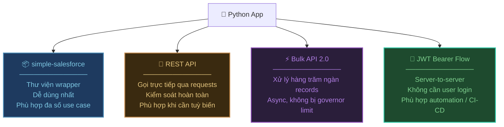
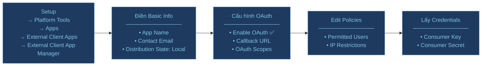
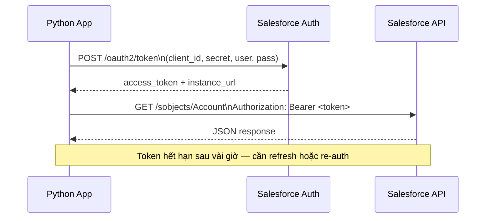
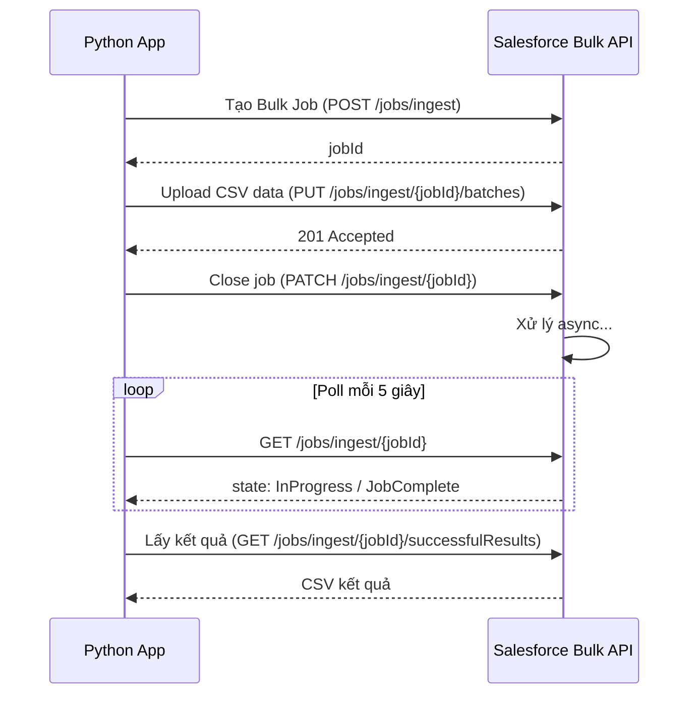
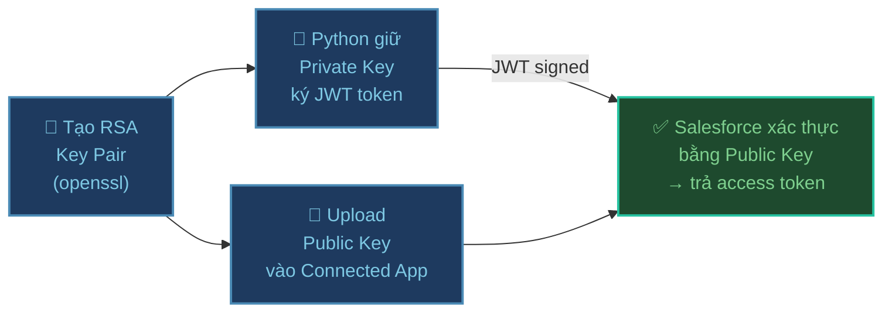
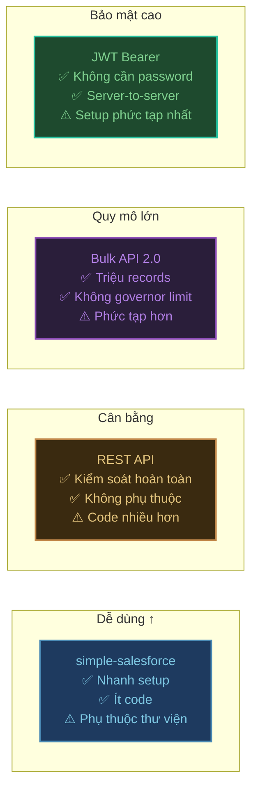

# Kết nối Salesforce từ Python

## Tổng quan các phương thức



### Chọn phương thức nào?

| Tình huống | Phương thức |
| :--- | :--- |
| Cần nhanh, không muốn phức tạp | ✅ simple-salesforce |
| Gọi API đặc biệt không có trong wrapper | REST API |
| Insert/Update/Delete > 10.000 records | Bulk API 2.0 |
| Automation không có user login | JWT Bearer Flow |
| Production app, bảo mật cao | JWT Bearer Flow |

---

## Chuẩn bị — Tạo External Client App

Tất cả các phương thức đều cần **External Client App (ECA)** — thế hệ kế tiếp của Connected App, bảo mật cao hơn và hỗ trợ packaging tốt hơn.

:::info External Client App vs Connected App
ECA là hướng đi mới của Salesforce từ API version 59.0+. Nếu org bạn chưa thấy ECA, kiểm tra lại phiên bản Salesforce hoặc hỏi admin bật tính năng này.
:::



### Bước 1 — Truy cập External Client App Manager

Đăng nhập với quyền **Administrator**, sau đó:

**Setup** → Apps → **External Client Apps** → **External Client App Manager** → nhấn **New External Client App**

### Bước 2 — Basic Information

| Field | Giá trị |
| :--- | :--- |
| **External Client App Name** | Tên dễ nhận biết (ví dụ: `Python API Connector`) |
| **Contact Email** | Email admin |
| **Distribution State** | `Local` — chỉ dùng trong 1 org |

### Bước 3 — API (Enable OAuth Settings)

Tick **Enable OAuth**, sau đó điền:

App Settings

- **Callback URL:** `http://localhost:1717/OauthRedirect` (hoặc URL thực của app)
- **OAuth Scopes** — thêm các scope cần thiết:

| Scope | Mục đích |
| :--- | :--- |
| `Manage user data via APIs (api)` | Gọi REST/SOAP API |
| `Manage user data via Web browsers (web)` | Access Salesforce UI |
| `Perform requests at any time (refresh_token, offline_access)` | Refresh token, chạy background |

Flow Enablement
Check Enable JWT Bearer Flow
Upload file *.crt đã tạo lên
> Xem hướng dẫn chi tiết tại [Tạo key trên Windows](./index.md).

### Bước 4 — Edit Policies

Sau khi **Save**, từ danh sách app → nhấn mũi tên → **Edit Policies**:

- **Permitted Users:**
  - `All users can self-authorize` — cho phép mọi user tự auth
  - `Admin approved users are pre-authorized` — chỉ user được admin duyệt (dùng cho JWT Bearer)
- Nhấn **Save**

### Bước 5 — Lấy Consumer Key & Secret

Mở app → **Edit Settings** → **App Settings** → **OAuth Settings** → nhấn **Consumer Key and Secret**

Salesforce gửi mã xác minh về email → nhập mã → sao chép:
- **Consumer Key** → chính là `Client ID`
- **Consumer Secret** → chính là `Client Secret`

### File .env — Lưu credentials

```bash
# .env (KHÔNG commit vào git)
SF_USERNAME=your@email.com
SF_PASSWORD=yourpassword
SF_SECURITY_TOKEN=yourtoken        # Setup → My Personal Information → Reset My Security Token
SF_CONSUMER_KEY=3MVG9...           # Consumer Key từ ECA
SF_CONSUMER_SECRET=ABC123...       # Consumer Secret từ ECA
SF_DOMAIN=login                    # hoặc "test" cho sandbox
```

```bash
# .gitignore — bắt buộc có
.env
.venv
```

---

## Phương thức 1 — simple-salesforce

Thư viện wrapper phổ biến nhất — che giấu toàn bộ complexity của OAuth và REST API.

### Cài đặt

```bash
uv add simple-salesforce python-dotenv
```

### Kết nối cơ bản

```python
import os
from dotenv import load_dotenv
from simple_salesforce import Salesforce

load_dotenv()

# Kết nối bằng Username + Password + Security Token
sf = Salesforce(
    username=os.environ["SF_USERNAME"],
    password=os.environ["SF_PASSWORD"],
    security_token=os.environ["SF_SECURITY_TOKEN"],
    domain=os.environ.get("SF_DOMAIN", "login"),  # "test" cho sandbox
)

print(f"Kết nối thành công! Instance: {sf.sf_instance}")
```

### SOQL Query

```python
# Query cơ bản
result = sf.query("SELECT Id, Name, Industry FROM Account LIMIT 10")

for record in result["records"]:
    print(f"{record['Id']} | {record['Name']} | {record.get('Industry', 'N/A')}")

# Query tất cả (tự xử lý pagination)
result = sf.query_all("SELECT Id, Name FROM Contact WHERE Email != null")
print(f"Tổng: {result['totalSize']} contacts")
contacts = result["records"]
```

### CRUD Operations

```python
# CREATE
new_account = sf.Account.create({
    "Name": "Công ty ABC",
    "Industry": "Technology",
    "Phone": "0901234567",
})
account_id = new_account["id"]
print(f"Đã tạo Account: {account_id}")

# READ
account = sf.Account.get(account_id)
print(f"Tên: {account['Name']}")

# UPDATE
sf.Account.update(account_id, {
    "Phone": "0987654321",
    "Website": "https://abc.com",
})

# DELETE
sf.Account.delete(account_id)

# UPSERT — tạo mới hoặc update theo external ID
sf.Contact.upsert(
    "External_ID__c/EXT-001",   # field/value
    {"FirstName": "Huấn", "LastName": "Đào", "Email": "huan@abc.com"}
)
```

### Gọi Apex REST Endpoint

```python
# Gọi custom Apex REST class
result = sf.apexecute(
    "MyApexEndpoint",           # class name
    method="POST",
    data={"accountId": "001..."}
)
print(result)
```

---

## Phương thức 2 — REST API trực tiếp

Dùng `requests` để gọi thẳng Salesforce REST API — phù hợp khi cần endpoint không có trong simple-salesforce.

### Cài đặt

```bash
uv add requests python-dotenv
```

### Authentication — OAuth2 Username-Password Flow

```python
import os
import requests
from dotenv import load_dotenv

load_dotenv()

def get_sf_token() -> dict:
    """Lấy access token qua OAuth2 Username-Password flow"""
    domain = os.environ.get("SF_DOMAIN", "login")
    url = f"https://{domain}.salesforce.com/services/oauth2/token"

    response = requests.post(url, data={
        "grant_type":    "password",
        "client_id":     os.environ["SF_CONSUMER_KEY"],
        "client_secret": os.environ["SF_CONSUMER_SECRET"],
        "username":      os.environ["SF_USERNAME"],
        "password":      os.environ["SF_PASSWORD"] + os.environ["SF_SECURITY_TOKEN"],
    })
    response.raise_for_status()
    return response.json()
    # Trả về: {"access_token": "...", "instance_url": "https://xxx.salesforce.com", ...}

token_data = get_sf_token()
ACCESS_TOKEN = token_data["access_token"]
INSTANCE_URL = token_data["instance_url"]
API_VERSION  = "v59.0"
BASE_URL     = f"{INSTANCE_URL}/services/data/{API_VERSION}"

HEADERS = {
    "Authorization": f"Bearer {ACCESS_TOKEN}",
    "Content-Type":  "application/json",
}
```

### Sequence diagram OAuth flow



### Gọi các endpoint

```python
import json

# Query SOQL
def soql_query(query: str) -> list:
    response = requests.get(
        f"{BASE_URL}/query",
        headers=HEADERS,
        params={"q": query}
    )
    response.raise_for_status()
    return response.json()["records"]

accounts = soql_query("SELECT Id, Name FROM Account LIMIT 5")
for acc in accounts:
    print(acc["Name"])

# Tạo record
def create_record(sobject: str, data: dict) -> str:
    response = requests.post(
        f"{BASE_URL}/sobjects/{sobject}",
        headers=HEADERS,
        json=data
    )
    response.raise_for_status()
    return response.json()["id"]

new_id = create_record("Account", {"Name": "Công ty XYZ", "Industry": "Finance"})

# Cập nhật record (PATCH)
def update_record(sobject: str, record_id: str, data: dict):
    response = requests.patch(
        f"{BASE_URL}/sobjects/{sobject}/{record_id}",
        headers=HEADERS,
        json=data
    )
    response.raise_for_status()  # 204 No Content khi thành công

update_record("Account", new_id, {"Phone": "0909090909"})

# Xóa record
def delete_record(sobject: str, record_id: str):
    response = requests.delete(
        f"{BASE_URL}/sobjects/{sobject}/{record_id}",
        headers=HEADERS
    )
    response.raise_for_status()

# Gọi Apex REST
def call_apex(endpoint: str, method: str = "GET", payload: dict = None):
    url = f"{INSTANCE_URL}/services/apexrest/{endpoint}"
    response = requests.request(method, url, headers=HEADERS, json=payload)
    response.raise_for_status()
    return response.json()

result = call_apex("MyEndpoint/001xxx", method="POST", payload={"key": "value"})
```

---

## Phương thức 3 — Bulk API 2.0

Dành cho xử lý **hàng chục nghìn đến hàng triệu records** — chạy async, không bị governor limit.

### Cài đặt

```bash
uv add simple-salesforce python-dotenv pandas
```

### Cơ chế hoạt động



### Insert hàng loạt bằng Bulk API

```python
import os
import csv
import io
import time
import requests
from dotenv import load_dotenv

load_dotenv()

# Tái dùng hàm get_sf_token() từ phần REST API ở trên
token_data = get_sf_token()
ACCESS_TOKEN = token_data["access_token"]
INSTANCE_URL = token_data["instance_url"]
API_VERSION  = "v59.0"

HEADERS = {
    "Authorization": f"Bearer {ACCESS_TOKEN}",
    "Content-Type":  "application/json",
}

def bulk_insert(sobject: str, records: list[dict]) -> dict:
    """
    Insert nhiều records qua Bulk API 2.0
    records: list of dicts, mỗi dict là 1 record
    """
    base = f"{INSTANCE_URL}/services/data/{API_VERSION}/jobs/ingest"

    # Bước 1: Tạo job
    job = requests.post(base, headers=HEADERS, json={
        "object":      sobject,
        "operation":   "insert",    # insert | update | upsert | delete
        "contentType": "CSV",
    }).json()
    job_id = job["id"]
    print(f"Job created: {job_id}")

    # Bước 2: Convert records sang CSV
    output = io.StringIO()
    writer = csv.DictWriter(output, fieldnames=records[0].keys())
    writer.writeheader()
    writer.writerows(records)
    csv_data = output.getvalue()

    # Bước 3: Upload CSV
    requests.put(
        f"{base}/{job_id}/batches",
        headers={**HEADERS, "Content-Type": "text/csv"},
        data=csv_data.encode("utf-8"),
    )

    # Bước 4: Đóng job để bắt đầu xử lý
    requests.patch(
        f"{base}/{job_id}",
        headers=HEADERS,
        json={"state": "UploadComplete"},
    )

    # Bước 5: Poll trạng thái
    while True:
        status = requests.get(f"{base}/{job_id}", headers=HEADERS).json()
        state = status["state"]
        print(f"  State: {state} | Processed: {status.get('numberRecordsProcessed', 0)}")
        if state in ("JobComplete", "Failed", "Aborted"):
            break
        time.sleep(5)

    # Bước 6: Lấy kết quả
    success_csv = requests.get(
        f"{base}/{job_id}/successfulResults", headers=HEADERS
    ).text
    failed_csv = requests.get(
        f"{base}/{job_id}/failedResults", headers=HEADERS
    ).text

    success_count = len(success_csv.strip().split("\n")) - 1  # trừ header
    fail_count    = len(failed_csv.strip().split("\n")) - 1

    return {
        "job_id":  job_id,
        "success": success_count,
        "failed":  fail_count,
    }


# Ví dụ: Insert 5000 Contacts
contacts = [
    {"FirstName": f"User{i}", "LastName": "Test", "Email": f"user{i}@test.com"}
    for i in range(5000)
]

result = bulk_insert("Contact", contacts)
print(f"Kết quả: {result['success']} thành công, {result['failed']} lỗi")
```

---

## Phương thức 4 — JWT Bearer Flow

Phù hợp cho **automation, CI/CD, server-to-server** — không cần username/password, không cần user login.

### Cơ chế



### Bước 1 — Tạo RSA Key Pair

> Xem hướng dẫn chi tiết tại [Tạo key trên Windows](./index.md).

```bash
# 1. Tạo private key có mã hóa (passphrase)
openssl genpkey -aes-256-cbc -algorithm RSA -pass pass:SomePassword \
  -out private.pass.pem -pkeyopt rsa_keygen_bits:2048

# 2. Giải mã private key (bỏ passphrase để dùng trong code)
openssl rsa -passin pass:SomePassword -in private.pass.pem -out private.pem

# 3. Tạo Certificate Signing Request (CSR)
openssl req -new -key private.pem -out server.csr

# 4. Tạo self-signed certificate từ CSR
openssl x509 -req -sha256 -days 365 -in server.csr -signkey private.pem -out certificate.crt
```

### Bước 2 — Upload certificate lên External Client App Manager

Trong **External Client App Manager** → **Use Digital Signatures** → Upload file `certificate.crt`

Cấp thêm scope: **Perform requests at any time (refresh_token, offline_access)**

### Bước 3 — Pre-authorize user

**External Client App Manager** → chọn app → mũi tên → **Edit Policies**:
- **Permitted Users:** chọn `Admin approved users are pre-authorized`
- Sau đó vào **Profiles** hoặc **Permission Sets** → cấp quyền cho user sẽ dùng JWT

### Bước 4 — Code Python

```bash
uv add cryptography requests python-dotenv
```

```python
import os
import time
import requests
from cryptography.hazmat.primitives import serialization, hashes
from cryptography.hazmat.primitives.asymmetric import padding
from cryptography.hazmat.backends import default_backend
import base64, json
from dotenv import load_dotenv

load_dotenv()

def create_jwt_token(
    consumer_key: str,
    username: str,
    private_key_path: str,
    domain: str = "login",
) -> str:
    """Tạo JWT assertion để đổi lấy access token"""

    # Header
    header = base64.urlsafe_b64encode(
        json.dumps({"alg": "RS256"}).encode()
    ).rstrip(b"=").decode()

    # Payload
    now = int(time.time())
    payload = base64.urlsafe_b64encode(json.dumps({
        "iss": consumer_key,
        "sub": username,
        "aud": f"https://{domain}.salesforce.com",
        "exp": now + 300,   # hết hạn sau 5 phút
    }).encode()).rstrip(b"=").decode()

    # Ký bằng private key
    with open(private_key_path, "rb") as f:
        private_key = serialization.load_pem_private_key(
            f.read(), password=None, backend=default_backend()
        )

    signing_input = f"{header}.{payload}".encode()
    signature = private_key.sign(signing_input, padding.PKCS1v15(), hashes.SHA256())
    sig_encoded = base64.urlsafe_b64encode(signature).rstrip(b"=").decode()

    return f"{header}.{payload}.{sig_encoded}"


def get_token_via_jwt(
    consumer_key: str,
    username: str,
    private_key_path: str,
    domain: str = "login",
) -> dict:
    """Đổi JWT assertion lấy access token"""
    jwt = create_jwt_token(consumer_key, username, private_key_path, domain)

    response = requests.post(
        f"https://{domain}.salesforce.com/services/oauth2/token",
        data={
            "grant_type": "urn:ietf:params:oauth:grant-type:jwt-bearer",
            "assertion":  jwt,
        }
    )
    response.raise_for_status()
    return response.json()


# Sử dụng
token_data = get_token_via_jwt(
    consumer_key=os.environ["SF_CONSUMER_KEY"],
    username=os.environ["SF_USERNAME"],
    private_key_path="private.pem",
    domain=os.environ.get("SF_DOMAIN", "login"),
)

ACCESS_TOKEN = token_data["access_token"]
INSTANCE_URL = token_data["instance_url"]
print(f"JWT auth thành công! Instance: {INSTANCE_URL}")
```

---

## Đóng gói thành SalesforceClient

Trong thực tế, nên bọc logic kết nối vào một class tái sử dụng:

```python
# sf_client.py
import os
import requests
from dataclasses import dataclass, field
from dotenv import load_dotenv

load_dotenv()

@dataclass
class SalesforceClient:
    domain: str          = field(default_factory=lambda: os.environ.get("SF_DOMAIN", "login"))
    api_version: str     = "v59.0"
    _access_token: str   = field(default="", init=False, repr=False)
    _instance_url: str   = field(default="", init=False, repr=False)

    def __post_init__(self):
        self._authenticate()

    def _authenticate(self):
        resp = requests.post(
            f"https://{self.domain}.salesforce.com/services/oauth2/token",
            data={
                "grant_type":    "password",
                "client_id":     os.environ["SF_CONSUMER_KEY"],
                "client_secret": os.environ["SF_CONSUMER_SECRET"],
                "username":      os.environ["SF_USERNAME"],
                "password":      os.environ["SF_PASSWORD"] + os.environ["SF_SECURITY_TOKEN"],
            }
        )
        resp.raise_for_status()
        data = resp.json()
        self._access_token = data["access_token"]
        self._instance_url = data["instance_url"]

    @property
    def headers(self) -> dict:
        return {
            "Authorization": f"Bearer {self._access_token}",
            "Content-Type":  "application/json",
        }

    @property
    def base_url(self) -> str:
        return f"{self._instance_url}/services/data/{self.api_version}"

    def query(self, soql: str) -> list:
        resp = requests.get(
            f"{self.base_url}/query",
            headers=self.headers,
            params={"q": soql}
        )
        resp.raise_for_status()
        return resp.json()["records"]

    def create(self, sobject: str, data: dict) -> str:
        resp = requests.post(
            f"{self.base_url}/sobjects/{sobject}",
            headers=self.headers,
            json=data
        )
        resp.raise_for_status()
        return resp.json()["id"]

    def update(self, sobject: str, record_id: str, data: dict):
        resp = requests.patch(
            f"{self.base_url}/sobjects/{sobject}/{record_id}",
            headers=self.headers,
            json=data
        )
        resp.raise_for_status()

    def delete(self, sobject: str, record_id: str):
        resp = requests.delete(
            f"{self.base_url}/sobjects/{sobject}/{record_id}",
            headers=self.headers
        )
        resp.raise_for_status()


# Sử dụng
if __name__ == "__main__":
    sf = SalesforceClient()

    accounts = sf.query("SELECT Id, Name FROM Account LIMIT 5")
    for acc in accounts:
        print(acc["Name"])

    new_id = sf.create("Account", {"Name": "Test Corp"})
    sf.update("Account", new_id, {"Phone": "0909090909"})
    sf.delete("Account", new_id)
```

---

## So sánh tổng kết



| | simple-salesforce | REST API | Bulk API | JWT Bearer |
| :--- | :---: | :---: | :---: | :---: |
| Dễ setup | ✅ | ✅ | ⚠️ | ❌ |
| Kiểm soát | ⚠️ | ✅ | ✅ | ✅ |
| Xử lý lớn | ❌ | ❌ | ✅ | N/A |
| Không cần password | ❌ | ❌ | ❌ | ✅ |
| Phù hợp production | ⚠️ | ✅ | ✅ | ✅ |
