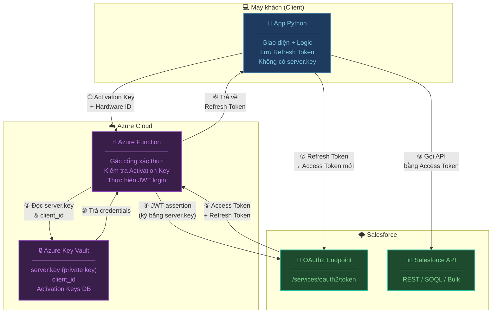
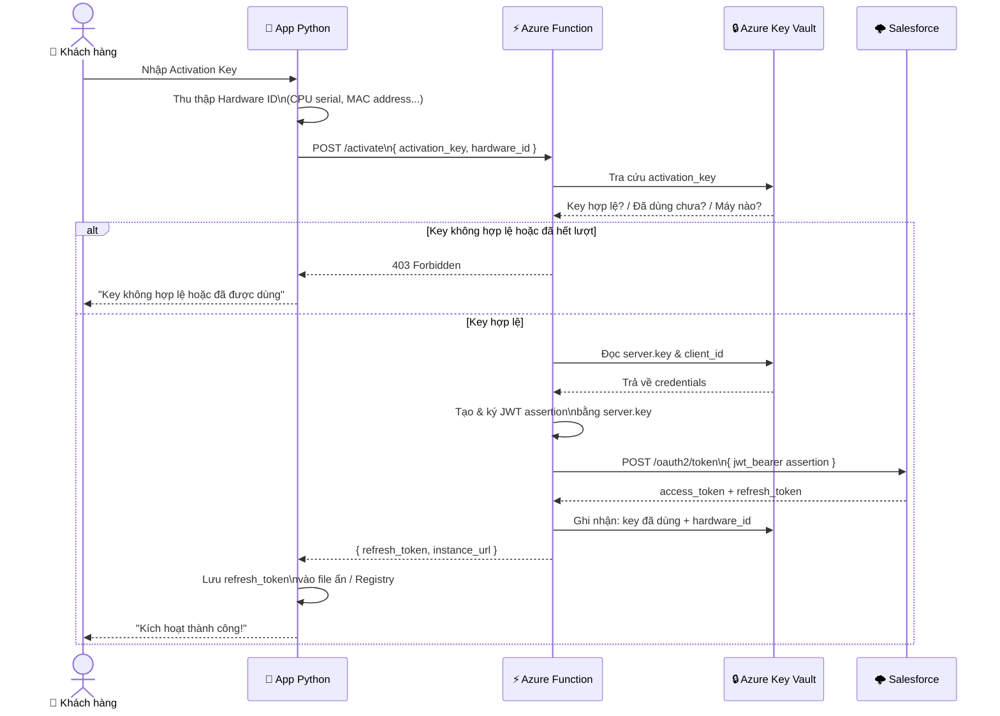
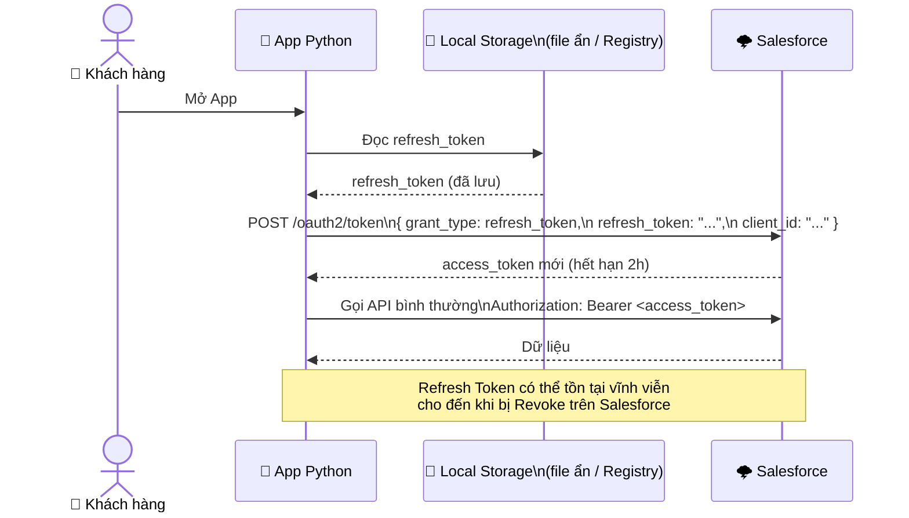
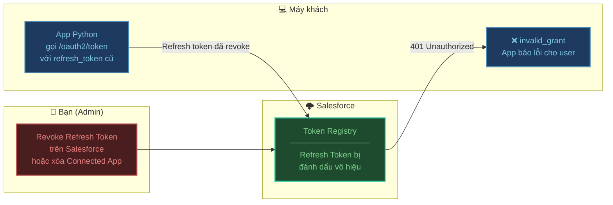

# Phân phối App Python bảo mật với Azure Function

## Vấn đề cần giải quyết

Khi phân phối App Python cho nhiều khách hàng, bạn cần kết nối Salesforce mà **không để lộ `server.key` (private key)**. Nếu để client tự tải `server.key` về máy, người dùng am hiểu kỹ thuật có thể trích xuất và sử dụng trái phép.

**Giải pháp:** Dùng Azure Function làm trạm trung chuyển — `server.key` nằm trong Azure Key Vault, client chỉ nhận về **Refresh Token** để dùng cho các lần sau.

---

## Kiến trúc tổng thể



---

## Luồng 1 — Kích hoạt lần đầu

Khi khách hàng cài App và nhập Activation Key lần đầu tiên:



---

## Luồng 2 — Các lần chạy sau (không cần server.key)

Từ lần thứ 2 trở đi, App dùng Refresh Token đã lưu — không cần Azure Function:



---

## Luồng 3 — Thu hồi quyền truy cập

Khi hợp đồng hết hạn, bạn thu hồi từ xa mà không cần can thiệp vào máy khách:



---

## Triển khai

### Bước 1 — Chuẩn bị Azure Key Vault

```bash
# Tạo Key Vault
az keyvault create --name "sf-connector-kv" --resource-group "my-rg" --location "eastasia"

# Lưu server.key vào Key Vault
az keyvault secret set --vault-name "sf-connector-kv" \
    --name "sf-private-key" \
    --file "./private.pem"

# Lưu Client ID
az keyvault secret set --vault-name "sf-connector-kv" \
    --name "sf-client-id" \
    --value "3MVG9xxxxxxxxxxxxxxx"
```

### Bước 2 — Cấu hình Salesforce để trả về Refresh Token

:::warning Quan trọng
Mặc định, JWT Bearer Flow **không trả về Refresh Token**. Bạn phải cấu hình đúng:
:::

Trong **External Client App Manager** → chọn app → **Edit Settings** → **OAuth Settings**:

1. Thêm scope: **Perform requests at any time (refresh_token, offline_access)**
2. Trong **Edit Policies** → **Refresh Token Policy**: chọn `Refresh token is valid until revoked`

### Bước 3 — Azure Function (Python)

```bash
# Tạo Function App
func init ActivationFunction --python
cd ActivationFunction
func new --name activate --template "HTTP trigger"
pip install azure-keyvault-secrets azure-identity cryptography requests
```

```python
# activate/__init__.py
import logging
import json
import time
import base64
import hashlib
import requests

import azure.functions as func
from azure.identity import DefaultAzureCredential
from azure.keyvault.secrets import SecretClient
from cryptography.hazmat.primitives import serialization, hashes
from cryptography.hazmat.primitives.asymmetric import padding

VAULT_URL = "https://sf-connector-kv.vault.azure.net/"
SF_DOMAIN = "login"  # hoặc "test" cho sandbox

# ----- Lấy secrets từ Key Vault -----
credential = DefaultAzureCredential()
kv_client = SecretClient(vault_url=VAULT_URL, credential=credential)

def get_secret(name: str) -> str:
    return kv_client.get_secret(name).value


def _check_activation_key(activation_key: str, hardware_id: str) -> bool:
    """
    Kiểm tra activation_key có hợp lệ không.
    Triển khai thực tế: truy vấn database (Azure Table Storage, CosmosDB...)
    """
    # TODO: thay bằng logic kiểm tra DB thực
    valid_keys = {
        "CUST-001-XXXX": {"max_devices": 1, "used_by": []},
        "CUST-002-YYYY": {"max_devices": 3, "used_by": []},
    }
    key_info = valid_keys.get(activation_key)
    if not key_info:
        return False
    if len(key_info["used_by"]) >= key_info["max_devices"]:
        return hardware_id in key_info["used_by"]  # cho phép re-activate cùng máy
    return True


def _create_jwt_assertion(private_key_pem: str, client_id: str, sf_username: str) -> str:
    """Tạo JWT assertion để gửi lên Salesforce"""
    private_key = serialization.load_pem_private_key(
        private_key_pem.encode(), password=None
    )

    now = int(time.time())
    header = base64.urlsafe_b64encode(
        json.dumps({"alg": "RS256"}).encode()
    ).rstrip(b"=").decode()

    payload = base64.urlsafe_b64encode(json.dumps({
        "iss": client_id,
        "sub": sf_username,
        "aud": f"https://{SF_DOMAIN}.salesforce.com",
        "exp": now + 300,
    }).encode()).rstrip(b"=").decode()

    signing_input = f"{header}.{payload}".encode()
    signature = private_key.sign(signing_input, padding.PKCS1v15(), hashes.SHA256())
    sig_encoded = base64.urlsafe_b64encode(signature).rstrip(b"=").decode()

    return f"{header}.{payload}.{sig_encoded}"


def main(req: func.HttpRequest) -> func.HttpResponse:
    try:
        body = req.get_json()
        activation_key = body.get("activation_key", "").strip()
        hardware_id    = body.get("hardware_id", "").strip()

        if not activation_key or not hardware_id:
            return func.HttpResponse(
                json.dumps({"error": "Thiếu activation_key hoặc hardware_id"}),
                status_code=400, mimetype="application/json"
            )

        # ① Xác thực Activation Key
        if not _check_activation_key(activation_key, hardware_id):
            return func.HttpResponse(
                json.dumps({"error": "Activation Key không hợp lệ hoặc đã hết lượt"}),
                status_code=403, mimetype="application/json"
            )

        # ② Đọc credentials từ Key Vault
        private_key_pem = get_secret("sf-private-key")
        client_id       = get_secret("sf-client-id")
        sf_username     = get_secret("sf-username")  # user được pre-authorized

        # ③ Tạo JWT và đổi lấy token từ Salesforce
        jwt_assertion = _create_jwt_assertion(private_key_pem, client_id, sf_username)

        sf_response = requests.post(
            f"https://{SF_DOMAIN}.salesforce.com/services/oauth2/token",
            data={
                "grant_type": "urn:ietf:params:oauth:grant-type:jwt-bearer",
                "assertion":  jwt_assertion,
            }
        )
        sf_response.raise_for_status()
        token_data = sf_response.json()

        # ④ Ghi nhận hardware_id vào DB (chống dùng lại key)
        # TODO: cập nhật DB

        # ⑤ Trả về Refresh Token cho client (KHÔNG trả private key)
        return func.HttpResponse(
            json.dumps({
                "refresh_token": token_data["refresh_token"],
                "instance_url":  token_data["instance_url"],
                "client_id":     client_id,  # client cần để refresh
            }),
            status_code=200, mimetype="application/json"
        )

    except requests.HTTPError as e:
        logging.error(f"Salesforce error: {e.response.text}")
        return func.HttpResponse(
            json.dumps({"error": "Lỗi xác thực Salesforce"}),
            status_code=502, mimetype="application/json"
        )
    except Exception as e:
        logging.error(str(e))
        return func.HttpResponse(
            json.dumps({"error": "Lỗi server"}),
            status_code=500, mimetype="application/json"
        )
```

### Bước 4 — App Python phía Client

```python
# sf_auth.py — module xác thực phía client
import os
import json
import platform
import hashlib
import requests
from pathlib import Path

AZURE_FUNCTION_URL = "https://your-function.azurewebsites.net/api/activate"
TOKEN_FILE = Path.home() / ".myapp" / ".sf_token"  # file ẩn trong home dir


def _get_hardware_id() -> str:
    """Tạo Hardware ID duy nhất từ thông tin máy"""
    import uuid
    mac = uuid.getnode()
    machine = platform.node()
    raw = f"{mac}-{machine}-{platform.system()}"
    return hashlib.sha256(raw.encode()).hexdigest()[:32]


def _save_token(refresh_token: str, instance_url: str, client_id: str):
    """Lưu token vào file ẩn (mã hóa đơn giản bằng XOR với hardware_id)"""
    TOKEN_FILE.parent.mkdir(parents=True, exist_ok=True)
    data = json.dumps({
        "refresh_token": refresh_token,
        "instance_url":  instance_url,
        "client_id":     client_id,
    })
    TOKEN_FILE.write_text(data)
    # Trên Windows: ẩn file
    if platform.system() == "Windows":
        import ctypes
        ctypes.windll.kernel32.SetFileAttributesW(str(TOKEN_FILE), 2)  # FILE_ATTRIBUTE_HIDDEN


def _load_token() -> dict | None:
    """Đọc token đã lưu. Trả về None nếu chưa có."""
    if not TOKEN_FILE.exists():
        return None
    try:
        return json.loads(TOKEN_FILE.read_text())
    except Exception:
        return None


def activate(activation_key: str) -> bool:
    """
    Kích hoạt lần đầu: gửi Activation Key lên Azure Function
    Trả về True nếu thành công
    """
    hardware_id = _get_hardware_id()

    response = requests.post(AZURE_FUNCTION_URL, json={
        "activation_key": activation_key,
        "hardware_id":    hardware_id,
    })

    if response.status_code == 403:
        raise PermissionError("Key không hợp lệ hoặc đã được dùng trên máy khác")

    response.raise_for_status()
    data = response.json()

    _save_token(
        refresh_token=data["refresh_token"],
        instance_url=data["instance_url"],
        client_id=data["client_id"],
    )
    return True


def get_access_token() -> tuple[str, str]:
    """
    Lấy Access Token từ Refresh Token đã lưu.
    Trả về (access_token, instance_url)
    """
    token_data = _load_token()
    if not token_data:
        raise RuntimeError("Chưa kích hoạt. Vui lòng nhập Activation Key.")

    response = requests.post(
        f"{token_data['instance_url']}/services/oauth2/token",
        data={
            "grant_type":    "refresh_token",
            "refresh_token": token_data["refresh_token"],
            "client_id":     token_data["client_id"],
        }
    )

    if response.status_code == 400:
        # Refresh token hết hạn hoặc bị revoke
        TOKEN_FILE.unlink(missing_ok=True)
        raise PermissionError("Phiên đăng nhập đã hết hạn hoặc bị thu hồi. Liên hệ nhà cung cấp.")

    response.raise_for_status()
    data = response.json()
    return data["access_token"], token_data["instance_url"]


def is_activated() -> bool:
    """Kiểm tra đã kích hoạt chưa"""
    return _load_token() is not None
```

```python
# main.py — ví dụ sử dụng trong App chính
import requests
from sf_auth import activate, get_access_token, is_activated

def run_app():
    # Kiểm tra kích hoạt
    if not is_activated():
        key = input("Nhập Activation Key: ").strip()
        try:
            activate(key)
            print("Kích hoạt thành công!")
        except PermissionError as e:
            print(f"Lỗi: {e}")
            return

    # Lấy Access Token (từ Refresh Token đã lưu)
    try:
        access_token, instance_url = get_access_token()
    except PermissionError as e:
        print(f"Lỗi: {e}")
        return

    # Gọi Salesforce API bình thường
    headers = {
        "Authorization": f"Bearer {access_token}",
        "Content-Type":  "application/json",
    }
    result = requests.get(
        f"{instance_url}/services/data/v59.0/query",
        headers=headers,
        params={"q": "SELECT Id, Name FROM Account LIMIT 5"}
    )
    result.raise_for_status()

    for record in result.json()["records"]:
        print(record["Name"])


if __name__ == "__main__":
    run_app()
```

---

## Tóm tắt bảo mật

| Thành phần | Lưu gì | Ai được truy cập |
| :--- | :--- | :--- |
| **Azure Key Vault** | `server.key`, `client_id`, `sf_username` | Chỉ Azure Function (Managed Identity) |
| **Azure Function** | Activation Key database | Chỉ bạn (admin) |
| **Máy khách** | `refresh_token`, `instance_url`, `client_id` | App Python (không thể kết nối Salesforce nếu bị revoke) |

### Ưu điểm

| # | Ưu điểm | Chi tiết |
| :--- | :--- | :--- |
| 1 | **server.key không rời Azure** | Client không bao giờ chạm vào private key |
| 2 | **Giới hạn 1 key = 1 máy** | Gửi Hardware ID để Azure Function kiểm tra |
| 3 | **Thu hồi quyền từ xa** | Revoke Refresh Token trên Salesforce là xong |
| 4 | **Không cần internet khi refresh** | Gọi thẳng Salesforce, không qua Azure Function nữa |
| 5 | **Chi phí thấp** | Azure Function tính theo lượt gọi — activation chỉ tốn vài nghìn lượt/tháng |

:::tip Bước tiếp theo
Xem thêm [Kết nối Salesforce từ Python](./python-connect.md) để biết cách dùng `access_token` sau khi đã xác thực.
:::
